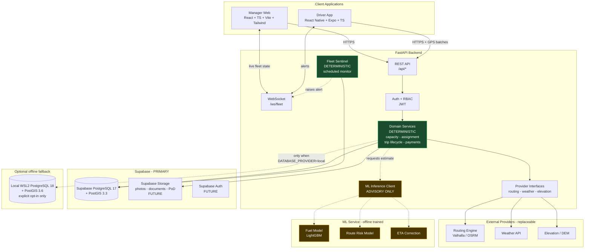
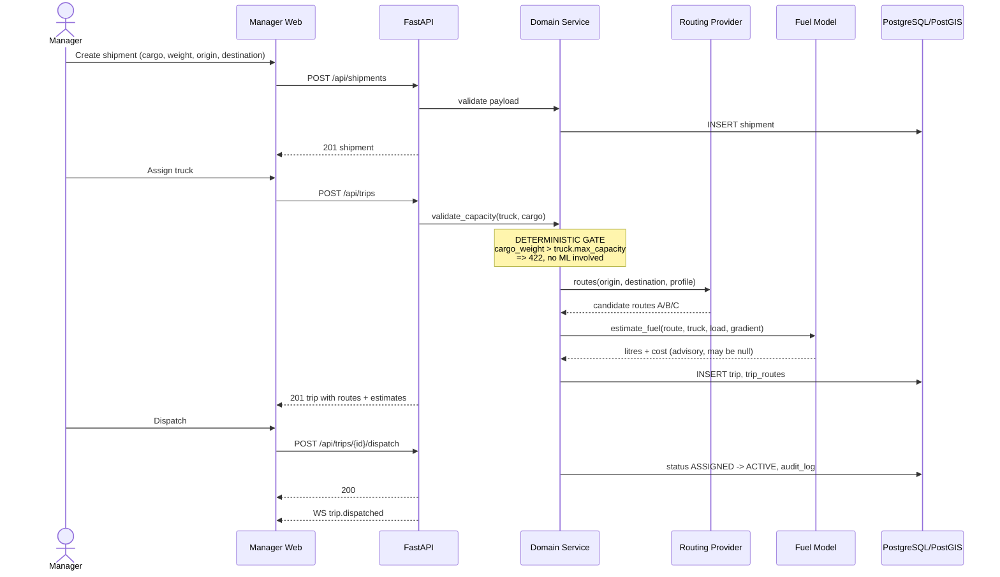
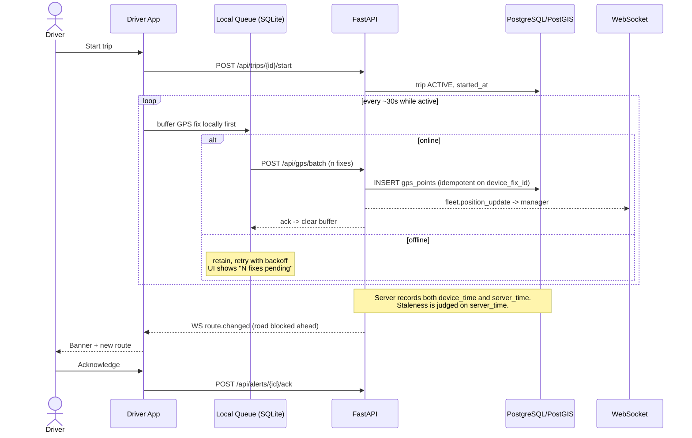
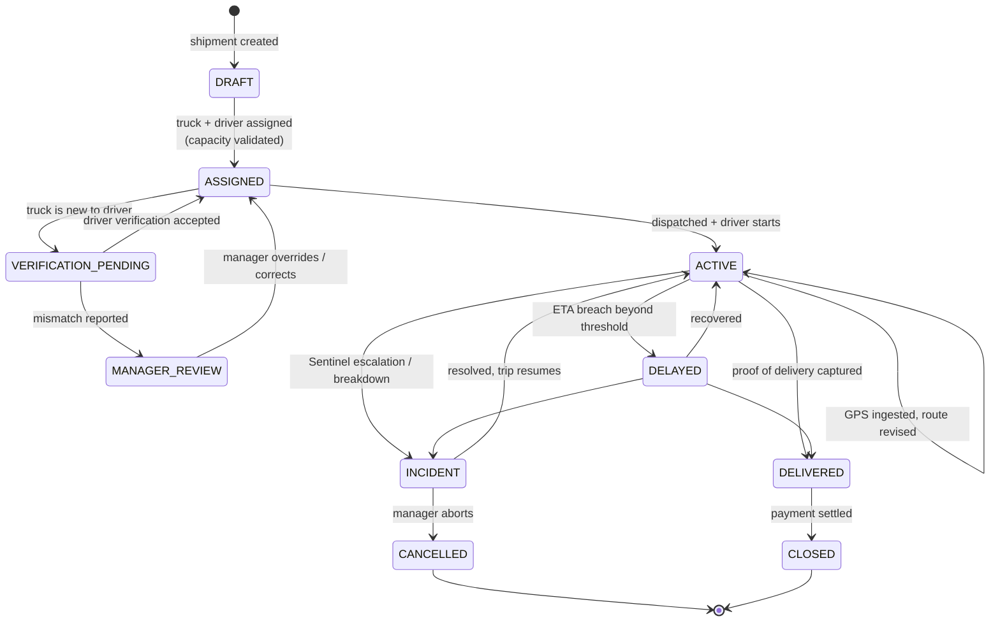
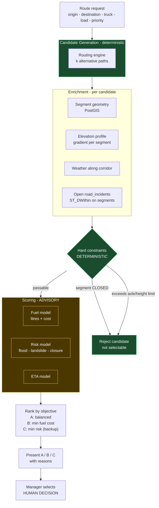
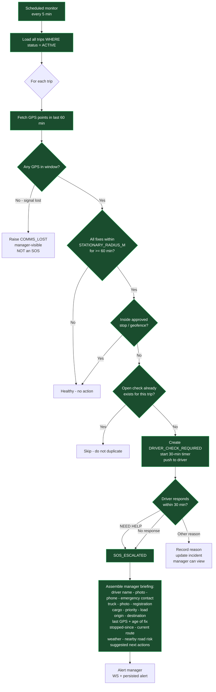
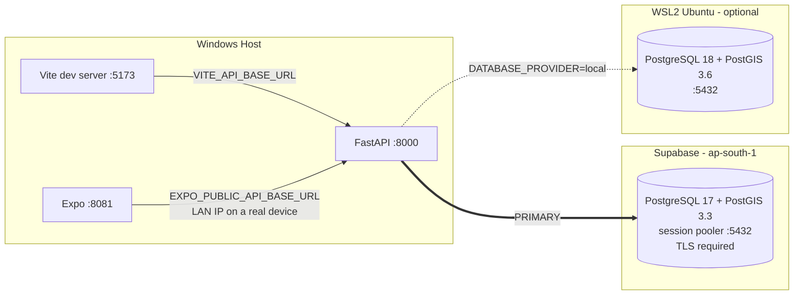

# Architecture

> **Read this document before modifying system structure.** Changes to service boundaries, the
> AI/deterministic split, or the safety path must be reflected here in the same change.

---

## 1. Guiding Principles

1. **Deterministic core, advisory intelligence.** ML produces *estimates and rankings*. Deterministic
   code makes *decisions* that affect money, safety, capacity or compliance. See §8.
2. **One backend, two clients.** The manager web app and driver mobile app share one API. No
   business logic is duplicated in a client.
3. **The phone is an unreliable sensor.** Assume intermittent connectivity, clock skew and
   background-execution limits. GPS ingestion must be idempotent and accept batched, late data.
4. **External providers are replaceable.** Routing, weather and elevation sit behind interfaces so a
   provider outage or a licensing surprise is a configuration change, not a rewrite.
5. **Everything consequential is auditable.** Assignment, dispatch, reroute, escalation and payment
   transitions all write to `audit_logs`.

---

## 2. Diagram A — Complete System Architecture



Green = deterministic decision-making. Amber = advisory only, never authoritative.

---

## 3. Diagram B — Manager to Backend Flow



**Note the ordering.** Capacity is validated *before* routing and ML are consulted. A failed
capacity check costs nothing and cannot be overridden by a model.

---

## 4. Diagram C — Driver App to Backend Flow



---

## 5. Diagram D — Trip Lifecycle



Every transition is written to `audit_logs` with actor, timestamp and reason. `INCIDENT` is a
suspension, not a terminus — a stuck truck that resumes returns to `ACTIVE`.

---

## 6. Diagram E — Future Route Intelligence



**A closed road is never a low score — it is a rejection.** Models rank only survivors of the
deterministic filter, so no model output can route a truck onto a closed road.

---

## 7. Diagram F — Future Fleet Sentinel



**No LLM appears anywhere in this diagram, and none may be added.** Every branch is a comparison
against a configured threshold. This is a hard architectural constraint, not a preference.

Two distinctions that matter:

- **`COMMS_LOST` is not `SOS_ESCALATED`.** In NER, signal loss is routine. Conflating the two would
  produce constant false alarms and train managers to ignore the alert.
- **Idempotency.** The monitor runs every 5 minutes over a 60-minute window, so the same stationary
  condition is observed repeatedly. One open check per trip at a time.

---

## 8. Deterministic / AI Boundary

| Concern | Owner | Rationale |
| --- | --- | --- |
| Truck capacity validation | **Deterministic** | Safety and legal limit |
| Driver/truck assignment rules | **Deterministic** | Document validity is a compliance fact |
| Trip status transitions | **Deterministic** | Auditability |
| Sentinel stationary detection | **Deterministic** | Safety-critical; must be explainable |
| SOS escalation | **Deterministic** | Never gated on model availability |
| Salary, payments, expenses | **Deterministic** | Money |
| Document expiry enforcement | **Deterministic** | Compliance |
| Road closure hard filter | **Deterministic** | Physical impossibility |
| Fuel litres / cost estimate | *Advisory ML* | Estimate, shown with uncertainty |
| Route risk score | *Advisory ML* | Ranks survivors of the hard filter |
| ETA prediction | *Advisory ML* | Informational |
| Anomaly flagging | *Advisory ML* | Surfaces for human review |
| Incident narrative summarisation | *Advisory LLM* | Post-hoc reading aid only |

**Rule:** if the ML service is entirely unavailable, the platform must still dispatch trips,
track GPS, reroute around closures, and escalate SOS. Only estimates degrade. This is a testable
property — see [TESTING_STRATEGY.md](TESTING_STRATEGY.md) §9 failure injection.

---

## 9. Current Implementation State

As of Mission 1 (foundation), what actually exists:

| Component | State |
| --- | --- |
| FastAPI backend, config loading, `/health`, `/ready` | **Implemented** |
| PostgreSQL 18 + PostGIS 3.6, Alembic bootstrap migration | **Implemented** |
| Manager web shell reading real backend health | **Implemented** |
| Driver app shell reading real backend health | **Implemented** |
| Everything else in this document | **Specified only — not implemented** |

Do not read the diagrams above as a description of running code. They are the target.

---

## 10. Database Provider and Topology

### Primary: Supabase

**Supabase PostgreSQL is the primary database and the single source of truth.**

| Property | Value |
| --- | --- |
| Project region | `ap-south-1` (Mumbai) — lowest latency to the North East |
| PostgreSQL | 17.6 |
| PostGIS | 3.3, installed in the `extensions` schema |
| Connection | Session pooler, port 5432 |

**Why the session pooler rather than a direct connection.** `db.<ref>.supabase.co`
resolves to IPv6 only. The pooler (`*.pooler.supabase.com`) is reachable over IPv4,
which removes a dependency on the developer's network and on venue wifi during the
demo. Between the two pooler modes:

- **Session pooler (5432)** — a real PostgreSQL session per connection. Supports
  prepared statements, which psycopg uses, and supports DDL, which Alembic needs.
  **This is what both runtime and migrations use.**
- **Transaction pooler (6543)** — multiplexes statements across connections.
  Breaks prepared statements and is unsafe for Alembic. Deliberately not used.

`MIGRATION_DATABASE_URL` exists so migrations can be pointed at a different
connection later without touching the runtime one; it defaults to `DATABASE_URL`.

### Provider selection — no silent fallback

```
DATABASE_PROVIDER=supabase  ->  DATABASE_URL        (rejected if it names a local host)
DATABASE_PROVIDER=local     ->  LOCAL_DATABASE_URL  (requires scripts\db-start.ps1)
```

There is **no code path** that lets Supabase mode fall back to the local database.
If Supabase is unreachable, `/ready` returns 503. Quietly serving a stale local
copy would let the application look healthy while returning the wrong data — a far
worse outcome than an honest outage, and impossible to notice during a demo.

This is enforced in `Settings._validate_provider_selection` and covered by tests
that run **while the local database is reachable**, so a fallback would be caught.

### Optional local fallback

The Mission 1 WSL2 PostgreSQL 18 + PostGIS 3.6 install is intact and remains
useful for offline work. It is opt-in only: set `DATABASE_PROVIDER=local` and run
`scripts\db-start.ps1`. Normal Supabase development does **not** require that
script.

Note the two are not identical — Supabase runs PostgreSQL 17 / PostGIS 3.3 against
local PostgreSQL 18 / PostGIS 3.6. Nothing this project uses differs between them,
but migrations are authored against Supabase, which is the lower version.



Clients never talk to Supabase directly. Every read and write goes through
FastAPI, so authorisation, capacity rules and the safety path cannot be bypassed
by a client holding a key.

One caveat worth recording: a physical phone running Expo Go cannot reach the
Windows host on `localhost`. It must use the host LAN IP, and Windows Firewall
must permit inbound 8000. The Android emulator uses `10.0.2.2` instead. See
[README.md](../README.md).

---

## 11. Future Supabase Services

Documented so the boundary is decided before anything is built. None of this is
implemented.

### Supabase Auth — *candidate, not yet adopted*

Roles will be `MANAGER` and `DRIVER` with the permission split in
[SECURITY.md](SECURITY.md) §2. Open question: Supabase Auth issues its own JWTs,
and FastAPI already needs to authorise every request. Adopting it means FastAPI
**verifies** Supabase-issued tokens rather than issuing its own. That is a real
simplification for password reset and phone OTP, and it is the likely choice — but
it must not become a second, parallel authorisation system. One authority only.

### Supabase Storage — *planned*

Buckets, all **private**, no public read:

`driver-photos` · `truck-photos` · `driver-documents` · `truck-documents` ·
`incident-photos` · `proof-of-delivery`

Access via short-lived signed URLs issued by FastAPI after an authorisation check,
matching [SECURITY.md](SECURITY.md) §4. EXIF stripping still happens server-side
before upload — Storage does not do it.

### Supabase Realtime — *deliberately NOT adopted for now*

We already have a FastAPI WebSocket design. Running both would create two
competing channels delivering overlapping events, and a demo failure in either
would be confusing to diagnose.

| Responsibility | Owner |
| --- | --- |
| GPS position updates to the manager map | **FastAPI WebSocket** |
| Trip status changes | **FastAPI WebSocket** |
| Route changes and hazard alerts | **FastAPI WebSocket** |
| Fleet Sentinel checks and SOS escalation | **FastAPI WebSocket** — safety path stays in one place |

Supabase Realtime would only be reconsidered if FastAPI WebSocket fan-out becomes
a real bottleneck, which at hackathon scale it will not. The decision is recorded
here so it is not revisited by accident.
