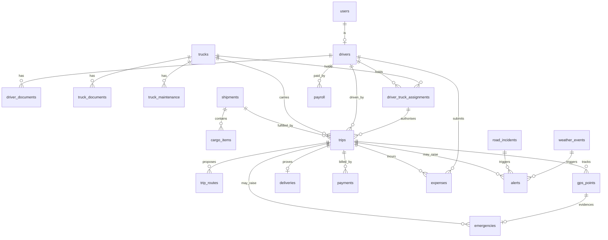

# Data Model

**Status: partially implemented.** Migrations `0001_bootstrap` and `0002_core_domain` are applied
to Supabase — 15 tables covering the operational spine. The financial, alerting and environmental
entities (`payments`, `expenses`, `payroll`, `deliveries`, `alerts`, `emergencies`,
`road_incidents`, `weather_events`) remain design-only and arrive with the phases that use them.
§13 states exactly what exists. Tables are introduced phase by phase per
[DEVELOPMENT_ROADMAP.md](DEVELOPMENT_ROADMAP.md).

---

## 1. Conventions

| Rule | Choice | Reason |
| --- | --- | --- |
| Primary keys | `UUID` (v4), `id` | No sequence contention; safe to generate client-side for offline driver records |
| Timestamps | `TIMESTAMPTZ`, always UTC | Never store naive local time |
| Soft delete | `deleted_at TIMESTAMPTZ NULL` on master data | Drivers/trucks are referenced by historical trips |
| Enums | PostgreSQL native `ENUM` | Enforced at DB level, not just in Python |
| Money | `NUMERIC(12,2)` + `currency CHAR(3)` | Never float |
| Weight | `NUMERIC(10,2)` kilograms | One unit everywhere; convert at the edge |
| Geometry | `geography(Point, 4326)` / `geography(LineString, 4326)` | `geography` gives metre-based distance without projection choices |
| Audit | Every consequential mutation writes `audit_logs` | Non-negotiable |
| **RLS** | **`ENABLE ROW LEVEL SECURITY` on every table, no policies** | **Supabase publishes `public` via its Data API; without RLS every table is readable with the anon key** |

**The RLS rule is not optional and applies to every table below.** See
[SECURITY.md](SECURITY.md) section 5. The backend connects as `postgres` and
bypasses RLS, so this costs the application nothing and closes a direct-read path
to driver documents and GPS traces.

**Why `geography` not `geometry`:** NER spans roughly 22–29°N. `ST_DWithin` on `geography`
returns true metres directly. With `geometry` in 4326 the units are degrees, and a degree of
longitude at 26°N is about 90 km versus 111 km for latitude — an easy and dangerous mistake in
proximity checks used for safety logic.

The cost of `geography` is a smaller function set and slower operations than a projected CRS.
For what this system does — distance, proximity, `ST_DWithin`, route length — that trade is
correct.

> ### ⚠ PostGIS does not reject inverted coordinates
>
> Verified against PostGIS 3.3 on Supabase: `ST_GeogFromText('POINT(26.1445 91.7362)')` —
> Guwahati with latitude and longitude swapped — **raises no error**. PostGIS reflects the
> out-of-range latitude over the pole and stores `88.2638`, a plausible-looking point in the
> Arctic Ocean about 7,000 km from Assam.
>
> **The database is therefore not a defence against latitude/longitude inversion.** The
> `Coordinate` bounds in `app/schemas/common.py` are the only layer that catches it, which makes
> them a safety control rather than input hygiene. Every coordinate entering the system must pass
> through `Coordinate`; no endpoint may accept raw floats.
>
> Pinned by `tests/test_geospatial.py::test_postgis_silently_wraps_an_out_of_range_latitude`.

---

## 2. Enumerations

```sql
CREATE TYPE user_role         AS ENUM ('ADMIN','MANAGER','DRIVER');
CREATE TYPE document_status   AS ENUM ('VALID','EXPIRING_SOON','EXPIRED','MISSING','REJECTED');
CREATE TYPE truck_status      AS ENUM ('AVAILABLE','ON_TRIP','MAINTENANCE','BREAKDOWN','RETIRED');
CREATE TYPE driver_status     AS ENUM ('AVAILABLE','ON_TRIP','OFF_DUTY','SUSPENDED');
CREATE TYPE assignment_status AS ENUM ('PENDING_VERIFICATION','ACTIVE','ENDED','REJECTED');
CREATE TYPE cargo_priority    AS ENUM ('LOW','NORMAL','HIGH','CRITICAL');
CREATE TYPE shipment_status   AS ENUM ('DRAFT','PLANNED','IN_TRANSIT','DELIVERED','CANCELLED');

CREATE TYPE trip_status       AS ENUM (
  'DRAFT','ASSIGNED','VERIFICATION_PENDING','MANAGER_REVIEW',
  'ACTIVE','DELAYED','INCIDENT','DELIVERED','CLOSED','CANCELLED');

CREATE TYPE route_kind        AS ENUM ('PRIMARY','FUEL_EFFICIENT','EMERGENCY_BACKUP');
CREATE TYPE route_state       AS ENUM ('PROPOSED','SELECTED','SUPERSEDED','REJECTED_BLOCKED');

CREATE TYPE incident_kind     AS ENUM (
  'LANDSLIDE','FLOOD','ROAD_CLOSURE','ACCIDENT','PROTEST_BANDH',
  'BRIDGE_DAMAGE','SNOW','CONSTRUCTION','OTHER');
CREATE TYPE incident_severity AS ENUM ('ADVISORY','RESTRICTED','IMPASSABLE');
CREATE TYPE incident_state    AS ENUM ('REPORTED','CONFIRMED','CLEARED','EXPIRED');

CREATE TYPE payment_status    AS ENUM ('PENDING','PARTIAL','PAID','OVERDUE','DISPUTED');
CREATE TYPE expense_kind      AS ENUM (
  'FUEL','TOLL','PARKING','LOADING','UNLOADING','REPAIR','FOOD','OTHER');
CREATE TYPE expense_state     AS ENUM ('SUBMITTED','APPROVED','REJECTED','REIMBURSED');
CREATE TYPE payroll_state     AS ENUM ('DRAFT','APPROVED','PAID');

CREATE TYPE alert_kind        AS ENUM (
  'DOCUMENT_EXPIRY','ROUTE_CHANGED','WEATHER_WARNING','ROAD_BLOCKED',
  'TRIP_DELAYED','COMMS_LOST','DRIVER_CHECK_REQUIRED','SOS','CAPACITY_VIOLATION');
CREATE TYPE alert_severity    AS ENUM ('INFO','WARNING','CRITICAL');

CREATE TYPE emergency_state   AS ENUM (
  'DRIVER_CHECK_REQUIRED','DRIVER_RESPONDED','SOS_ESCALATED','RESOLVED','FALSE_ALARM');
CREATE TYPE driver_check_response AS ENUM (
  'I_AM_SAFE','TRAFFIC','ROAD_BLOCKED','BREAKDOWN','REST_STOP',
  'LOADING','UNLOADING','MEDICAL_ISSUE','OTHER','NEED_HELP');
```

`driver_check_response` mirrors the driver button set in [PRODUCT_VISION.md](PRODUCT_VISION.md)
exactly. If a button is added to the app, the enum changes with it in the same migration.

---

## 3. Identity

### `users`
| Column | Type | Notes |
| --- | --- | --- |
| `id` | UUID PK | |
| `email` | CITEXT UNIQUE NULL | Managers/admins sign in with email |
| `phone` | VARCHAR(20) UNIQUE NULL | Drivers sign in with phone |
| `password_hash` | TEXT NOT NULL | Argon2id |
| `role` | `user_role` NOT NULL | |
| `is_active` | BOOLEAN NOT NULL DEFAULT true | |
| `last_login_at` | TIMESTAMPTZ NULL | |
| `created_at` / `updated_at` | TIMESTAMPTZ NOT NULL | |

- `CHECK (email IS NOT NULL OR phone IS NOT NULL)`
- Indexes: unique on `email`, unique on `phone`, `(role) WHERE is_active`

---

## 4. Driver Domain

### `drivers`
`id` UUID PK · `user_id` UUID FK→`users` UNIQUE · `full_name` · `photo_url` ·
`phone` · `emergency_contact_name` · `emergency_contact_phone` ·
`licence_number` UNIQUE · `licence_class` · `licence_expiry` DATE ·
`date_of_joining` DATE · `status` `driver_status` · `base_salary_monthly` NUMERIC(12,2) ·
`created_at` · `updated_at` · `deleted_at`

- Index: `(status) WHERE deleted_at IS NULL`, `(licence_expiry)` for the expiry sweep.

### `driver_documents`
`id` · `driver_id` FK→`drivers` ON DELETE CASCADE · `doc_type` · `doc_number` ·
`file_url` · `issued_on` DATE · `expires_on` DATE NULL · `status` `document_status` ·
`verified_by` FK→`users` NULL · `verified_at` · `created_at`

- Index: `(driver_id, doc_type)`, `(expires_on) WHERE status <> 'EXPIRED'`
- `status` is **derived** by a scheduled job from `expires_on`, never hand-edited.

---

## 5. Truck Domain

### `trucks`
`id` · `registration_number` UNIQUE NOT NULL · `photo_url` · `truck_type` · `make` · `model` ·
`manufacture_year` · `max_capacity_kg` NUMERIC(10,2) NOT NULL CHECK > 0 ·
`current_load_kg` NUMERIC(10,2) DEFAULT 0 CHECK >= 0 · `axle_count` ·
`height_m` / `length_m` NUMERIC(5,2) · `fuel_tank_capacity_l` ·
`baseline_mileage_kmpl` NUMERIC(5,2) NULL · `odometer_km` ·
`status` `truck_status` · `created_at` · `updated_at` · `deleted_at`

- `CHECK (current_load_kg <= max_capacity_kg)` — capacity enforced at the **database** level, so
  application logic cannot be the only thing standing between a bug and an overloaded truck.
- `baseline_mileage_kmpl` is the fallback the fuel *baseline* uses when the ML model is unavailable.

### `truck_documents`
Same shape as `driver_documents`, keyed on `truck_id`. `doc_type` covers RC, insurance, fitness,
PUC, national/state permits.

### `truck_maintenance`
`id` · `truck_id` FK · `event_type` (SERVICE / REPAIR / BREAKDOWN / INSPECTION) ·
`description` · `odometer_km` · `cost` NUMERIC(12,2) · `performed_on` DATE ·
`next_due_on` DATE NULL · `created_at`

- Index: `(truck_id, performed_on DESC)`

---

## 6. Assignment

### `driver_truck_assignments`
`id` · `driver_id` FK · `truck_id` FK · `assigned_by` FK→`users` ·
`status` `assignment_status` · `assigned_at` · `verification_photo_url` NULL ·
`reported_odometer_km` NULL · `reported_fuel_level_pct` NULL ·
`reported_damage_notes` TEXT NULL · `verified_at` NULL ·
`mismatch_flagged` BOOLEAN DEFAULT false · `manager_review_note` TEXT NULL · `ended_at` NULL

- **Partial unique index** — one active truck per driver and one active driver per truck:
  ```sql
  CREATE UNIQUE INDEX uq_active_assignment_driver
    ON driver_truck_assignments (driver_id) WHERE status = 'ACTIVE';
  CREATE UNIQUE INDEX uq_active_assignment_truck
    ON driver_truck_assignments (truck_id)  WHERE status = 'ACTIVE';
  ```
  This is the cleanest way to express "at most one current assignment" while retaining full
  history. It is a database guarantee, not a convention.

---

## 7. Shipment and Trip

### `shipments`
`id` · `reference_code` UNIQUE · `client_name` · `client_contact` ·
`pickup_address` · `pickup_location` `geography(Point,4326)` NOT NULL ·
`destination_address` · `destination_location` `geography(Point,4326)` NOT NULL ·
`total_weight_kg` NUMERIC(10,2) · `priority` `cargo_priority` ·
`scheduled_pickup_at` · `expected_delivery_at` ·
`status` `shipment_status` · `created_by` FK→`users` · `created_at` · `updated_at`

- GIST index on both geography columns.

### `cargo_items`
`id` · `shipment_id` FK ON DELETE CASCADE · `cargo_type` · `cargo_name` ·
`weight_kg` NUMERIC(10,2) CHECK > 0 · `quantity` INT CHECK > 0 ·
`is_hazardous` BOOLEAN · `is_perishable` BOOLEAN · `handling_notes`

- `shipments.total_weight_kg` is maintained as `SUM(weight_kg * quantity)` by trigger, and is the
  value compared against `trucks.max_capacity_kg`.

### `trips`
`id` · `trip_code` UNIQUE · `shipment_id` FK · `truck_id` FK · `driver_id` FK ·
`assignment_id` FK→`driver_truck_assignments` ·
`status` `trip_status` NOT NULL DEFAULT 'DRAFT' ·
`selected_route_id` FK→`trip_routes` NULL ·
`dispatched_at` · `started_at` · `delivered_at` · `closed_at` ·
`planned_eta` · `current_eta` · `delay_minutes` INT ·
`payment_status` `payment_status` DEFAULT 'PENDING' ·
`created_by` FK→`users` · `created_at` · `updated_at`

- Indexes: **`(status) WHERE status IN ('ACTIVE','DELAYED')`** — the Fleet Sentinel monitor query
  runs every 5 minutes and must never table-scan; `(truck_id, created_at DESC)`;
  `(driver_id, created_at DESC)`.
- `selected_route_id` is nullable and deliberately creates a cycle with `trip_routes.trip_id`. The
  FK is `DEFERRABLE INITIALLY DEFERRED` so both rows can be written in one transaction.

### `trip_routes`
`id` · `trip_id` FK ON DELETE CASCADE · `kind` `route_kind` · `state` `route_state` ·
`geometry` `geography(LineString,4326)` NOT NULL · `distance_km` NUMERIC(8,2) ·
`estimated_duration_min` INT · `estimated_fuel_litres` NUMERIC(8,2) NULL ·
`estimated_fuel_cost` NUMERIC(12,2) NULL · `fuel_estimate_source` VARCHAR(32) NULL ·
`risk_score` NUMERIC(4,3) NULL · `risk_factors` JSONB ·
`routing_provider` VARCHAR(32) · `provider_route_id` · `superseded_by` FK self NULL ·
`created_at`

- GIST index on `geometry` — required for `ST_DWithin` against incident locations.
- **Nullable estimate columns are deliberate.** A null fuel estimate means "not available", which
  the UI must render as such. It must never be silently defaulted to zero or to a made-up figure.
- `fuel_estimate_source` records `MODEL_V1` / `BASELINE_KMPL` / `NULL` so any displayed number can
  be traced to what produced it.
- Rerouting inserts a **new** row and sets `superseded_by` on the old one. Route history is never
  overwritten — it is evidence in an incident review.

---

## 8. Telemetry

### `gps_points`
| Column | Type | Notes |
| --- | --- | --- |
| `id` | BIGSERIAL PK | High volume; UUID is unnecessary overhead here |
| `trip_id` | UUID FK | |
| `driver_id` / `truck_id` | UUID FK | Denormalised for query speed |
| `location` | `geography(Point,4326)` NOT NULL | |
| `altitude_m` | NUMERIC(7,2) NULL | |
| `speed_kmph` | NUMERIC(6,2) NULL | |
| `heading_deg` | NUMERIC(5,2) NULL | |
| `accuracy_m` | NUMERIC(7,2) NULL | Fixes worse than a threshold are stored but excluded from Sentinel |
| `device_fix_id` | UUID NOT NULL | Client-generated, for idempotency |
| `recorded_at` | TIMESTAMPTZ NOT NULL | Device clock |
| `received_at` | TIMESTAMPTZ NOT NULL DEFAULT now() | Server clock |
| `is_mock_location` | BOOLEAN DEFAULT false | Reported by Android; see [SECURITY.md](SECURITY.md) |

- `UNIQUE (trip_id, device_fix_id)` — makes the offline replay queue safely retryable. A driver app
  that resends a buffered batch after a timeout cannot create duplicates.
- Index `(trip_id, recorded_at DESC)`, GIST on `location`.
- **Both clocks are stored.** Staleness and the Sentinel timers use `received_at`, because a phone
  with a wrong clock must not be able to defeat the safety rule.
- Growth: ~2 fixes/min/truck ≈ 2,880/day/truck. Partition by month if the demo fleet grows;
  unnecessary at hackathon scale.

---

## 9. Environment

### `road_incidents`
`id` · `kind` `incident_kind` · `severity` `incident_severity` · `state` `incident_state` ·
`location` `geography(Point,4326)` · `affected_segment` `geography(LineString,4326)` NULL ·
`radius_m` INT · `description` · `source` (MANUAL / API / DRIVER_REPORT) ·
`reported_by` FK→`users` NULL · `reported_at` · `expected_clear_at` NULL · `cleared_at` NULL

- GIST on both geography columns.
- Impact query: a trip is affected when its selected route intersects an incident.
  ```sql
  SELECT DISTINCT t.id
  FROM trips t
  JOIN trip_routes r ON r.id = t.selected_route_id
  JOIN road_incidents i ON ST_DWithin(r.geometry, i.location, i.radius_m)
  WHERE t.status IN ('ACTIVE','DELAYED')
    AND i.state = 'CONFIRMED' AND i.severity = 'IMPASSABLE';
  ```
- `severity = 'IMPASSABLE'` is the hard filter in Diagram E. `ADVISORY` and `RESTRICTED` feed the
  risk score instead.

### `weather_events`
`id` · `area` `geography(Polygon,4326)` · `event_type` (RAIN / HEAVY_RAIN / FLOOD_WARNING /
LANDSLIDE_RISK / STORM) · `severity` · `rainfall_mm` · `valid_from` · `valid_until` ·
`source` · `raw_payload` JSONB · `fetched_at`

- `raw_payload` retains the provider response verbatim so a scoring change can be re-run against
  history without re-fetching.

---

## 10. Financial

### `payments`
`id` · `trip_id` FK · `amount` NUMERIC(12,2) · `currency` CHAR(3) DEFAULT 'INR' ·
`status` `payment_status` · `due_date` · `paid_amount` NUMERIC(12,2) DEFAULT 0 ·
`settled_at` NULL · `notes` · `created_at` · `updated_at`

- `CHECK (paid_amount <= amount)`.
- **No gateway fields, no card data, no tokens.** This table records state a human asserts. See
  [MVP_SCOPE.md](MVP_SCOPE.md) out-of-scope table.

### `expenses`
`id` · `trip_id` FK · `driver_id` FK · `kind` `expense_kind` · `amount` NUMERIC(12,2) ·
`receipt_url` NULL · `incurred_at` · `state` `expense_state` ·
`approved_by` FK→`users` NULL · `approved_at` NULL · `rejection_reason` NULL

### `payroll`
`id` · `driver_id` FK · `period_month` DATE (first of month) · `base_salary` ·
`allowances` · `advances` · `deductions` · `net_payable` NUMERIC(12,2) ·
`state` `payroll_state` · `approved_by` FK NULL · `paid_at` NULL

- `UNIQUE (driver_id, period_month)`.
- `net_payable` is computed by deterministic backend code and stored. **No model may write here.**

---

## 11. Operations

### `deliveries` (proof of delivery)
`id` · `trip_id` FK UNIQUE · `received_by_name` · `received_by_phone` ·
`signature_url` · `photo_urls` TEXT[] · `delivered_at` ·
`delivery_location` `geography(Point,4326)` · `notes` ·
`geofence_ok` BOOLEAN — whether capture happened within an acceptable radius of the destination

### `alerts`
`id` · `kind` `alert_kind` · `severity` `alert_severity` · `title` · `body` ·
`trip_id` / `driver_id` / `truck_id` FK NULL · `payload` JSONB ·
`target_role` `user_role` · `target_user_id` FK NULL ·
`created_at` · `acknowledged_by` FK NULL · `acknowledged_at` NULL

- Index `(target_role, created_at DESC) WHERE acknowledged_at IS NULL`.

### `emergencies`
| Column | Notes |
| --- | --- |
| `id` | UUID PK |
| `trip_id` | FK |
| `state` | `emergency_state` |
| `triggered_at` | When the stationary condition was confirmed |
| `stationary_since` | Start of the stationary window |
| `last_gps_point_id` | BIGINT FK→`gps_points` |
| `check_sent_at` | |
| `response_deadline_at` | `check_sent_at + 30 min`, stored not computed |
| `driver_response` | `driver_check_response` NULL |
| `responded_at` | NULL |
| `escalated_at` | NULL |
| `resolved_at` / `resolved_by` / `resolution_note` | NULL |
| `briefing_snapshot` | JSONB |

- **Partial unique index — the single most important constraint in the safety path:**
  ```sql
  CREATE UNIQUE INDEX uq_open_emergency_per_trip ON emergencies (trip_id)
    WHERE state IN ('DRIVER_CHECK_REQUIRED','DRIVER_RESPONDED','SOS_ESCALATED');
  ```
  The monitor runs every 5 minutes against a 60-minute window, so it re-observes the same
  stationary truck ~12 times. Without this index a single stuck truck generates a dozen
  emergencies and a dozen driver notifications. Enforcing it in the database means a monitor bug
  cannot spam a driver.
- `response_deadline_at` is **stored, not derived**, so the 30-minute window is unaffected by a
  later configuration change.
- `briefing_snapshot` freezes the full manager briefing at escalation time. The truck may move and
  the weather may change afterwards; the incident record must show what was true when it fired.

### `audit_logs`
`id` BIGSERIAL · `actor_user_id` FK NULL (null = system/scheduler) · `action` VARCHAR(64) ·
`entity_type` · `entity_id` UUID · `before` JSONB NULL · `after` JSONB NULL ·
`reason` TEXT NULL · `ip_address` INET NULL · `created_at`

- Index `(entity_type, entity_id, created_at DESC)`.
- Append-only: `REVOKE UPDATE, DELETE` from the application role.

---

## 12. Entity Relationships



---

## 13. What Is Actually Implemented

### Migration 0002 — the P2 operational spine

Fifteen tables, implemented and tested against Supabase:

`users` · `drivers` · `driver_documents` · `trucks` · `truck_documents` ·
`truck_maintenance` · `driver_truck_assignments` · `shipments` · `cargo_items` ·
`trips` · `trip_stops` · `trip_routes` · `trip_events` · `gps_points` · `audit_logs`

Two entities were added beyond the original design in this document:

- **`trip_stops`** — the ordered execution sequence for a trip. `shipments` carries the
  *commercial* pickup and destination; `trip_stops` carries the *operational* sequence, which may
  include rest, fuel and checkpoint stops. This is what Fleet Sentinel will later treat as an
  approved stationary location.
- **`trip_events`** — the append-only operational timeline (what happened on the road), distinct
  from `audit_logs` (who changed which record, for compliance).

Three database mechanisms enforce invariants that application code alone could not:

| Mechanism | Guarantee |
| --- | --- |
| `trg_audit_logs_append_only` | `audit_logs` rejects UPDATE and DELETE. A trigger, not a GRANT, because the application connects as the table owner and an owner cannot be denied by privilege. |
| `trg_cargo_items_recalc_weight` | `shipments.total_weight_kg` is derived from `cargo_items`. It is the value compared against truck capacity, so a client must not be able to declare it. |
| `set_updated_at()` on 5 tables | `updated_at` cannot be forged by a client and is maintained for raw SQL too. Uses `now()` (transaction time), so all rows changed by one operation share a timestamp. |

Still not implemented, deliberately: `road_incidents`, `weather_events`, `payments`, `expenses`,
`payroll`, `deliveries`, `alerts`, `emergencies`. Each arrives with the phase that uses it.

### Migration 0001 — bootstrap

The bootstrap migration (`backend/alembic/versions/`) creates exactly three things,
against **Supabase** (PostgreSQL 17.6, PostGIS 3.3):

1. `CREATE EXTENSION IF NOT EXISTS postgis` — into the `extensions` schema on Supabase
   (its convention, and already on the `postgres` role's `search_path`), or the default
   schema on a local database. One migration, both providers.
2. A `system_info` table holding a schema marker row, with one `geography(Point,4326)` column
   populated with a reference point (Guwahati, 91.7362 26.1445) so the PostGIS type is exercised
   end-to-end rather than merely installed.
3. `ALTER TABLE system_info ENABLE ROW LEVEL SECURITY` - see the RLS rule in section 1.

No domain table above exists yet. Phase P2 introduces `users`, `drivers`, `trucks` and
`driver_truck_assignments` — see [DEVELOPMENT_ROADMAP.md](DEVELOPMENT_ROADMAP.md).
