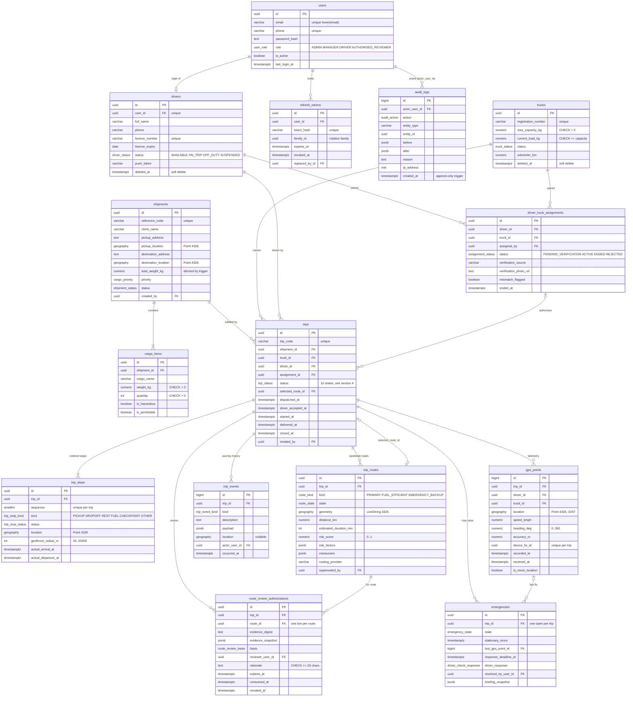

# RASTA AI — Database Schema and ER Diagram (Day 2 · Task 1)

**Source of truth:** the SQLAlchemy models in `backend/app/models/` and the Alembic chain
`backend/alembic/versions/0001 … 0012` (linear, head `0012_push_notifications`). Everything on
this page was generated from `Base.metadata` and checked against a live database on
19 Sep 2026 (`alembic current` = `0012_push_notifications (head)`; 20 domain tables + `alembic_version`
+ `system_info`; 41 foreign keys; 36 named CHECK constraints; 75 indexes; 20 PostgreSQL enum types;
PostGIS 3.6 locally, 3.3 on Supabase; Row Level Security enabled on every table).

Rendered image: [`docs/submission/day2/task1/er-diagram.png`](submission/day2/task1/er-diagram.png)
(from the Mermaid source below via `docs/submission/day2/task1/render_er.mjs`).

Conventions (see `docs/DATA_MODEL.md` §1): `UUID` primary keys, `TIMESTAMPTZ` everywhere,
PostgreSQL native `ENUM`s, `NUMERIC` for money and weight, PostGIS `geography(Point|LineString, 4326)`
for every coordinate, soft delete (`deleted_at`) on master data, append-only `audit_logs`.

---

## 1. Core operational ER diagram

The 14 tables a judge needs to follow a shipment from a manager's plan to a driver's delivery.
Reference tables (documents, maintenance, files, push notifications, refresh tokens) are listed in §3.

---

## 2. How to read it — the relationships in words

| Relationship | Cardinality | Enforced by |
| --- | --- | --- |
| A **user** is the login behind at most one **driver** | `users 1 — 0..1 drivers` | `drivers.user_id` UNIQUE, NOT NULL, FK → `users.id` |
| A **driver** and a **truck** are paired through **driver_truck_assignments**; only one *open* pairing per driver and per truck | `drivers 1 — 0..n assignments`, `trucks 1 — 0..n assignments` | partial unique indexes `uq_current_assignment_driver`, `uq_current_assignment_truck` (partial: open statuses only), migration 0006 |
| A **shipment** carries the commercial order and at least one **cargo item**; its `total_weight_kg` is *derived* from the items | `shipments 1 — 1..n cargo_items` | trigger `trg_cargo_items_recalc_weight` (0002) — a client cannot declare the weight the capacity check uses |
| A **trip** executes one shipment with one truck and one driver, optionally citing the assignment that authorised the pairing | `shipments 1 — 0..n trips` | FKs `trips.shipment_id`, `truck_id`, `driver_id` NOT NULL; `assignment_id` nullable |
| A trip has an **ordered stop list** | `trips 1 — 1..n trip_stops` | `uq_trip_stops_sequence (trip_id, sequence)`; geofence radius CHECK 10–20 000 m |
| A trip has **candidate routes**, and at most one of them is *selected* | `trips 1 — 0..n trip_routes`; `trips.selected_route_id → trip_routes.id` | FK; `trip_routes.superseded_by` is a self-reference used when a reroute replaces a road |
| Every consequential moment on the road is a **trip event** (journey history), distinct from **audit_logs** (who changed which record) | `trips 1 — 0..n trip_events` | `trip_events.kind` enum; `audit_logs` is append-only by trigger `trg_audit_logs_append_only` (0004) |
| The driver app streams **gps_points**; a replayed offline batch cannot duplicate a fix | `trips 1 — 0..n gps_points` | `uq_gps_trip_device_fix (trip_id, device_fix_id)`; GIST index on `location` |
| A route with incomplete hazard evidence may carry one live **review authorisation**, spent by the selection | `trip_routes 1 — 0..1 live authorisation` | partial unique `uq_rra_one_live_per_route`; CHECKs on rationale length, expiry, consumed/revoked exclusivity (0007) |
| Fleet Sentinel raises at most one open **emergency** per trip, anchored to the last GPS fix | `trips 1 — 0..1 open emergency` | partial unique `uq_open_emergency_per_trip` (0010) |
| A user's sessions are **refresh tokens** in rotation families | `users 1 — 0..n refresh_tokens` | `uq_refresh_tokens_hash`; `replaced_by_id` self-reference; reuse of a rotated token revokes the family (0003) |

---

## 3. Complete table inventory (20 domain tables)

| Table | Purpose | PK | Important FKs | Migration |
| --- | --- | --- | --- | --- |
| `users` | Every login; role decides the permission set | `id uuid` | — | 0002 |
| `refresh_tokens` | Rotating session tokens (family, revocation, replaced_by) | `id uuid` | `user_id → users`, `replaced_by_id → refresh_tokens` | 0003 |
| `drivers` | Driver profile, licence, status, push token, soft delete | `id uuid` | `user_id → users` (unique) | 0002, 0012 (push_token) |
| `driver_documents` | Licence / ID papers with verification status | `id uuid` | `driver_id → drivers`, `verified_by → users` | 0002 |
| `trucks` | Vehicle master data, capacity, load, status, soft delete | `id uuid` | — | 0002 |
| `truck_documents` | RC / insurance / permit / fitness with expiry | `id uuid` | `truck_id → trucks`, `verified_by → users` | 0002 |
| `truck_maintenance` | Service history | `id uuid` | `truck_id → trucks` | 0002 |
| `driver_truck_assignments` | Driver↔truck pairing with physical verification | `id uuid` | `driver_id`, `truck_id`, `assigned_by → users` | 0002, 0006, 0011 |
| `shipments` | Commercial order: client, pickup/destination (PostGIS), priority | `id uuid` | `created_by → users` | 0002 |
| `cargo_items` | Line items; drives `shipments.total_weight_kg` | `id uuid` | `shipment_id → shipments` | 0002 |
| `trips` | Execution of a shipment: state machine, timestamps, selected route | `id uuid` | `shipment_id`, `truck_id`, `driver_id`, `assignment_id`, `selected_route_id → trip_routes`, `driver_accepted_by → drivers`, `created_by → users` | 0002, 0008 |
| `trip_stops` | Ordered operational stops with geofences | `id uuid` | `trip_id → trips` | 0002 |
| `trip_routes` | Candidate and selected roads (LineString), risk, manoeuvres | `id uuid` | `trip_id → trips`, `superseded_by → trip_routes` | 0002, 0009 (maneuvers) |
| `trip_events` | Append-only journey timeline | `id bigint` | `trip_id → trips`, `actor_user_id → users` | 0002, 0005 |
| `gps_points` | Telemetry, one row per device fix | `id bigint` | `trip_id`, `driver_id`, `truck_id` | 0002 |
| `route_review_authorizations` | Single-use authorisation to select a REQUIRES_REVIEW route | `id uuid` | `trip_id`, `route_id → trip_routes`, `reviewer_user_id`, `consumed_by_user_id`, `revoked_by_user_id → users` | 0007 |
| `emergencies` | Fleet Sentinel incidents (stationary truck → check → escalation) | `id uuid` | `trip_id → trips`, `last_gps_point_id → gps_points`, `resolved_by_user_id → users` | 0010 |
| `stored_files` | Private binary files (verification photos), max 5 MiB, served through `/api/files/{id}` | `id uuid` | `owner_driver_id → drivers`, `uploaded_by_user_id → users` | 0011 |
| `driver_notifications` | Push/notice log with de-duplication fingerprint | `id uuid` | `driver_id → drivers`, `trip_id → trips` | 0012 |
| `audit_logs` | Who changed what, before/after JSON, IP; UPDATE/DELETE rejected by trigger | `id bigint` | `actor_user_id → users` (ON DELETE RESTRICT) | 0002, 0004 |

Plus `system_info` (bootstrap marker with one `geography(Point)` row exercising PostGIS, 0001)
and `alembic_version`.

---

## 4. Enumerations (PostgreSQL native, 20 types)

`user_role`, `driver_status`, `truck_status`, `assignment_status`, `shipment_status`, `cargo_priority`,
`trip_status`, `trip_stop_kind`, `trip_stop_status`, `route_kind`, `route_state`, `trip_event_kind`,
`audit_action`, `document_status`, `driver_document_type`, `truck_document_type`, `maintenance_kind`,
`route_review_basis`, `emergency_state`, `driver_check_response`.
Python mirrors live in `backend/app/models/enums.py`; a value is added in the same migration as the
feature that needs it (`tests/test_schema_drift.py::test_no_drift_between_models_and_database` fails otherwise).

## 5. Integrity the database enforces on its own

- **Capacity:** `ck_trucks_load_within_capacity` (`current_load_kg <= max_capacity_kg`) and the derived
  shipment weight together mean an overloaded truck cannot be *stored*, whatever a client sends.
- **Time ordering:** `ck_trips_started_after_dispatched`, `ck_trips_delivered_after_started`,
  `ck_trips_closed_after_delivered`, `ck_assignment_ended_after_assigned`, `ck_refresh_expiry_after_issue`.
- **Telemetry sanity:** speed ≥ 0, heading in [0, 360), accuracy ≥ 0, unique `(trip_id, device_fix_id)`.
- **Governance:** review rationale ≥ 20 characters; consumed and revoked are mutually exclusive; both
  consumption and revocation must name the person (`num_nonnulls(...) IN (0, 2)`).
- **History:** `audit_logs` cannot be updated or deleted (trigger — the app connects as table owner, so a
  GRANT could not do this); `updated_at` is set by trigger on 5 tables.
- **Spatial indexes:** GIST on `shipments.pickup_location`, `shipments.destination_location`,
  `trip_stops.location`, `trip_routes.geometry`, `gps_points.location`.
