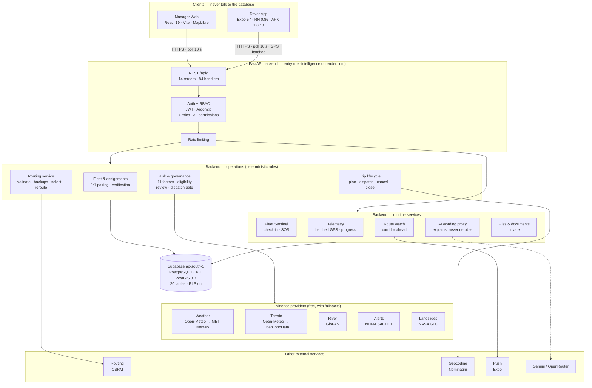
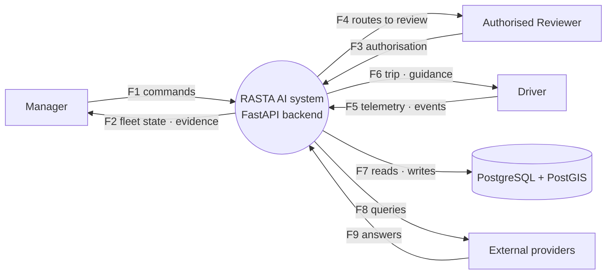
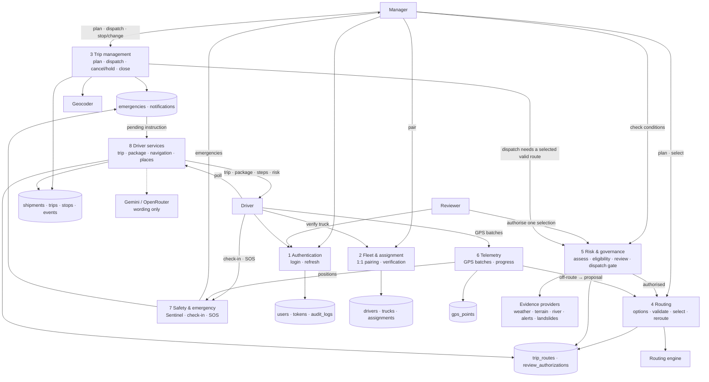

# RASTA AI
## SIH 2026 — Day 1 Task 1
### Problem Understanding, Solution Planning & System Design

| | |
| --- | --- |
| **Problem statement** | SIH26002 — AI-Based Smart Logistics and Accessibility Intelligence Platform for the North Eastern Region (MDoNER, Smart Automation) |
| **Team** | NER-AI LOGISTICS (Team 17) |
| **Product name** | RASTA AI |
| **Document** | Day 1 · Task 1 · Problem Understanding, Solution Planning & System Design |
| **Prepared** | 18 September 2026 |
| **Repository state at time of writing** | branch `main`, commit `9f28321` (16 Sep 2026), 106 commits |
| **Evidence basis** | Source code, API routers, Alembic migrations, test suites, configuration files, deployment descriptor, hosted-deployment certification logs (`docs/terrain/HANDOFF.md` §7–§17) |

**How to read this document.** Every capability carries one of six status labels: **IMPLEMENTED**, **PARTIALLY IMPLEMENTED**, **NOT IMPLEMENTED**, **BROKEN**, **BLOCKED**, **NEEDS TESTING**. A label is given only when the evidence named beside it exists in the repository or in a certification log. Where evidence is missing the entry says **NOT VERIFIED**. No accuracy percentage is claimed anywhere in this document, because no predictive model has been evaluated on a held-out set (`docs/AI_MODELS.md` §0).

---

## Table of contents

1. Problem Statement Understanding
2. Proposed Solution
3. Unique Key Features
4. Target Users
5. System Architecture
6. Workflow / User Flow Diagram
7. Data Flow Diagram
8. Module Definition
9. Technology Stack
10. Technology Justification
11. Scalability Analysis
12. Security
13. Failure & Degradation Strategy
14. Implementation Status Matrix
15. Final System Flowchart
16. Completion Report

---

## 1. Problem Statement Understanding

### 1.1 Problem Context

Freight movement in the North Eastern Region (NER) of India runs over a small number of long, hilly corridors: Guwahati–Shillong, Guwahati–Silchar, Guwahati–Itanagar, Dimapur–Kohima–Imphal. These roads share operating conditions that mainstream logistics tooling was not designed for.

- **Difficult road conditions.** Steep gradients, single-carriageway hill sections and monsoon damage. The project's own terrain sampling (Copernicus DEM through Open-Meteo, SRTM through OpenTopoData) is used precisely because gradient matters on these corridors (`backend/app/services/terrain.py`).
- **Long-distance transportation with few alternatives.** Measured against the live routing provider on eight real NER corridors, six have exactly one sensible road and two have a second corridor; never three (comment in `manager-web/src/components/TripRouteReview.tsx`). When the one road is cut, the truck waits.
- **Route disruption from landslides and floods.** The NASA Global Landslide Catalog records repeated slides within 5 km of these roads (the project ships a 2007–2017 snapshot; `backend/app/services/landslide/history.py`). River discharge on the Brahmaputra tributaries drives seasonal closures (GloFAS discharge context, `backend/app/domain/flood.py`).
- **Extreme weather.** Monsoon rainfall intensities above 3 mm/h on a corridor point are the project's own rain-exposure trigger (`backend/app/domain/route_risk.py`, `MAX_RAIN_POINTS = 45`).
- **Weak or intermittent connectivity.** A truck loses mobile data for long stretches; signal bars do not mean data. The driver application therefore derives its connection status from whether its last server poll succeeded, never from the operating system's "online" flag (`driver-app/src/trip/TripProvider.tsx`, `isStale`).
- **Lack of timely driver information.** Official disaster alerts (NDMA SACHET) are published as a national CAP feed; nothing filters them to the district a specific truck is entering.
- **Emergency situations.** A stationary truck on a hill road for an hour with no contact is either a rest stop or an accident; a fleet office cannot tell which without a check-in mechanism.
- **Route visibility for fleet managers.** Managers see a planned corridor but not the observed track, so a truck that has left the road is invisible until it phones in.
- **Driver safety and language.** Drivers on NER corridors speak Assamese, Bengali, Bodo, Manipuri, Nepali, Hindi and English; safety guidance in English only is guidance for some.
- **Inefficient routing and dependency on continuous internet.** Consumer navigation assumes the internet is always there and that the shortest road is the best road.

### 1.2 Existing System Limitations

Conventional navigation and fleet tools are excellent at what they were built for. The gaps below are specific to this use case, not criticism of those products.

| Limitation | What it means on an NER corridor |
| --- | --- |
| Internet-dependent information | Map tiles, rerouting and alerts stop the moment data drops. The driver is left with a frozen screen exactly where the road is hardest. |
| Limited route-risk awareness | Consumer routing optimises time and distance. It has no notion of landslide history, river discharge, terrain gradient or an active district alert. |
| Disconnected logistics tools | Trip planning, driver assignment, vehicle tracking and safety information usually live in separate systems (or a WhatsApp group). |
| Weak offline preparedness | Nothing is pre-downloaded for the road ahead; there is no bundled emergency guidance; nothing tells the driver how stale the last information is. |
| Limited manager–driver coordination | A route change, a cancellation after pickup or a "stop and wait" instruction has no acknowledged, audited path from office to cab. |
| Insufficient route-specific safety intelligence | An "all clear" is shown when the system simply has no data. On a hill road, unknown is not safe. |

### 1.3 Core Problem

> Transport operators and drivers working across difficult, hazard-prone and connectivity-constrained corridors of the North Eastern Region need one platform that combines fleet and trip management, real road routing, evidence-based route risk assessment with a human authorisation step, near-live vehicle tracking, driver safety and emergency support, and a controlled offline mode — where every displayed judgement carries its evidence and its freshness, and where missing evidence is never presented as safety.

This statement is sharpened from the original brief by two findings in the project's own logs: the 2,908 km route incident of 14 September (a route was correct for its stops; the stops themselves were outside the region — `docs/terrain/HANDOFF.md` §12), and the hosted finding that with no landslide inventory configured every corridor is "review required", so the human authorisation step is not optional but mandatory (`HANDOFF.md` §16).

### 1.4 Stakeholder Pain Points

**Fleet Manager**
- Cannot tell whether a truck is moving, parked, or out of contact.
- Has to choose a road without evidence about its current condition.
- Cannot change a driver's instructions after pickup in a way that is confirmed and recorded.
- Is shown "safe" by tools that have no data.

**Driver**
- Loses navigation when data drops on the hill section.
- Receives official alerts (if at all) in a language or a form that does not say whether they apply to this road.
- Has no way to signal "I am fine, this is a rest stop" versus "I need help" other than a phone call that may not connect.
- Cannot read guidance written only in English.

**Logistics Company**
- No audit trail of who selected which route, on what evidence, and who authorised it.
- Duplicate or contradictory records when a manager double-clicks or two managers act at once.
- No single record of driver, truck, documents, assignment and trip history.

**Emergency / Support Operations**
- Learns about an incident late and second-hand.
- Has no frozen snapshot of where the truck was, what the last known conditions were, and whether the driver responded.

### 1.5 Why Existing Approaches Are Insufficient

The gap RASTA AI addresses is the *combination*: routing that is real (a routing engine, not a drawn line), risk that is evidence-based and honest about its gaps, a governance step where a named person accepts incomplete evidence for one dispatch, a driver application that degrades in a controlled way when the network goes, and a fleet console that shows the observed track against the planned corridor — all writing to one audit log. No single conventional tool does these together, and bolting them together without one authoritative backend recreates the coordination problem.

### 1.6 Design Constraints

| Constraint | How the design responds (evidence) |
| --- | --- |
| Unreliable mobile data | Driver app polls; connection status = poll round-trip success; GPS fixes are queued durably on the phone and uploaded in batches (`driver-app/src/tracking/tracker.ts`, `queueStorage.ts`); an offline trip package is stored for 6 hours (`driver-app/src/offline/packageStore.ts`, `PACKAGE_FRESH_MS`). |
| GPS limitations | Accuracy-aware stationary filter; last-known position is shown with its age, never as live (`driver-app/src/tracking/speed.ts`, `tracker.ts` `lastKnown`); server judges staleness on server time. |
| API / provider failure | Every external provider sits behind an interface with a fallback and a timeout (routing 8 s, weather 6 s); an outage yields `UNKNOWN`/`NOT_AVAILABLE`, never a fabricated value (`backend/app/core/config.py`, `backend/app/services/provider_health.py`). |
| Weather-data freshness | Observation timestamps are carried; the driver's Safety card shows "N of M evidence factors available · updated … ago". |
| Route-provider dependency | Primary URL configurable; public OSRM as keyless fallback; every returned route is validated against the requested endpoints before storage (`backend/app/domain/routing.py`, `endpoint_mismatch`). |
| Battery limitations | One GPS watcher; moving interval 10 s, stationary 60 s; batch size 6; trip poll runs 3× slower in background (`backend/app/domain/telemetry_policy.py`, `TripProvider.tsx`). |
| Offline operation | Bundled safety guide (en/hi/as), phrasebook, offline assistant intents, cached trip package; planned 9 km look-ahead prefetch is **not on main** (draft PR #1). |
| Hardware limitations | Android APK built with Expo; map on native rendered through a WebView (Leaflet); no proprietary SDK. |
| Security | Argon2id passwords, 15-minute access tokens, rotating refresh tokens with reuse detection, role permissions enforced server-side, rate limiting on login/refresh, RLS enabled on every table (`docs/SECURITY.md`, `backend/app/core/`). |
| Cost | Every data source is free/public: OSRM, Open-Meteo, MET Norway, OpenTopoData, GloFAS, NDMA SACHET, NASA GLC, Nominatim; hosting on Render free tier; Supabase free tier. |
| Scalability | Stateless FastAPI, connection pool sized for Supabase's session pooler (3 + 2 on Render), idempotent GPS ingestion, bounded polling (§11). |

---

## 2. Proposed Solution

### 2.1 Solution Overview

RASTA AI is a two-client, one-backend logistics platform for the North Eastern Region. A **manager web console** plans shipments and trips, pairs drivers with trucks, asks the backend for real road routes, checks each candidate route against seven evidence sources (weather, terrain, landslide history, river discharge, official alerts, fleet traffic, routing metadata), routes any route with incomplete or elevated evidence to a named **authorised reviewer**, selects a route, dispatches the trip, and then follows the truck's observed GPS track against the planned corridor. A **driver application** (Android APK and a web build) receives the trip, verifies the truck with a photo, starts, navigates the pickup first and then the delivery with turn-by-turn guidance from the routing engine, uploads GPS in batches, raises a reroute request when it leaves the road, shows safety evidence and official alerts in the driver's language, keeps an offline emergency pack, and completes stops.

Everything consequential — assignment, route selection, reviewer authorisation, dispatch, reroute acceptance, cancellation with cargo disposition, emergency escalation — goes through the **FastAPI backend**, which is the only component that writes to the database. The backend's decisions are **deterministic rules over evidence**; two online language models are used only to word an explanation and never to decide. What the system cannot verify it labels `UNKNOWN`, and `UNKNOWN` is never rendered as safe.

### 2.2 Manager Platform

The manager console (`manager-web/`, React 19 + TypeScript, hosted at `ner-manager.onrender.com`) provides, each verified through the real UI on 16 September 2026 (`HANDOFF.md` §17):

| Responsibility | What the manager does | Status |
| --- | --- | --- |
| Fleet overview | Fleet page: quick actions (New trip, Assign truck, Review required, Active trips), "On the road" table with contact freshness (LIVE / stale / NO CONTACT) and stop progress, MapLibre map with observed track vs planned corridor. | IMPLEMENTED |
| Driver and truck records | Drivers page (create, profile drawer with licence health, documents, deactivate, "View as driver" read-only support session), Trucks page (create, retire, documents, verification state). | IMPLEMENTED |
| Driver assignment | One "Assign truck" dialog reachable from Fleet, Drivers, Trucks and the profile; server rules restated before the click (one-to-one pairing, live-trip guard, suspended/expired refusals); driver confirms the physical truck in the app. | IMPLEMENTED |
| Trip creation | Atomic shipment + trip planning (`POST /api/trips/plan`): client, cargo weight against truck capacity, pickup and destination as *confirmed locations* (address search, map pin or pasted Maps link), service-region check. | IMPLEMENTED |
| Route planning | `POST /api/trips/{id}/routes/recalculate?detailed=true` asks the routing engine for up to three options; distinct corridors are kept as EMERGENCY_BACKUP (max 2); each answer is validated against the requested endpoints. | IMPLEMENTED |
| Route review | "Check conditions & review" runs the recommendation engine; each candidate shows risk score/band, reason codes, evidence coverage (Weather / Terrain / Warnings / Traffic AVAILABLE or UNKNOWN), and its eligibility. | IMPLEMENTED |
| Route selection and dispatch | The control follows the server state: "Use this route" (eligible or authorised), "Open review" (review required), "Route blocked" (rejected). Dispatch is gated server-side on a selected, valid, authorised route. | IMPLEMENTED |
| Vehicle tracking | Fleet snapshot polled every 10 s; last position, speed, accuracy, reported age; track breadcrumb (gaps are drawn as gaps, not roads). | IMPLEMENTED (polling, not push) |
| In-trip control | Stop / change dialog for started trips: reason (≥ 10 characters) plus a cargo disposition after pickup; driver must acknowledge hold and route-change instructions. | IMPLEMENTED |
| Reroute governance | Route options on a moving trip; driver's reroute proposal appears as a candidate; reviewer authorisation; "Reroute onto this". | IMPLEMENTED (inspector needs a reload to show a new proposal — open P3) |
| Emergency handling | Fleet Sentinel emergencies listed on the Fleet page with resolve / false-alarm. | IMPLEMENTED, NEEDS TESTING on hosted UI (sweep is on demand; scheduler disabled by default) |
| Diagnostics | System page: backend, database, provider health (routing, weather, terrain, flood, warnings, landslide inventory, AI providers, push, SMS) with truthful `UNKNOWN` / `NOT_CONFIGURED` states. | IMPLEMENTED |

### 2.3 Driver Application

The driver application (`driver-app/`, Expo SDK 57 + React Native 0.86, APK 1.0.18; web build at `ner-driver-web.onrender.com`) provides:

| Capability | Behaviour | Status |
| --- | --- | --- |
| Sign-in | Phone number + password; session restore from secure storage. | IMPLEMENTED |
| Trip request and Accept | "NEW TRIP REQUEST" card; Accept records acceptance without starting the trip or sharing location. | IMPLEMENTED (physical phone, 16 Sep) |
| Truck verification | Photo (camera/gallery) + registration plate entered; backend records verification; mismatch is flagged to the manager. | IMPLEMENTED (physical phone, 14 Sep) |
| Start and stops | Start trip (needs a verified pairing), "Arrived at …" / "Finish …" per stop, pickup executes before delivery by construction, Complete trip. | IMPLEMENTED |
| Navigation | Navigate tab: next manoeuvre and distance from the routing engine's steps, remaining distance, route overview, terrain/landslide overlays, spoken guidance (device TTS). No maneuver is invented when the server sent none. | IMPLEMENTED |
| GPS tracking | Single watcher; accuracy-aware stationary filter; durable bounded queue; batched, idempotent upload; last-known position shown with its age. | IMPLEMENTED |
| Off-route and reroute | On-device projection with hysteresis (200 m enter / 80 m exit / 3 fixes); leaving the road pauses guidance and posts a reroute request; the new road is proposed to the manager, never applied automatically. | IMPLEMENTED |
| Safety information | Safety tab: emergency numbers (112 / 108 / 1033 hand-off to the dialler), bundled first-aid and road-safety guide (en/hi/as), danger cards with evidence classes (official alert, server decision, DEM, inventory). | IMPLEMENTED |
| Emergency tools | SOS with confirmation sheet; driver check-in ("I am safe / routine pause" vs "need help") feeding the Fleet Sentinel. | IMPLEMENTED; escalation path NEEDS TESTING end-to-end on hosted deployment |
| Roadside information | Nearby fuel, rest, repair and hospital from an OSM corridor snapshot (`/me/trip/places`). | IMPLEMENTED |
| Offline support | Trip package (selected route, backup route, stops, safety guide) cached for 6 h; assistant intents, phrasebook and guide work with the radio off. | PARTIALLY IMPLEMENTED (no look-ahead tile/route prefetch on main) |
| Safety assistant | Offline intent matching over application state in five languages; optional online explanation through the backend's AI proxy (wording only). | IMPLEMENTED |
| Connectivity awareness | "Connected / Last sync Ns ago" from poll success; `isStale` after a failed poll; never `navigator.onLine`. | IMPLEMENTED |
| Language | 22 UI languages listed; English VERIFIED, several DRAFT, others FALLBACK_ENGLISH with the status shown to the driver (`driver-app/src/i18n/appLanguage.ts`). | PARTIALLY IMPLEMENTED |

### 2.4 Backend Platform

The backend (`backend/app`, FastAPI on Python 3.11, hosted at `ner-intelligence.onrender.com`) is the system of authority.

| Concern | Implementation | Evidence |
| --- | --- | --- |
| Authentication | Local JWT: Argon2id password hashing, 15-minute access tokens, 30-day rotating refresh tokens with reuse detection (a replayed token revokes the whole family). Web clients receive the refresh token as an HttpOnly cookie; native clients in the body. | `backend/app/services/auth.py`, `api/auth.py`, `docs/SECURITY.md` §1 |
| Authorization | Roles ADMIN / MANAGER / DRIVER / AUTHORISED_REVIEWER mapped to fine-grained permissions (`route:select`, `route:review_authorize`, `trip:dispatch`, `fleet:location_read`…); every mutating endpoint requires a permission; the reviewer deliberately lacks `route:select`. | `backend/app/core/permissions.py`, `tests/test_authorization.py` |
| API layer | 14 routers, 84 route handlers under `/api/*`, Pydantic request/response models, consistent `{error: {code, message, details}}` envelope. | `backend/app/api/*.py`, `docs/API_CONTRACTS.md` |
| Trip lifecycle | DRAFT → ASSIGNED → (VERIFICATION_PENDING) → ACTIVE ⇄ DELAYED → DELIVERED → CLOSED, plus CANCELLED with post-pickup cargo dispositions; every transition audited. | `backend/app/services/trips.py`, `domain/trip_state.py`, `models/enums.py` |
| Routing | Provider chain (primary URL optional, OSRM fallback), 8 s timeout, up to 3 options, endpoint and detour validation, distinct-corridor de-duplication, EMERGENCY_BACKUP cap 2, planning never changes the current selection. | `backend/app/services/routes.py`, `services/routing/osrm.py`, `domain/routing.py` |
| Telemetry | `POST /api/driver/me/location` accepts batches; unique index on `(trip_id, device_fix_id)`; device time and server time both stored; staleness judged on server time. | `backend/app/services/telemetry.py`, `models/operations.py` |
| Risk services | 11-factor route risk (distance, duration, weather, landslide inventory, flood, historical incidents, elevation, official warnings, fuel model, road quality, truck restrictions — the last two always reported unavailable), fleet traffic reported alongside; bands LOW / MODERATE ≥ 30 / HIGH ≥ 60; unavailable factors listed; eligibility ELIGIBLE / REQUIRES_REVIEW / REJECTED / NOT_ASSESSED. | `backend/app/domain/route_risk.py`, `route_eligibility.py` |
| External APIs | Routing, weather, terrain, flood, warnings, geocoding, AI wording — all with timeouts and fallbacks; health reported on `/api/system/providers`. | `backend/app/core/config.py`, `services/provider_health.py` |
| Validation | Pydantic `Coordinate` bounds (PostGIS silently accepts swapped lat/lon), service-region bbox, capacity check before routing, reason length minimums, plausibility of reroute origins. | `backend/app/schemas/common.py`, `schemas/domain.py`, `tests/test_geospatial.py` |
| Error handling | Domain errors carry stable codes (`ROUTE_SELECTION_REQUIRES_REVIEW`, `ROUTE_VALIDATION_FAILED`, `ASSIGNMENT_HAS_LIVE_TRIP`, `POST_PICKUP_RESOLUTION_REQUIRED`…); provider outages are 503 `ROUTING_UNAVAILABLE`, refusals are 422; clients render the code's meaning before the click where possible. | `backend/app/core/errors.py`, `docs/API_CONTRACTS.md` |
| Database | Supabase PostgreSQL 17.6 + PostGIS 3.3 (ap-south-1), SQLAlchemy 2.0 async over psycopg 3, 12 Alembic migrations, 20 tables. | `backend/alembic/versions/`, `backend/app/models/` |

### 2.5 Intelligent / AI Layer

The project keeps a code-audited inventory of everything that could be called intelligence (`docs/AI_INVENTORY.md`, served live on `/api/system/providers`). The honest summary:

```
TRUE_LOCAL_ML               = 0     (no trained model is deployed)
LOCAL_LLM                   = 0
TRUE_LOCAL_ML_EXPERIMENTAL  = 1     (landslide-day logistic regression; research scripts only)
DETERMINISTIC_INTELLIGENCE  = 20    (rules over evidence)
GEOMETRIC_ALGORITHM         = 5     (projection, gradient, next-turn, speed filter)
OFFLINE_KNOWLEDGE_SYSTEM    = 4     (phrasebook, safety guide, reason codes, places snapshot)
ONLINE_LLM                  = 2     (Gemini primary, OpenRouter fallback — wording only)
PROVIDER_MODEL_OUTPUT       = 5     (weather, flood and DEM providers, routing engine)
```

**Deterministic logic (decides):** route risk scoring, eligibility refusal, reroute governance, route recommendation, Fleet Sentinel escalation, off-route projection, telemetry policy, capacity and pairing invariants, dispatch gate. All are plain functions with published thresholds and reason codes (`backend/app/domain/*.py`).

**AI / ML functionality (does not decide):** two online language models produce a worded explanation of facts the backend already computed; the prompt carries the facts and the model may not add any (`backend/app/services/gemini.py`, `api/ai.py`). An Ollama client exists but has never had a model installed. The landslide model is **BLOCKED_BY_DATA**: the public inventory ends in 2017 and is too sparse for a calibrated probability (`docs/AI_MODELS.md` §0a). The fuel estimate is a physics-informed baseline with hand-set constants, labelled advisory, not a trained model.

The phrase the team uses with judges is *evidence-based decision support with deterministic rules; language models word the answers and never decide.*

### 2.6 Offline / Connectivity-Aware Strategy

```
ONLINE
  │  trip polled every 10 s; GPS batches uploaded; evidence refreshed
  ▼
WEAK NETWORK  (a poll fails → isStale = true; "Last sync Ns ago" keeps counting)
  │  last good trip state retained on screen; GPS queue keeps filling (durable, bounded)
  ▼
PRE-DOWNLOAD CRITICAL DATA
  │  IMPLEMENTED: trip package (selected route geometry + turn steps, backup route,
  │               stops, safety guide) fetched on start and cached for 6 h
  │  NOT ON MAIN: 9 km look-ahead prefetch of tiles/route ahead (draft PR #1, unmerged)
  ▼
OFFLINE MODE
  │  IMPLEMENTED: guidance from the cached package; bundled safety guide, phrasebook,
  │               offline assistant intents; emergency numbers hand off to the dialler
  │  NOT IMPLEMENTED: offline map tiles (native map is a WebView; tiles need network)
  ▼
CACHE / LOCAL DATA
  │  AsyncStorage: GPS queue (`ner.gps.queue`), trip package (`ner.trip.package.v1`),
  │  language; SecureStore: tokens
  ▼
NETWORK RETURNS
  │  next poll succeeds → isStale = false; queued GPS batches flushed in order;
  │  server de-duplicates on (trip_id, device_fix_id); a poll started before a local
  │  mutation is discarded so state never goes backwards
  ▼
SYNC
     manager sees the backfilled track; pending instructions (hold / route change)
     surface with a required acknowledgement
```

An SMS fallback path is **NOT CONFIGURED** (`SMS_PROVIDER` unset; Diagnostics shows the row as such). Push notifications are relayed server-side through Expo, but the installed APK was built without `google-services.json`, so device push is **BLOCKED**; the app relies on polling plus local notifications.

---

## 3. Unique Key Features

Each feature below is described the same way. "Current implementation status" uses the six labels defined at the top of the document, with the evidence that supports the label.

### 3.1 Validated Route Planning (real roads, checked answers)

- **Purpose:** Give the manager real road routes for a trip, never a drawn line.
- **Problem solved:** Consumer routers return whatever connects two points; a wrong stop or a snapped endpoint produced a confident 2,908 km "route" on 14 Sep.
- **How it works:** Backend asks the routing engine for up to three options with turn instructions; each answer is checked to start within 10 km of the pickup, end within 10 km of the destination, be no shorter than the straight line and no longer than 3× straight line + 20 km; distinct corridors are kept as EMERGENCY_BACKUP (max 2); the trip's current selection is never changed by planning.
- **Inputs:** confirmed pickup and destination coordinates (in the service region), routing profile.
- **Processing:** `routes.plan()` → provider chain → `endpoint_mismatch` → `is_distinct_corridor` → persist PROPOSED routes, supersede obsolete unselected ones.
- **Output:** `trip_routes` rows with geometry, distance, free-flow duration, maneuvers, provider name.
- **User:** Manager (planning), Driver (drives the selected one).
- **Offline capability:** None at planning time (server-side); the selected route is cached on the phone.
- **Current implementation status:** **IMPLEMENTED** — `backend/app/services/routes.py`, `domain/routing.py`; tests `test_route_api.py`, `test_corridor_too_wide.py`, `test_routing.py`; hosted planning 2.9 s on 16 Sep.
- **Technical dependency:** OSRM (public fallback or configured primary), PostGIS geography.
- **Failure behaviour:** provider down → 503 `ROUTING_UNAVAILABLE` (retry sensible); no road → 422 `NO_VIABLE_ROUTE`; answer does not match the question → 422 `ROUTE_VALIDATION_FAILED`, nothing stored.
- **Potential future enhancement:** self-hosted Valhalla/OSRM with a truck profile (height/weight restrictions); the interface already exists (`services/routing/base.py`).

### 3.2 Planned Route vs Observed GPS Track

- **Purpose:** Let a manager see where the truck actually went against where it was told to go.
- **Problem solved:** A planned corridor alone hides departures from the road and GPS gaps.
- **How it works:** Fleet map draws the planned polyline and the observed breadcrumb separately; gaps in GPS are drawn as gaps ("A gap is not a road"); the inspector shows last position, speed, accuracy and reported age.
- **Inputs:** `trip_routes.geometry`, `gps_points` (recent track endpoint).
- **Processing:** `GET /api/trips/{id}/track`, `GET /api/fleet/active` polled every 10 s.
- **Output:** two layers on MapLibre; LIVE / stale / NO CONTACT badge by reported age.
- **User:** Manager.
- **Offline capability:** Not applicable (console).
- **Current implementation status:** **IMPLEMENTED** — `manager-web/src/components/FleetMap.tsx`, `components/track.ts`, `pages/FleetPage.tsx`; hosted, 16 Sep.
- **Technical dependency:** MapLibre GL, OSM raster tiles.
- **Failure behaviour:** a failed poll shows the last good snapshot with a stale banner; it never blanks the map.
- **Potential future enhancement:** server push (WebSocket) instead of 10 s polling.

### 3.3 Real Route Alternatives (no fabricated backups)

- **Purpose:** Offer the manager a genuine second corridor when one exists, and say plainly when it does not.
- **Problem solved:** Earlier UI implied three routes always existed; on most NER corridors there is one sensible road.
- **How it works:** Extra provider options are stored only when they are a distinct corridor; the panel reads "1 corridor offered — that is the answer, not a shortfall" when so.
- **Inputs / Processing / Output:** as 3.1; cards per route with state SELECTED / SELECTABLE / REVIEW REQUIRED / BLOCKED / NOT CHECKED / STALE.
- **User:** Manager.
- **Current implementation status:** **IMPLEMENTED** — `manager-web/src/components/RouteCandidateCards.tsx`; `MAX_EMERGENCY_BACKUPS = 2`; test `test_route_api.py` cap test.
- **Failure behaviour:** none needed; absence of alternatives is a valid state.
- **Potential future enhancement:** manager-defined via-points.

### 3.4 Evidence-Based Route Risk (UNKNOWN ≠ SAFE)

- **Purpose:** Score each candidate route from evidence and state which evidence was missing.
- **Problem solved:** Tools that show "clear" when they have no data.
- **How it works:** `route_risk.assess` scores eleven named factors — distance, duration, weather (rain intensity and coverage at up to 10 route points, wind gusts), landslide inventory, flood (river discharge vs 30-day mean), historical incidents (recorded slides within 5 km), elevation (terrain gradient), official warnings (CAP alerts matched by district), fuel model, road quality and truck restrictions (the last two always reported as unavailable) — and reports fleet traffic from own probes alongside; score → band LOW < 30 ≤ MODERATE < 60 ≤ HIGH; every unavailable factor is listed.
- **Inputs:** route geometry, provider observations, static inventories.
- **Output:** score, band, reason codes (translated en/hi/as), per-factor availability, evidence coverage line.
- **User:** Manager (review), Driver (Safety cards, Personal Route AI explanation).
- **Offline capability:** Driver keeps the last assessment with its timestamp in the trip package.
- **Current implementation status:** **IMPLEMENTED** — `backend/app/domain/route_risk.py` (+ `weather.py`, `terrain.py`, `landslide.py`, `flood.py`, `warnings.py`, `traffic.py`); tests `test_route_risk.py`, `test_landslide_route_risk.py`, `test_flood_context.py`, `test_official_warnings.py`, `test_terrain_route_risk.py`. Hosted cold check 9.3 s, warm 5.3 s (16 Sep).
- **Technical dependency:** Open-Meteo / MET Norway, Open-Meteo elevation / OpenTopoData, GloFAS, NDMA SACHET, NASA GLC snapshot.
- **Failure behaviour:** a provider that does not answer marks its factor `NOT_AVAILABLE`; the band still computes from what is available and the coverage line says what is missing.
- **Potential future enhancement:** a current landslide inventory (state DDMA feeds) would unblock the landslide model.

### 3.5 Route Governance: Review Authorisation and the Dispatch Gate

- **Purpose:** A route with incomplete or elevated evidence can be used only after a named reviewer accepts responsibility for one dispatch.
- **Problem solved:** "Click through the warning" culture; silent acceptance of risk.
- **How it works:** Eligibility REQUIRES_REVIEW blocks selection; an AUTHORISED_REVIEWER (who cannot select routes) records a rationale (≥ 20 characters) bound to the evidence digest; the authorisation is spent inside the selection transaction and expires; a hazard-REJECTED route cannot be authorised by anyone. Dispatch is refused server-side without a selected, valid route.
- **Inputs:** assessment digest, reviewer identity, rationale.
- **Output:** `route_review_authorizations` row; audit entry; selection.
- **User:** Reviewer, Manager.
- **Current implementation status:** **IMPLEMENTED** — migration `0007`, `backend/app/services/route_review.py`, `routes.apply_selection`, `trips._assert_dispatchable_route`; tests `test_route_review_authorization.py`, `test_dispatch_route_gate.py`, `test_route_selection_hazard_api.py`; hosted end to end 16 Sep. On the hosted deployment every corridor is REQUIRES_REVIEW (no landslide inventory configured), so this path runs on every trip.
- **Failure behaviour:** the UI names the way forward ("Open review") instead of a dead button; server refusals carry `ROUTE_SELECTION_REQUIRES_REVIEW`, `ROUTE_REJECTED_ACTIVE_HAZARD`, `ROUTE_ELIGIBILITY_NOT_ASSESSED`.
- **Potential future enhancement:** two-person control for HIGH band.

### 3.6 Pickup-First Navigation with Turn Guidance

- **Purpose:** The driver's first target is the pickup; guidance switches to the delivery once the pickup is completed.
- **How it works:** Stops execute in sequence; the Navigate tab reads the routing engine's step list and selects the next manoeuvre from the driver's projected position; distance to next turn and remaining distance are shown; spoken guidance uses device text-to-speech.
- **Inputs:** selected route maneuvers (migration `0009`), GPS fixes.
- **User:** Driver.
- **Offline capability:** guidance continues from the cached package; map tiles need network.
- **Current implementation status:** **IMPLEMENTED** — `driver-app/src/map/maneuvers.ts`, `navState.ts`, `NextTurnPanel.tsx`, `useSpokenGuidance.ts`; physical phone: "1 Pickup NEXT", "Arrived at Pickup" first, delivery next after completion (16 Sep).
- **Failure behaviour:** no maneuvers from the server → "Guidance unavailable", never an invented instruction.
- **Potential future enhancement:** lane guidance; offline tiles.

### 3.7 Off-Route Detection and Governed Reroute

- **Purpose:** Detect a truck that has left the planned road and get it a real new road, approved by a person.
- **How it works:** Server projection with a 200 m threshold and on-device projection with hysteresis (200/80 m, 3 fixes); the phone pauses guidance, shows "Off the planned road · new road N km awaits manager", and posts `POST /me/trip/reroute` with its position; the backend plans a real road from there (validated against the planned road's length), stores it as EMERGENCY_BACKUP; the manager's route options show it; reviewer authorises; "Reroute onto this" applies it; the old route stays as history; the phone follows the new road on its next poll.
- **Current implementation status:** **IMPLEMENTED** — `backend/app/domain/route_progress.py`, `services/reroute.py`, `api/driver.py` reroute; tests `test_reroute.py`, `test_reroute_api.py`, `test_driver_reroute_api.py`; hosted: off-route at 22 km → proposal 76.6 km → authorised → accepted → phone on the new road (16 Sep).
- **Failure behaviour:** a position far outside the corridor is refused (422) so a 2,451 km "backup" can no longer be stored (fixed 16 Sep, commit `7b56554`).
- **Potential future enhancement:** manager notification when a proposal arrives (today the inspector needs a reload — open P3).

### 3.8 Connectivity-Aware Driver App and GPS Queue

- **Purpose:** Keep tracking honest and cheap on a bad network.
- **How it works:** connection state = last poll succeeded; one GPS watcher; moving 10 s / stationary 60 s; fixes queued in a durable bounded queue and uploaded in batches of 6 (max 500); server idempotent on `(trip_id, device_fix_id)`; last-known position shown with age.
- **Current implementation status:** **IMPLEMENTED** — `driver-app/src/tracking/*`, `backend/app/domain/telemetry_policy.py`, `services/telemetry.py`; tests `tracker.test.ts`, `queueStorage.test.ts`, `speed.test.ts`, `test_telemetry.py`.
- **Failure behaviour:** 422 on a malformed batch drops that batch permanently; other failures back off and retry; queue overflow keeps the newest fixes.
- **Known gap:** with device location switched off the app still uploads a cached fix labelled "GPS live" (open P3, `HANDOFF.md` §17).

### 3.9 Pre-download / Offline Trip Package

- **Purpose:** Carry the trip's road, backup road, stops and safety guide through a dead zone.
- **How it works:** `GET /api/driver/me/trip/offline-package` at start; stored in AsyncStorage under `ner.trip.package.v1`; CURRENT for 6 h, then STALE (still shown, labelled).
- **Current implementation status:** **PARTIALLY IMPLEMENTED** — package: `backend/app/services/offline_package.py`, `driver-app/src/offline/packageStore.ts`, tests `test_offline_package.py`, `packageStore.test.ts`. Look-ahead prefetch of 9 km ahead: **NOT IMPLEMENTED on main** (draft PR #1, unmerged). Offline map tiles: **NOT IMPLEMENTED**.
- **Failure behaviour:** package fetch failure → app continues online-only and says so.

### 3.10 Weather, Landslide and Disruption Awareness on the Phone

- **Purpose:** Tell the driver what is ahead, from which source, and how fresh it is.
- **How it works:** Danger cards carry an evidence class (official alert / server decision / DEM / inventory), a distance ahead, and a "N of M evidence factors available · updated … ago" line; official NDMA alerts are matched to corridor districts; cards de-duplicate with a cooldown.
- **Current implementation status:** **IMPLEMENTED** — `driver-app/src/safety/riskCards.ts`, `notify/local.ts`, `backend/app/domain/warnings.py`; physical phone showed a CRITICAL IMD thunderstorm alert for Assam districts on 16 Sep.
- **Failure behaviour:** feed unavailable → "NOT CHECKED", never "clear".

### 3.11 Driver Safety Assistant (offline first, online wording optional)

- **Purpose:** Answer "what do I do now" in the driver's language without a network.
- **How it works:** keyword intent matching over application state (trip, route risk, breaks, guide) in five languages; `assistant.test.ts` asserts it imports no network client; an optional online answer is worded by Gemini/OpenRouter through `POST /api/ai/ask` with the facts supplied by the backend.
- **Current implementation status:** **IMPLEMENTED** offline path; online wording **IMPLEMENTED** but depends on `GEMINI_API_KEY` / `OPENROUTER_API_KEY` being set on the host (both reported `UNKNOWN` on Diagnostics at the time of writing → effectively **BLOCKED** on hosted until keys are set).

### 3.12 Emergency Assistance and Fleet Sentinel

- **Purpose:** Turn "stationary and silent" into a checked, escalated, recorded event.
- **How it works:** Sentinel rules: stationary ≥ 60 min within 100 m outside a stop, or no contact ≥ 60 min → driver check-in required; "I am safe" clears; "need help" or an expired deadline → SOS escalated with a frozen briefing snapshot; manager resolves or marks false alarm; driver-side SOS opens a confirmation sheet and hands off to the dialler (112 / 108 / 1033).
- **Current implementation status:** **IMPLEMENTED** — `backend/app/domain/sentinel.py`, `services/sentinel.py`, `api/emergencies.py`, migration `0010`, `driver-app/src/screens/SafetyScreen.tsx`, `TripScreen.tsx` check-in; tests `test_sentinel.py`, `test_sentinel_concurrency.py`, `test_emergency_api.py`, `test_driver_decision.py`. **NEEDS TESTING** end-to-end on the hosted deployment; the periodic sweep scheduler is disabled by default (`SENTINEL_SCHEDULER_ENABLED = False`), so sweeps run on demand.

### 3.13 Roadside Facilities

- **How it works:** `GET /api/driver/me/trip/places` returns fuel, rest, repair and medical points near the corridor from an OSM snapshot bundled with the backend; Google Places is an optional key.
- **Current implementation status:** **IMPLEMENTED** — `backend/app/services/places/snapshot.py`, test `test_places_snapshot.py`; driver Navigate → "Find a place to stop".

### 3.14 Trip Lifecycle with Post-Pickup Cargo Rules

- **How it works:** A trip cannot be cancelled silently once cargo is on the truck: the manager must give a reason (≥ 10 characters) and a disposition (RETURN_TO_DEPOT, NEW_DESTINATION, HOLD_FOR_INSTRUCTION, COMPLETE_CURRENT_LEG, CARGO_UNLOADED); hold and route-change instructions require the driver's acknowledgement; every step is a `trip_events` row.
- **Current implementation status:** **IMPLEMENTED** — `backend/app/services/trips.py` `DISPOSITIONS`, `driver_trips.acknowledge_instruction`; tests `test_post_pickup_resolution.py` (10 cases); hosted smoke 16 Sep.

### 3.15 Fleet Monitoring and Manager–Driver Coordination

- **Current implementation status:** **IMPLEMENTED** as near-live polling (10 s manager, 10 s driver, 3× slower in background). Not real-time push. Measured cross-device latencies on 16 Sep: dispatch → phone ≤ 9 s; start → manager 10 s; delivery → manager ≤ 45 s including the driver's taps.

### 3.16 Battery / Last-Known-Location Strategy

- **Current implementation status:** **IMPLEMENTED** — quantised last-known age, stationary interval 60 s, single watcher, no network call per fix (batched), background poll slowdown.

### 3.17 Multilingual Assistance

- **Current implementation status:** **PARTIALLY IMPLEMENTED** — safety guide and reason codes reviewed in en/hi/as; UI strings for 22 listed languages with a shown status (English VERIFIED; Assamese, Bengali, Hindi, Gujarati, Kannada… DRAFT; Bodo, Dogri, Kashmiri, Konkani… FALLBACK_ENGLISH); phrasebook bundled; device speech recognition/TTS.

### 3.18 One-to-One Driver–Truck Assignment with Physical Verification

- **Current implementation status:** **IMPLEMENTED** — partial unique indexes (migration `0006`) guarantee one live pairing per driver and per truck; a pairing with a trip under way cannot be broken (`ASSIGNMENT_HAS_LIVE_TRIP`); the driver verifies the physical truck with a photo and plate before the first start; manager can verify manually. Hosted UI certified 16 Sep.

---

## 4. Target Users

### 4.1 Fleet Manager (dispatcher)

- **Needs:** Know where every truck is and how fresh that knowledge is; choose a road on evidence; change instructions with a record; never dispatch blind.
- **Responsibilities:** Create trips, pair drivers with trucks, plan and check routes, send routes for review, dispatch, watch the fleet, respond to holds and emergencies, close delivered trips.
- **System interaction:** Manager web console (Fleet, Trips, Drivers, Trucks, Review, Diagnostics).
- **Primary benefits:** One screen per decision; refusals explained before the click; observed track vs plan; audit trail.

```
USER      Fleet manager
  ↓
PROBLEM   A truck is out of contact on a hill road; the road ahead may be closed
  ↓
SYSTEM    Fleet page shows NO CONTACT with age; Route tab checks conditions
          (rain, alerts, landslide history, river); reroute options are real roads
  ↓
RESULT    A recorded decision: hold, reroute (after review), or continue — with evidence
```

### 4.2 Truck Driver

- **Needs:** Know the next turn and the pickup first; be told about hazards in a language they read; keep working when data drops; get help fast.
- **Responsibilities:** Accept, verify the truck, start, follow the road, complete stops, acknowledge instructions, check in when asked.
- **System interaction:** Driver app (Trip, Navigate, Safety, More) on an Android phone; web build as fallback.
- **Primary benefits:** Turn guidance and safety evidence in one app; no dead ends offline; SOS that cannot dial by accident.

```
USER      Driver
  ↓
PROBLEM   Data drops on the ghat section; an IMD thunderstorm alert covers the district ahead
  ↓
SYSTEM    Cached trip package keeps guidance; danger card names the source and its age;
          Safety tab works with the radio off; GPS fixes queue and upload later
  ↓
RESULT    The driver keeps navigating, knows what the alert means for this road,
          and the manager sees the backfilled track when the network returns
```

### 4.3 Logistics Company / Fleet Operator

- **Needs:** Accountability and continuity: who decided what, on what evidence; no duplicate or lost records; a system that outlives a WhatsApp group.
- **Business value:** Fewer stranded loads; documented risk acceptance; driver and vehicle records with document expiry tracking.
- **Operational value:** One backend enforcing capacity, pairing and dispatch rules; audit log on every consequential change (`audit_logs`).

```
USER      Operator
  ↓
PROBLEM   A consignment was lost to a landslide; nobody can show what was known and who approved the road
  ↓
SYSTEM    Route review authorisation binds a reviewer, a rationale and the evidence digest
          to one selection; audit_logs holds every transition
  ↓
RESULT    A defensible record and a repeatable process
```

### 4.4 Emergency / Support Personnel

Included because the design supports it: the Fleet Sentinel escalation produces a frozen briefing snapshot (position, last conditions, driver response) and the manager's "View as driver" read-only support session lets a support operator see the driver's screen state without the driver's password.

```
USER      Support / emergency operator
  ↓
PROBLEM   A truck has been stationary for an hour with no reply
  ↓
SYSTEM    Sentinel requires a driver check-in; no answer → SOS escalated with a snapshot;
          manager resolves or confirms false alarm
  ↓
RESULT    A timed, recorded escalation instead of a late phone call
```

---

## 5. System Architecture

### 5.1 High-Level Architecture

The diagram below is drawn from the repository as it is, not from the earlier design (`docs/ARCHITECTURE.md` shows a WebSocket channel and an ML service; neither exists in code — clients poll, and no trained model is deployed).



### 5.2 Client Layer

**Manager web application.** A single-page React 19 application built with Vite, styled with Tailwind 4, routed with React Router 7. Pages: Login, Fleet (map + on-the-road table + inspector with Overview / Route / Cargo / Activity tabs), Trips (planner + trip review + trips table), Drivers, Trucks, Assignment records, Review (reviewer role), Diagnostics. The API client (`manager-web/src/api/client.ts`) wraps `fetch` with a 15 s timeout (90 s for the two evidence fan-out reads), one silent token refresh on 401, and a typed `ApiError`. Polling hooks (`useFleetPoll`, `useResource`) retain the last good reading on failure. No business rule is decided in the client; the client restates server rules to prevent dead clicks.

**Driver application.** Expo SDK 57 / React Native 0.86 with TypeScript. Tabs: Trip, Navigate, Safety, More (My details, Assistant, Language, Theme). The map is Leaflet in a WebView on native and Leaflet directly on web (`DriverRouteMap.native.tsx` / `.web.tsx`), with static and live layers drawn in separate passes. `TripProvider` polls the current trip every 10 s and is the single source of connection truth. `useLocationTracking` owns the one GPS watcher and the durable queue.

**Map / navigation UI.** Manager: MapLibre GL with OSM raster tiles, planned corridor vs observed track, terrain and hazard overlays. Driver: Leaflet with route polyline, next-turn panel, terrain/landslide overlays, route overview, re-centre.

**Local cache (driver).** AsyncStorage: GPS queue, trip package (6 h), language choice. SecureStore: access and refresh tokens. No tile cache.

### 5.3 Backend Layer

| Element | Responsibility | Where |
| --- | --- | --- |
| API routers | `/api/auth`, `/api/drivers`, `/api/trucks`, `/api/assignments`, `/api/driver/me/*`, `/api/shipments`, `/api/trips/*`, `/api/fleet`, `/api/emergencies`, `/api/geocoding`, `/api/ai`, `/api/files`, driver/manager documents, `/health`, `/ready`, `/api/system/*` | `backend/app/api/` |
| Services | Orchestration and transactions: `trips`, `routes`, `route_review`, `reroute`, `route_recommendation`, `route_risk`, `telemetry`, `driver_trips`, `assignments`, `drivers`, `trucks`, `shipments`, `sentinel`, `notify`, `offline_package`, `navigation`, `provider_health`, `simulation` (demo only) | `backend/app/services/` |
| Domain (pure rules) | `route_risk`, `route_eligibility`, `route_recommendation`, `reroute`, `routing` (validation), `route_progress`, `terrain`, `weather`, `flood`, `landslide`, `warnings`, `traffic`, `sentinel`, `telemetry_policy`, `trip_state`, `fuel_model`, `road_memory` | `backend/app/domain/` |
| Authentication | Argon2id, HS256 JWT signed with `SECRET_KEY`, 15 min access, 30 day rotating refresh with family revocation on reuse, cookie for web / body for native | `backend/app/services/auth.py`, `core/security.py` |
| Authorization | `require_permission(...)` dependency on every mutating handler; role → permission map | `backend/app/core/permissions.py`, `api/deps.py` |
| Routing abstraction | `RoutingProvider` interface, `RoutingChain` primary → fallback, OSRM implementation | `backend/app/services/routing/` |
| Trip management | State machine, dispatch gate, cancellation rules, instructions with acknowledgement | `backend/app/services/trips.py`, `domain/trip_state.py` |
| Telemetry | Batch ingest, idempotency, server-time staleness, route progress projection | `backend/app/services/telemetry.py`, `domain/route_progress.py` |
| Risk calculation | 11-factor assessment, eligibility, recommendation comparison rule | `backend/app/domain/route_risk.py` et al. |
| Provider integration | Weather (2), terrain (2), flood, warnings, landslide snapshot, geocoding, AI wording, push | `backend/app/services/*` |
| Background workers | Route-ahead watch (`ROUTE_WATCH_ENABLED`, 60 s tick), warnings poller, Sentinel scheduler (off by default) | `backend/app/services/route_watch.py`, `warnings.py`, `sentinel.py` |

### 5.4 Data Layer

**Database:** Supabase PostgreSQL 17.6 with PostGIS 3.3 in `ap-south-1`. Schema managed by 12 Alembic migrations (`0001_bootstrap_postgis` … `0012_push_notifications`). All geometry is `geography(…, 4326)` so distances are metres. UUID primary keys, `TIMESTAMPTZ` everywhere, soft delete on master data, native enums.

**Main entities (20 tables):**

| Group | Tables |
| --- | --- |
| Identity | `users`, `refresh_tokens`, `drivers`, `driver_documents` |
| Fleet | `trucks`, `truck_documents`, `truck_maintenance`, `driver_truck_assignments` |
| Operations | `shipments`, `cargo_items`, `trips`, `trip_stops`, `trip_routes`, `trip_events`, `driver_notifications` |
| Telemetry | `gps_points` (unique `(trip_id, device_fix_id)`) |
| Governance & safety | `route_review_authorizations`, `emergencies`, `audit_logs` |
| Files | `stored_files` |

**Relationships:** a user may be a driver; a driver holds at most one live assignment to one truck (partial unique indexes); a shipment has cargo items and one trip; a trip has ordered stops, many routes (one SELECTED / current), events, GPS points, review authorisations and at most one active emergency.

**Persistence rules:** every consequential mutation writes `audit_logs` (actor, action, before/after); route history is superseded, never deleted; GPS accepts late and batched data.

**RLS / authorization:** Row Level Security is enabled on every table with no policies, so the Supabase Data API exposes nothing with the anon key; the backend connects as the database role and is the only writer. Authorization is enforced in the backend, not in RLS (`docs/SECURITY.md` §5).

**Design-only entities (NOT IMPLEMENTED):** `payments`, `expenses`, `payroll`, `deliveries` (proof of delivery), `road_incidents`, `weather_events` (`docs/DATA_MODEL.md`).

### 5.5 External Services

| Service | Purpose | Data | Fallback | Failure handling |
| --- | --- | --- | --- | --- |
| OSRM (public `router.project-osrm.org`; primary URL configurable) | Road routing with turn steps | Geometry, distance, duration, maneuvers | Primary → public OSRM | 8 s timeout; 503 `ROUTING_UNAVAILABLE`; 422 on no route or failed validation; nothing stored |
| Open-Meteo | Weather at up to 10 route points | Precipitation, wind gusts, timestamps | MET Norway locationforecast | 6 s timeout; factor `NOT_AVAILABLE`; band computed from the rest |
| Open-Meteo elevation (Copernicus DEM) | Terrain profile | Elevation samples → gradient, steep km | OpenTopoData (SRTM) | Coverage below floor → "PARTIAL", not scored |
| Open-Meteo flood API (GloFAS) | River discharge context | Discharge vs 30-day mean at corridor cells | None | "NOT MEASURED"; never a closure claim |
| NDMA SACHET CAP RSS | Official disaster alerts | Event, severity, districts, expiry | None (10 min TTL cache) | "NOT CHECKED"; alerts placed by district name only |
| NASA Global Landslide Catalog | Historical landslide exposure | Bundled 2007–2017 snapshot | None | Inventory absent → `LANDSLIDE_DATA_NOT_CONFIGURED` → REQUIRES_REVIEW |
| Nominatim (OSM) | Address search; Google Maps link resolver | Coordinates, labels | None (map pin, paste link) | "Address search temporarily unavailable"; manager can choose on map |
| Gemini Developer API | Wording of explanations | Text | OpenRouter free models | Deterministic text remains; AI status shown on Diagnostics |
| Expo push service | Push alerts to phones | Tokens, messages | Local notifications + polling | Relay `UNKNOWN` without `google-services.json` in APK |
| Own fleet probes | Traffic | Observed vs planned pace, 15 min window | — | Fewer than two vehicles → `UNKNOWN`, never CLEAR |

Not present and not claimed: paid traffic APIs, satellite imagery, SMS gateway (`SMS_PROVIDER` unset → NOT_CONFIGURED).

### 5.6 Architecture Principles

- **Separation of concerns:** pure domain rules (`domain/`) are importable without a database; services own transactions; routers own HTTP.
- **Provider abstraction:** every external source sits behind an interface with a timeout and a fallback; a swap is configuration.
- **Deterministic decision logic:** decisions are functions with published thresholds and reason codes; language models word, never decide.
- **API validation:** Pydantic models with coordinate bounds, region bbox, reason-length and disposition validation; capacity checked before routing.
- **Authentication and authorization:** short-lived tokens, rotating refresh with reuse detection, role→permission map enforced per handler; reviewer cannot select, driver cannot use the manager console.
- **Failure handling:** stable error codes; provider outages are 503, refusals 422; clients render the state before the click.
- **Offline degradation:** poll-based truth, durable GPS queue, cached trip package, bundled guidance.
- **Data freshness:** every reading carries its age; staleness judged on server time; `UNKNOWN` is a first-class state.
- **Security:** no client holds a database credential; RLS on; private files; rate limits; audit log.
- **Scalability:** stateless API, idempotent ingestion, bounded polling, pooled connections (§11).

---

## 6. Workflow / User Flow Diagram

### 6.1 Manager Workflow (as the hosted console behaves, certified 16 Sep 2026)

```text
LOGIN  (email/phone + password; driver credentials are refused: "Manager account required")
  ↓
FLEET COMMAND  (quick actions · on-the-road table · map)
  ↓
ASSIGN TRUCK  (one dialog: driver ↔ truck, 1:1, live-trip guard, refusals stated before the click)
  ↓            driver confirms the physical truck in the app (photo + plate)
CREATE DRAFT TRIP  (client · cargo ≤ capacity · pickup and destination as CONFIRMED locations
  ↓               inside the service region · driver → paired truck auto-filled)
PLAN ROUTE  (real road options; validated; distinct backups only)
  ↓
CHECK CONDITIONS & REVIEW  (score, band, reason codes, evidence coverage; UNKNOWN ≠ SAFE)
  ↓
        ┌─────────────────────┬──────────────────────────┬──────────────────────┐
   ELIGIBLE               REVIEW REQUIRED               REJECTED             NOT ASSESSED
        │                       │                          │                      │
   "Use this route"        "Open review" → reviewer      "Route blocked"      "Check conditions"
        │                  signs in, records rationale,      (disabled,            (reason on the
        │                  authorises ONE selection            reason shown)         control)
        │                       │
        │                  manager re-checks → "Use this route"
        └───────────┬───────────┘
                    ↓
              ROUTE SELECTED  (one POST, authorisation spent, row: "Ready to dispatch")
                    ↓
                DISPATCH  (server gate: selected + valid + authorised route; status ASSIGNED)
                    ↓
            MONITOR DRIVER  (accept → truck check → start → ACTIVE; contact freshness; stop progress)
                    ↓
      TRACK GPS / STATUS  (observed track vs planned corridor; last position with age)
                    ↓
     RESPOND TO EXCEPTIONS
        ├─ driver off-route → reroute proposal → check conditions → review → "Reroute onto this"
        ├─ Stop / change → reason + cargo disposition → driver acknowledges (DELAYED / cancelled)
        └─ Sentinel emergency → driver check-in → resolve / false alarm
                    ↓
                DELIVERY  (driver completes the last stop → DELIVERED; driver & truck AVAILABLE)
                    ↓
               CLOSE TRIP  (CLOSED; history retained)
```

### 6.2 Driver Workflow (physical phone, APK 1.0.18, certified 16 Sep 2026)

```text
LOGIN  (phone + password; session restored on relaunch)
  ↓
RECEIVE TRIP  ("NEW TRIP REQUEST" within ~9 s of dispatch by polling)
  ↓
ACCEPT TRIP  (records acceptance; does not start or share location)
  ↓
TRUCK CHECK  (photo + plate → verified; skipped when the pairing is already verified)
  ↓
START TRIP  (location permission → "Location active"; manager sees ACTIVE in ~10 s)
  ↓
FIRST TARGET = PICKUP  (Trip tab: "1 Pickup NEXT"; Navigate: first manoeuvre from the pickup)
  ↓
FOLLOW ASSIGNED ROUTE  (next turn, distance, spoken guidance; terrain/landslide overlays)
  ↓
SEND GPS / STATUS  (10 s moving / 60 s stationary; batches of 6; durable queue)
  ↓
CHECK SAFETY INFORMATION  (danger cards with source and age; official alerts; Safety tab)
  ↓
WEAK NETWORK?  (a poll fails → isStale; "Last sync Ns ago" keeps counting)
 ┌───────┴────────┐
 NO               YES
 │                 │
 ▼                 ▼
CONTINUE        USE CACHED PACKAGE (route + turns + backup + guide, ≤ 6 h)
ONLINE          GPS keeps queueing · Safety tab offline · emergency numbers → dialler
 │                 │  (NOT ON MAIN: 9 km look-ahead prefetch; NOT IMPLEMENTED: offline tiles)
 └───────┬─────────┘
         ↓
   ARRIVED AT PICKUP → FINISH PICKUP  (stop 1 COMPLETED; manager shows 1/2, next Delivery)
         ↓
   NAVIGATION SWITCHES TO DELIVERY
         ↓
   OFF THE ROAD?  ── yes ──► "Guidance paused · new road N km awaits manager"
         │                    (reroute request posted; manager/reviewer decide; new road on next poll)
         ↓
   ARRIVED AT DELIVERY → FINISH DELIVERY → COMPLETE TRIP
         ↓
   "No active trip" · driver AVAILABLE
```

### 6.3 Emergency Flow

```text
RISK / INCIDENT
   ├─ driver: SOS on Navigate/Safety → confirmation sheet → hands off to dialler (112/108/1033)
   │          [IMPLEMENTED; never dials on first tap]
   └─ system: Fleet Sentinel rule fires
              (stationary ≥ 60 min within 100 m outside a stop, or no contact ≥ 60 min)
              [IMPLEMENTED; sweep on demand — scheduler disabled by default]
       ↓
DRIVER CHECK-IN REQUIRED  ("I am safe / routine pause"  |  "I need help")
       ↓
SYSTEM CHECKS AVAILABLE DATA  (last position, last conditions, route risk → frozen briefing)
       ↓
   ┌───────────────┴────────────────┐
"I am safe"                    "Need help" / no answer by the deadline
   │                                │
 cleared                       SOS ESCALATED (emergencies row, briefing snapshot)
                                    ↓
                             MANAGER: Fleet page emergency panel → resolve / false alarm
                                    ↓
                             NETWORK AVAILABLE?
                              ┌──────┴──────┐
                             YES            NO
                              │              │
                              ▼              ▼
                         LIVE DATA       CACHED DATA / LAST KNOWN
                         UPDATE          (age shown; nothing invented)
```

Implemented vs planned: SOS hand-off, check-in, Sentinel rules, escalation, manager resolution and the frozen snapshot are in code with tests; the hosted end-to-end run of an escalation is **NEEDS TESTING**; automatic periodic sweeps are **BLOCKED** by configuration (`SENTINEL_SCHEDULER_ENABLED=False`); SMS to a manager is **NOT CONFIGURED**; push to the phone is **BLOCKED** (APK without `google-services.json`).

---

## 7. Data Flow Diagram

### DFD Level 0 (context)



| Flow | From → To | Content |
| --- | --- | --- |
| F1 | Manager → System | trips, assignments, route requests, route selection, dispatch, hold / cancel with disposition |
| F2 | System → Manager | fleet snapshot (positions with age), observed tracks, route options with risk evidence, emergencies |
| F3 | Reviewer → System | review authorisation for one selection, with rationale |
| F4 | System → Reviewer | routes needing review with their evidence and reason codes |
| F5 | Driver → System | accept, truck check (photo + plate), start, GPS batches, stop events, reroute request, instruction ACK, check-in, SOS |
| F6 | System → Driver | current trip, offline package, navigation steps, route risk, notices, roadside places |
| F7 | System ↔ Database | the backend is the only reader and writer |
| F8 | System → Providers | route requests, weather / terrain / river / alert queries, geocoding |
| F9 | Providers → System | route geometry and steps, observations, DEM samples, discharge, CAP alerts |


### DFD Level 1 (processes)



Text view of the same Level 1 flow:

```text
MANAGER ──trip / route request──► BACKEND
                                     ├── 1 Authentication ──────────── users, refresh_tokens, audit_logs
                                     ├── 2 Fleet & assignment ──────── drivers, trucks, assignments
                                     ├── 3 Trip management ─────────── shipments, trips, stops, events
                                     ├── 4 Routing ─────────► Routing engine (OSRM) ── trip_routes
                                     ├── 5 Risk & governance ► weather / terrain / river / alerts / landslide
                                     │                          route_review_authorizations
                                     ├── 6 Telemetry ◄─────── GPS batches ─────────── gps_points
                                     ├── 7 Safety & emergency ── emergencies, driver_notifications
                                     └── 8 Driver services ──► current trip, offline package, navigation
                                                       ▲
                                                       │ GPS / status / check-in / reroute request
                                                    DRIVER
REVIEWER ──authorisation──► 5 Risk & governance
```

---

## 8. Module Definition

| Module | Responsibility | Input | Processing | Output | Dependencies | Status |
| --- | --- | --- | --- | --- | --- | --- |
| Authentication | Sign in, refresh, identity | Identifier + password; refresh token | Argon2id verify; JWT issue; rotating refresh with reuse detection; rate limits | Access token, refresh (cookie or body), `/me` | `users`, `refresh_tokens` | IMPLEMENTED (`services/auth.py`, `test_auth.py`) |
| User / Role management | Roles and permissions | Role | Role → permission map; `require_permission` per handler | Allow / 403 | Authentication | IMPLEMENTED (`core/permissions.py`, `test_authorization.py`) |
| Fleet records | Drivers, trucks, documents, maintenance | Manager forms | Validation, soft delete, document status | Records, profile drawers | Files | IMPLEMENTED (`services/drivers.py`, `trucks.py`; hosted UI 16 Sep) |
| Assignment | One driver ↔ one truck, verification | Driver id, truck id; driver photo + plate | Partial unique indexes; live-trip guard; verification / mismatch flag | Assignment record | Fleet records | IMPLEMENTED (`services/assignments.py`, migration 0006, 0011) |
| Trip management | Shipment + trip lifecycle | Client, cargo, confirmed stops, driver, truck | Capacity gate; region gate; atomic plan; dispatch gate; cancel with disposition; instructions + ACK | Trip, stops, events, notices | Routing, Governance | IMPLEMENTED (`services/trips.py`, `test_post_pickup_resolution.py`, `test_shipment_trip_atomicity.py`) |
| Route planning | Real road options | Confirmed endpoints (or a reported position) | Provider chain; endpoint + detour validation; distinct backups; supersede | `trip_routes` PROPOSED | OSRM | IMPLEMENTED (`services/routes.py`, `domain/routing.py`) |
| Route selection & reroute | Which road the trip follows | Route id, authorisation id | Eligibility refusal; spend authorisation in-transaction; reroute accept from position | SELECTED route; history | Governance | IMPLEMENTED (`routes.apply_selection`, `services/reroute.py`) |
| Navigation | Turn guidance | Selected route maneuvers, GPS | Next-turn selection; projection with hysteresis; spoken guidance | Next turn, distance, remaining | Driver map | IMPLEMENTED (`driver-app/src/map/*`, `services/navigation.py`) |
| GPS / Telemetry | Position ingestion | Fix batches | Idempotent insert; server time; progress projection (200 m) | `gps_points`; track; on/off-route | Trip | IMPLEMENTED (`services/telemetry.py`, `domain/route_progress.py`) |
| Fleet monitoring | Who is where, how fresh | Fleet snapshot | Contact freshness; stop progress | Map + table, inspector | Telemetry | IMPLEMENTED as 10 s polling (`api/trips.py` fleet router, `useFleetPoll`) |
| Weather | Observations along the route | Route points | Open-Meteo → MET Norway; freshness | Rain/wind components | — | IMPLEMENTED (`services/weather/`) |
| Terrain | Gradient profile | Route geometry | DEM sampling; class km; coverage floor | Terrain component, overlays | — | IMPLEMENTED (`services/terrain.py`, `domain/terrain.py`) |
| Risk analysis | Score and band | All evidence | 11-factor points; bands; unavailable list; eligibility; recommendation | Assessment, decision | Weather, Terrain, Flood, Warnings, Landslide, Traffic | IMPLEMENTED (`domain/route_risk.py`, `route_eligibility.py`, `route_recommendation.py`) |
| Review authorisation | Human acceptance of incomplete evidence | Rationale | Bind evidence digest; expiry; single use; revoke | Authorisation row | Risk analysis | IMPLEMENTED (`services/route_review.py`, migration 0007) |
| Emergency (Fleet Sentinel) | Stationary / comms-lost / SOS | Positions, check-ins | Rules; deadline; escalation; frozen briefing; resolve | `emergencies`, manager panel | Telemetry | IMPLEMENTED; hosted end-to-end NEEDS TESTING; scheduler BLOCKED by config |
| Roadside services | Places near the corridor | Route, position | OSM snapshot query | Fuel, rest, repair, hospital | — | IMPLEMENTED (`services/places/snapshot.py`) |
| Offline data | Trip package on the phone | Selected/backup route, stops, guide | Fetch on start; 6 h freshness; stale label | Cached guidance | AsyncStorage | PARTIALLY IMPLEMENTED (no look-ahead prefetch on main; no offline tiles) |
| Driver assistant | Answers from state, in-language | Intent text | Keyword intents (offline); optional LLM wording via backend | Answer, guidance | i18n, Risk | IMPLEMENTED offline; online wording BLOCKED on hosted until API keys are set |
| Notifications | Notices, push relay | Events | Dedupe + cooldown; Expo push; local notifications | Driver notices | Expo | PARTIALLY IMPLEMENTED (device push BLOCKED: APK lacks `google-services.json`) |
| Route watch worker | Conditions ahead of a moving truck | Positions, evidence | Corridor window by speed; material-change detection | Push events | Risk analysis | IMPLEMENTED (`services/route_watch.py`), enabled on Render; NEEDS TESTING with device push |
| Files & documents | Private photos and documents | Uploads | Type/size validation; owner-or-manager reads; masked numbers | `stored_files` | Auth | IMPLEMENTED (`api/files.py`, `documents.py`, `test_files_documents.py`); no OCR by design |
| Database layer | Persistence, geometry, audit | ORM models | SQLAlchemy 2.0 async; PostGIS geography; Alembic; audit rows | Tables | Supabase | IMPLEMENTED (12 migrations, `test_migrations.py`, `test_schema_drift.py`) |
| External provider integration | Health and fallbacks | Provider calls | Timeouts; chains; health rows | `/api/system/providers` | — | IMPLEMENTED (`services/provider_health.py`) |
| Demo simulation | Labelled scenario injection for demos | Scenario name | Adds codes/points to the real assessment | Labelled risk | Risk analysis | IMPLEMENTED, demo-only (`DEMO_SIMULATION_ENABLED`) |
| Payments / PoD / payroll | Financial closure | — | — | — | — | NOT IMPLEMENTED (design only, `docs/DATA_MODEL.md`) |
| WebSocket live channel | Server push to consoles | — | — | — | — | NOT IMPLEMENTED (design in `docs/ARCHITECTURE.md`; polling shipped) |
| Landslide ML model | Probability of slide | — | — | — | — | BLOCKED_BY_DATA (`docs/AI_MODELS.md`); research scripts only |
| SMS fallback | Manager alert without data | — | — | — | — | NOT CONFIGURED (`SMS_PROVIDER` unset) |

---

## 9. Technology Stack

Versions are read from `manager-web/package.json`, `driver-app/package.json`, `backend/requirements.txt` and the installed environment; nothing below is guessed.

### Frontend — Manager
- **Framework:** React 19.2 (`react`, `react-dom`), React Router 7.18
- **Language:** TypeScript 6.0
- **UI libraries:** Tailwind CSS 4.3 (`@tailwindcss/vite`), lucide-react icons
- **Map library:** MapLibre GL 6.6 with OpenStreetMap raster tiles
- **Testing:** Vitest 3.2, Testing Library (react 16.3, user-event 14.6, jest-dom 7), jsdom 30 — **225 tests passing** (16 Sep 2026)
- **Build system:** Vite 8.2, `tsc -b`, oxlint 1.79
- **Hosting:** Render static site, `vite build --mode remote-demo`

### Driver Application
- **Framework:** Expo SDK 57 (`expo ~57.0.18`), React Native 0.86.3, React 19.2.3, react-native-web 0.21 for the web build
- **Language:** TypeScript 6.0
- **Navigation:** in-app tab navigation (`src/navigation.ts`); map via Leaflet 1.9 inside `react-native-webview` 13.16 (native) / Leaflet directly (web); guidance from OSRM step data
- **Location / GPS:** `expo-location` 57 (single watcher, foreground)
- **Storage / cache:** `@react-native-async-storage/async-storage` 2.2 (GPS queue, trip package, language), `expo-secure-store` (tokens)
- **Other:** `expo-notifications` (local + push token), `expo-speech` (spoken guidance), `expo-image-picker` / `expo-document-picker` (truck photo, documents), `expo-intent-launcher` (hands speech input to the system recogniser); emergency calls use `tel:` links so the dialler places the call
- **Testing:** Vitest 4.1, jsdom — **624 tests passing** (16 Sep 2026)
- **Build:** EAS Build, profile `remote-demo` → Android APK 1.0.18 (versionCode 18); `check-release-config.mjs` guard

### Backend
- **Framework:** FastAPI 0.115.6 on Uvicorn 0.34 (Starlette 0.41)
- **Language:** Python 3.11.9 (pinned `>=3.11,<3.13`)
- **ORM / data access:** SQLAlchemy 2.0.36 (async) over psycopg 3.2.3, GeoAlchemy2 0.16, Alembic 1.14 (12 migrations)
- **Validation:** Pydantic 2.10 + pydantic-settings 2.7
- **Authentication:** argon2-cffi 23.1 (Argon2id), PyJWT 2.10 (HS256; crypto extra ready for RS256/JWKS)
- **HTTP client:** httpx 0.28 (providers, tests)
- **API architecture:** REST, `/api/*`, 14 routers, Pydantic schemas, uniform error envelope, permission dependency per handler, in-process rate limiter
- **Testing:** pytest 8.3, pytest-asyncio 0.25, pytest-cov — **1172 passed, 5 skipped** on an isolated PostgreSQL cluster (16 Sep 2026)
- **Container / hosting:** Dockerfile on Render (free, Singapore region), `buildFilter` on `backend/**`

### Database
- **Database:** Supabase PostgreSQL 17.6 (`ap-south-1`); optional local PostgreSQL 18 for offline development; isolated test cluster on port 55432
- **Geospatial support:** PostGIS 3.3 — `geography(Point/LineString, 4326)`, `ST_DWithin`, route length in metres
- **Authentication integration:** Application-level JWT (Supabase Auth verifier scaffolded, not enabled)
- **Security:** RLS enabled on every table (no policies), backend is the only writer, SSL required, pool sized for the session pooler

### Mapping / Routing
- **Map rendering:** MapLibre GL (manager), Leaflet (driver), OSM tiles
- **Routing provider:** OSRM (`ROUTING_PRIMARY_URL` optional, public OSRM fallback), 8 s timeout, up to 3 options with steps
- **Geospatial processing:** PostGIS on the server; haversine, polyline projection, hysteresis and gradient in pure TypeScript/Python domain code (parity-tested)

### Weather / Risk Sources
- **Providers:** Open-Meteo (weather, elevation, flood/GloFAS), MET Norway (weather fallback), OpenTopoData (elevation fallback), NDMA SACHET CAP (official alerts), NASA Global Landslide Catalog (bundled snapshot), Nominatim (geocoding), own fleet probes (traffic)
- **Usage:** sampled along the route at assessment time; cached with TTLs (warnings 10 min)
- **Fallback:** weather and terrain have a second provider; the rest degrade to `UNKNOWN` / `NOT_AVAILABLE`

### AI providers
- Gemini Developer API (primary), OpenRouter free models (fallback): wording only, 10 RPM cap, prompt with facts supplied by the backend; Ollama client present, no model installed

### DevOps / Tooling
- **Git / GitHub:** `main` branch, 106 commits; draft PR #1 (connectivity/prefetch) unmerged
- **Testing:** three suites above; hosted rehearsal scripts (`.runtime/rehearsal/*.mjs`, CDP-driven Chromium; phone via ADB + uiautomator)
- **Build:** Vite, `tsc`, EAS Build, Docker
- **Environment management:** `.env` per app, pydantic-settings, `render.yaml` blueprint, `docker-compose.yml` for local Postgres
- **CI:** NOT VERIFIED (no CI workflow file inspected in this document's evidence; tests are run locally and recorded in `HANDOFF.md`)
- **Deployment:** Render (backend Docker web service, two static sites), auto-deploy on push to `main`

---

## 10. Technology Justification

| Technology | Why this technology | Why it fits this project | Advantages | Limitations | Alternatives considered |
| --- | --- | --- | --- | --- | --- |
| FastAPI + Pydantic | Typed request/response contracts, async I/O, automatic OpenAPI | Many small provider calls in parallel; contracts shared with two clients (`docs/API_CONTRACTS.md`) | Fast to write and test; validation at the boundary is the safety layer for coordinates | Single-process; no built-in job queue | Django REST (heavier), Node/Express (team's Python evidence code) |
| PostgreSQL + PostGIS on Supabase | Managed Postgres with geography types | Distances in metres for proximity rules; one system of record | Free tier, PITR, `ap-south-1` latency | Session pooler limits connections (15); no RLS policies used | MongoDB (no geography semantics), SQLite (no PostGIS) |
| SQLAlchemy 2.0 async + Alembic | Explicit transactions and row locks; versioned schema | Trip row locks stop double dispatch and stale selection (`test_stale_selection_interleaving.py`) | Mature; migrations tested for drift | Verbose | Prisma/Drizzle (TypeScript backend not chosen) |
| React 19 + Vite + Tailwind | Fast build, component tests | Console with many state-driven controls | Vitest + Testing Library cover 225 cases | Bundle > 500 kB (MapLibre) | Next.js (SSR unnecessary), Angular |
| MapLibre GL | Open, no key, vector/raster | Planned vs observed layers, hazard overlays | No licensing surprise | Raster OSM tiles depend on network | Google Maps JS (key, cost), Leaflet (used on driver) |
| Expo + React Native | One TypeScript codebase for Android and web | Web build doubles as a judge fallback and as the GPS-simulation harness | EAS builds without a local Android toolchain | Native map is a WebView; no background location | Flutter, native Kotlin |
| Leaflet in WebView (driver) | Lightweight, no key | Works on the web build identically | Simple overlays | No offline tiles; WebView bridge | Mapbox/Google SDKs (keys, size) |
| OSRM | Open routing with steps and alternatives | Real roads for NER; keyless fallback exists | Free; interface allows a self-hosted primary | Public demo server has no SLA; car profile, not truck | Valhalla (truck profile; self-host later), Google Directions (cost) |
| Open-Meteo / MET Norway / OpenTopoData / GloFAS | Free, keyless, documented | Evidence must be affordable to sample at 10 points per route | Two weather providers; two DEM providers | Rate limits; forecasts not ground truth | IMD APIs (access), paid weather |
| NDMA SACHET CAP | The official Indian alert feed | Alerts are placed by district onto the corridor | Authoritative | District granularity only | None equivalent |
| Argon2id + JWT with rotating refresh | Current password-hashing recommendation; stateless access tokens | Short access life limits token theft; reuse detection catches replay | Standard, testable | Secret rotation is manual | Session cookies only; Supabase Auth (scaffolded for later) |
| Polling (10 s) instead of WebSocket | Simplicity and resilience on Render free tier | Bounded, cache-friendly, survives cold starts | Simple failure semantics (last good state) | 10 s latency; not "real-time" | WebSocket (designed, not built) |
| Deterministic rules over ML | No calibrated dataset exists | Judges can read every threshold; UNKNOWN is honest | Auditable; testable (`test_reason_code_coverage.py`) | No learned improvement | Landslide model (blocked by data) |
| Render + Docker | Deploys a Dockerfile from GitHub with no CLI | Hosted certification is the actual submission | Free; blueprint in repo | Cold starts ~30 s; restarts on deploy | Fly.io, Railway, Cloud Run (same image works) |

---

## 11. Scalability Analysis

```
CURRENT HACKATHON SCALE   4 drivers, 4 trucks, one corridor at a time, Render free tier, Supabase free tier
        ↓
MULTIPLE VEHICLES         tens of trucks: GPS at 10 s moving → ~6 fixes/min/truck, batched (6 per POST);
                          idempotent insert; fleet snapshot is one query per 10 s per console
        ↓
MULTIPLE FLEETS           tenancy is not modelled today (one organisation); would need an org id on
                          users/drivers/trucks/trips and permission scoping — NOT IMPLEMENTED
        ↓
DISTRICT / STATE          evidence fan-out becomes the cost: 10 weather points per route per check;
                          route watch worker per active trip every 60 s — cache by corridor cell
        ↓
MULTI-REGION DEPLOYMENT   stateless API behind a load balancer; Postgres read replicas for the fleet
                          snapshot; per-region routing engine
```

| Concern | Today | Next step |
| --- | --- | --- |
| Backend scaling | One Uvicorn process on Render free; stateless except the in-process rate limiter and warnings cache | Horizontal replicas; move rate limiting and caches to Redis; separate worker process for route watch and Sentinel |
| Database scaling | Pool 3 + 2 (Render) against Supabase's 15-client session pooler; indexes on `gps_points(trip_id, device_fix_id)`, assignments | Transaction pooler (PgBouncer) for API; partition `gps_points` by month; read replica for snapshots |
| GPS event volume | 100 trucks × 6 fixes/min = 600 rows/min, batched into ~100 POSTs/min | `COPY`-style bulk insert; retention job (design in `docs/SECURITY.md` §10) |
| Route-provider limits | Public OSRM demo server, no SLA, 8 s timeout | Self-hosted OSRM/Valhalla with NER extract and truck profile |
| Weather-provider limits | Open-Meteo free tier; 10 samples per route per check; checks only on request, never polled | Corridor-cell cache with TTL; batch endpoints; MET Norway spillover |
| Caching | Warnings feed 10 min TTL; landslide/places snapshots bundled; client keeps last good reading | Shared cache (Redis) for assessments keyed by route id + evidence version |
| Rate limiting | Per-IP and per-identifier login/refresh limits in process | Distributed limiter; per-role API quotas |
| Observability | `/health`, `/ready`, `/api/system/providers` with provider health rows; audit log | Structured logs to a sink, request ids in error envelope (already present), metrics (latency per provider) |
| Background processing | Route watch and warnings poller as in-process asyncio tasks; Sentinel sweep on demand | Dedicated worker with a queue; Sentinel scheduler enabled |
| Offline synchronisation | Durable bounded GPS queue; idempotent server | Conflict-free stop events with client ids (stops already sequenced server-side) |

---

## 12. Security

| Area | What is in place | Evidence |
| --- | --- | --- |
| Authentication | Argon2id hashes; 15-minute access JWT; 30-day rotating refresh with family revocation on reuse; web gets an HttpOnly refresh cookie (`SameSite=None` across Render subdomains), native gets it in the body | `services/auth.py`, `api/auth.py`, `docs/SECURITY.md` §1 |
| Authorization | 4 roles → 32 permissions enforced by a dependency on every mutating handler; reviewer cannot select routes; driver cannot open the manager console ("Manager account required"); manager cannot see driver passwords | `core/permissions.py`, `test_authorization.py`, hosted check 16 Sep |
| RLS | Enabled on all 20 tables with no policies; the anon key reads nothing; backend is the only writer | `docs/DATA_MODEL.md` §1, `test_rls_boundary.py` |
| Secret management | `SECRET_KEY` generated by Render; `DATABASE_URL`, `GEMINI_API_KEY`, `OPENROUTER_API_KEY` are dashboard secrets (`sync: false`); `.runtime/` and `.env*` are git-ignored; the Supabase publishable (anon) key in `eas.json` is public by design and grants no data access under RLS | `render.yaml`, `.gitignore` |
| API keys | No routing/weather keys needed; MapTiler key (if used) only through environment; Google Places optional | `core/config.py` |
| Input validation | `Coordinate` bounds (PostGIS silently wraps inverted latitude), service-region bbox, cargo ≤ capacity, reason ≥ 10 chars, rationale ≥ 20 chars, disposition enum, reroute origin plausibility | `schemas/common.py`, `schemas/domain.py`, `test_geospatial.py` |
| Rate limiting | Login 20/IP and 10/identifier per 60 s; refresh 60/IP; 429 with retry semantics | `core/rate_limit.py`, `test_rate_limit.py` |
| Sensitive data | Driver document numbers masked; private files served owner-or-manager only with audit `DOCUMENT_ACCESS`; no Aadhaar OCR; no government verification claims | `api/files.py`, `api/documents.py`, `test_files_documents.py` |
| GPS privacy | Location is uploaded only while a trip is active and the app says so; `fleet:location_read` is a separate permission the reviewer lacks; retention policy documented | `docs/SECURITY.md` §3, §10 |
| Manager / driver permissions | Manager: fleet, trips, routes (plan/select), dispatch; Driver: own trip, own location; Reviewer: read + authorise only | `core/permissions.py` |
| Transport | HTTPS on Render; CORS restricted to the two static origins; SSL required to the database | `render.yaml`, `main.py` |

Known gaps (documented, not hidden): no CI-enforced secret scanning; Supabase Auth not enabled (local JWT only); no per-organisation tenancy; retention job not scheduled (`docs/SECURITY.md` §12).

---

## 13. Failure & Degradation Strategy

| Failure | System response | Driver impact | Manager impact | Recovery |
| --- | --- | --- | --- | --- |
| Internet failure (phone) | Poll fails → `isStale`; last trip state kept; GPS queued durably (bounded) | Guidance from cached package (≤ 6 h); Safety tab offline; "Last sync Ns ago" grows; no map tiles | Contact freshness ages to stale then NO CONTACT; Sentinel comms-lost rule after 60 min | Next successful poll clears stale; queue flushes in order; server de-duplicates |
| GPS failure | Watcher error → `isTracking=false`; last-known shown with age; stationary filter | "GPS off" chip; no invented position | Last position with age; LIVE never claimed | Automatic when fixes resume |
| Routing provider failure | Chain fallback; 8 s timeout; 503 `ROUTING_UNAVAILABLE` | Existing selected route unaffected; reroute request fails with a message | "Plan route" shows a retryable error; nothing stored | Retry; configure `ROUTING_PRIMARY_URL` |
| Weather provider failure | MET Norway fallback; then factor `NOT_AVAILABLE` | Card shows "N of M factors" | Coverage line reads "Weather UNKNOWN"; band from remaining evidence | Automatic on next check |
| Backend unavailable (cold start / restart) | 15 s client timeout (90 s for evidence reads); "Cannot reach the backend" / "took too long" beside the control; unreadable 2xx body treated as error | App keeps last state; queue grows | Last good snapshot with banner; Try again repeats the failed action | Render restarts in ~30 s; `buildFilter` stops restarts on unrelated pushes |
| Battery low | Stationary interval 60 s; background poll 3× slower; one watcher | Longer gaps between uploads | Slightly older positions | — |
| Stale GPS | Server judges age on server time; quantised age on phone | "Last known · N min" | Row turns stale → NO CONTACT | Fresh fix |
| Invalid route (provider answer does not match the question) | `endpoint_mismatch` / detour rule → 422 `ROUTE_VALIDATION_FAILED`; nothing stored | None | Clear refusal message | Re-plan or fix the stops |
| Database error | 5xx with request id; transaction rolled back; authorisation never spent on a failed selection | Poll fails → stale | Error state with retry | Supabase recovery; `/ready` reports database checks |
| Authentication expiry | One silent refresh on 401; failure → login screen; refresh reuse revokes the family | Re-login | Re-login | Token rotation |
| Evidence provider rate-limited (429) | Provider health row `RATE_LIMITED`; factor unavailable | Same as provider failure | Diagnostics shows the provider state | TTL expiry |
| Push relay unavailable | Local notifications + polling | Notices arrive on next poll (≤ 10 s) | — | Add `google-services.json` and rebuild |

Controlled degradation is the design rule: the system narrows what it claims rather than pretending. `UNKNOWN`, `NOT_CHECKED`, `NOT_MEASURED`, `NOT_CONFIGURED` are rendered states, not errors.

---

## 14. Implementation Status Matrix

| Capability | Status | Evidence | Remaining work |
| --- | --- | --- | --- |
| Manager login, RBAC, driver-on-manager refusal | IMPLEMENTED | Hosted 16 Sep; `test_authorization.py` | — |
| Driver/truck records, documents, profile drawer | IMPLEMENTED | Hosted UI audits §14, §17 | — |
| Assign truck (1:1, live-trip guard, verification) | IMPLEMENTED | `assign_truck_check.mjs` 13/13; §17 | — |
| Trip planner with confirmed locations and region gate | IMPLEMENTED | `planValidation.test.ts`, server validator, §12 | — |
| Atomic shipment + trip creation | IMPLEMENTED | `test_shipment_trip_atomicity.py` | — |
| Route planning with validation and real backups | IMPLEMENTED | `test_route_api.py`, hosted 2.9 s | Self-hosted truck-profile router |
| 11-factor risk assessment | IMPLEMENTED | `test_route_risk.py` family; hosted 5–9 s | Current landslide inventory |
| Eligibility + reviewer authorisation + dispatch gate | IMPLEMENTED | `test_dispatch_route_gate.py` (8), `test_route_review_authorization.py`; hosted §16–§17 | — |
| State-driven route control (Use / Open review / Blocked) | IMPLEMENTED | `TripRouteReview.test.tsx` (9), hosted §16 | — |
| Dispatch → phone receipt | IMPLEMENTED | Physical phone ≤ 9 s, §17 | — |
| Accept, truck verification, start | IMPLEMENTED | Physical phone §7, §17 | Manager has no "accepted" signal (P3) |
| Pickup-first navigation, turn guidance | IMPLEMENTED | Physical phone §17; `maneuvers.test.ts` | Offline tiles |
| GPS batching, idempotency, stationary filter | IMPLEMENTED | `tracker.test.ts`, `test_telemetry.py` | Cached fix shown as "GPS live" when device location is off (P3) |
| Observed track vs planned corridor | IMPLEMENTED | Hosted §11, §17 | — |
| Off-route → reroute proposal → review → accept → phone | IMPLEMENTED | Hosted simulated GPS + phone §17 | Inspector must reload to see a new proposal (P3); far-origin guard added 16 Sep |
| Post-pickup cancel/hold with disposition and driver ACK | IMPLEMENTED | `test_post_pickup_resolution.py` (10), hosted smoke §13 | — |
| Delivery → driver/truck AVAILABLE → close | IMPLEMENTED | Hosted §17 | — |
| Fleet Sentinel (stationary / comms-lost / check-in / SOS) | IMPLEMENTED, NEEDS TESTING (hosted e2e) | `test_sentinel*.py`, `test_emergency_api.py` | Enable scheduler; hosted escalation run |
| Roadside places | IMPLEMENTED | `test_places_snapshot.py`; phone "Find a place to stop" | Live POI provider |
| Offline trip package (6 h) | IMPLEMENTED | `test_offline_package.py`, `packageStore.test.ts` | — |
| 9 km look-ahead prefetch | NOT IMPLEMENTED (on main) | Draft PR #1 unmerged | Review and merge PR #1 |
| Offline map tiles | NOT IMPLEMENTED | — | Tile cache in WebView |
| Connectivity truth from poll success | IMPLEMENTED | `TripProvider.tsx`; `navigator.onLine` not used | — |
| Multilingual UI | PARTIALLY IMPLEMENTED | `appLanguage.ts` statuses | Verify DRAFT languages with native speakers |
| Driver assistant (offline intents) | IMPLEMENTED | `assistant.test.ts` (no network import) | — |
| Online AI wording (Gemini/OpenRouter) | IMPLEMENTED, BLOCKED on hosted | `test_gemini_ai.py`; Diagnostics shows keys unset | Set API keys on Render |
| Push notifications to device | BLOCKED | Server relay implemented (migration 0012); APK lacks `google-services.json` | Add Firebase config, rebuild APK |
| SMS fallback | NOT CONFIGURED | `SMS_PROVIDER` unset; provider health row | Choose a gateway |
| WebSocket live updates | NOT IMPLEMENTED | Design only; polling shipped | — |
| Payments, proof of delivery, payroll | NOT IMPLEMENTED | `docs/DATA_MODEL.md` design-only | Future phase |
| Landslide ML model | BLOCKED_BY_DATA | `docs/AI_MODELS.md` §0a; research scripts only | Obtain a current inventory |
| Trips older than the newest 50 in the console | PARTIALLY IMPLEMENTED | §17 open item | Pagination / search on Trips |
| APK carries latest driver-web fixes | PARTIALLY IMPLEMENTED | APK 1.0.18 predates two driver changes of 16 Sep | Rebuild only if a phone blocker appears |
| CI pipeline | NOT VERIFIED | No workflow file inspected | Add CI running the three suites |

Test baseline (measured 16 Sep 2026, not inherited): backend 1172 passed / 5 skipped; manager 225 passed; driver 624 passed; typecheck and production builds clean. Hosted certification: `bash .runtime/judge.sh check` → READY.

---

## 15. Final System Flowchart

```text
                              ┌──────────────┐
                              │    START     │
                              └──────┬───────┘
                                     │
                          ┌──────────▼──────────┐
                          │   AUTHENTICATION    │  JWT · Argon2id · rate limits · role → permissions
                          └──────────┬──────────┘
                    ┌────────────────┼────────────────────┐
                    │                │                    │
                 MANAGER          REVIEWER              DRIVER
                    │                │                    │
                    ▼                │                    ▼
              ASSIGN TRUCK           │              RECEIVE TRIP  (poll ≤ 10 s)
             (1:1 · verified)        │                    │
                    │                │                    ▼
                    ▼                │               ACCEPT TRIP
              CREATE DRAFT TRIP      │                    │
      (confirmed stops · capacity)   │                    ▼
                    │                │              TRUCK CHECK  (photo + plate)
                    ▼                │                    │
               PLAN ROUTE            │                    ▼
     (OSRM · validated · backups)    │               START TRIP  → ACTIVE
                    │                │                    │
                    ▼                │                    ▼
        CHECK CONDITIONS & REVIEW    │           NAVIGATE: PICKUP FIRST
     (11 factors · UNKNOWN ≠ SAFE)   │        (turn guidance · GPS batches)
                    │                │                    │
       ELIGIBLE?────┼──REVIEW REQUIRED──►  AUTHORISE ONE SELECTION (rationale) ──┐
          │         │                                                             │
          ▼         ◄─────────────────────────────────────────────────────────────┘
              SELECT ROUTE  (authorisation spent in-transaction)
                    │
                    ▼
                DISPATCH  ◄─────────────────── server gate: selected · valid · authorised
                    │
                    ▼
            FLEET MONITORING  ◄──────────────── GPS UPDATE (idempotent batches)
      (observed track vs plan · freshness)               │
                    │                                    ▼
                    │                           ROUTE GUIDANCE ↔ RISK / ALERTS
                    │                        (danger cards with source + age)
                    │                                    │
                    │                          ┌─────────┴──────────┐
                    │                       ON ROUTE            OFF ROUTE (200 m)
                    │                          │                    │
                    │                          │          REROUTE REQUEST → PROPOSAL
                    │◄─────────────────────────┼──── review → "Reroute onto this"
                    │                          │                    │
                    └──────────┬───────────────┴────────────────────┘
                               ▼
                       CONNECTIVITY CHECK  (poll round-trip, not signal bars)
                        ┌──────┴──────┐
                     ONLINE        WEAK / OFFLINE
                        │              │
                        ▼              ▼
                   LIVE DATA      CACHED PACKAGE (≤ 6 h) · queued GPS · offline safety
                        │              │
                        └──────┬───────┘
                               ▼
                        PICKUP COMPLETE → DELIVERY LEG
                               │
                    ┌──────────┴───────────┐
               EXCEPTION?               NO
          (hold / cancel / SOS)          │
                    │                    │
        reason + disposition ·           │
        driver ACK · Sentinel            │
                    └──────────┬─────────┘
                               ▼
                          DESTINATION → DELIVERED
                               │
                               ▼
                DRIVER + TRUCK AVAILABLE → CLOSE TRIP → audit log
```

Nodes present in the original template but replaced here: "PLAN ROUTE before ASSIGN DRIVER" (in RASTA AI the pairing exists before the trip and is auto-filled into the planner), the implicit "route is safe" step (replaced by the evidence check and the reviewer branch), and any real-time push arrow (the system polls).

---

## 16. Completion Report

```
REQUIRED HEADINGS: 9/9
  1 Problem Statement Understanding ........ §1
  2 Proposed Solution ...................... §2
  3 Unique Key Features .................... §3
  4 Target Users ........................... §4
  5 System Architecture .................... §5
  6 Workflow / User Flow Diagram ........... §6
  7 Data Flow Diagram ...................... §7
  8 Module Definition ...................... §8
  9 Technology Stack ....................... §9

TECHNICAL CLAIMS VERIFIED:
  Every status label in §2, §3, §8 and §14 is tied to a file, a test, a migration,
  a configuration key, or a dated hosted-certification log (HANDOFF.md §7–§17).
  Versions in §9 are read from package.json / requirements.txt / pip list.
  Test counts are the 16 Sep 2026 runs (backend 1172/5 skipped, manager 225, driver 624).

UNVERIFIED CLAIMS:
  CI pipeline (no workflow inspected) — marked NOT VERIFIED.
  Hosted end-to-end run of a Sentinel escalation — marked NEEDS TESTING.
  Route watch worker with device push — marked NEEDS TESTING (push is BLOCKED).
  No accuracy figure of any kind is claimed.

IMPLEMENTED FEATURES:
  Auth/RBAC · fleet records · 1:1 assignment with physical verification · atomic trip planning
  with confirmed locations and region gate · validated route planning with real backups ·
  11-factor evidence risk (UNKNOWN ≠ SAFE) · eligibility + reviewer authorisation + server
  dispatch gate · state-driven route control · dispatch → phone · accept / truck check / start ·
  pickup-first turn guidance · batched idempotent GPS with durable queue · observed track vs
  plan · off-route → governed reroute → phone follows · post-pickup cancel/hold with
  disposition and driver ACK · delivery and close · roadside places · offline trip package ·
  offline assistant, safety guide, phrasebook · connectivity truth from poll success ·
  Fleet Sentinel rules and emergencies API · provider health diagnostics · demo simulation.

PARTIALLY IMPLEMENTED:
  Offline strategy (package yes; look-ahead prefetch and tiles no) · multilingual UI
  (English verified, others DRAFT/FALLBACK) · notifications (server relay yes, device push
  blocked) · trips list limited to newest 50 · APK predates two driver-web fixes.

NOT IMPLEMENTED:
  WebSocket live channel · payments / proof of delivery / payroll · offline map tiles ·
  9 km prefetch on main · SMS fallback (not configured) · landslide ML model (blocked by data)
  · multi-organisation tenancy.

DIAGRAMS CREATED:
  High-level architecture (Mermaid, §5.1) · DFD Level 0 (Mermaid, §7) · DFD Level 1 (Mermaid
  + text, §7) · Manager workflow (§6.1) · Driver workflow (§6.2) · Emergency flow (§6.3) ·
  Offline strategy ladder (§2.6) · Scalability ladder (§11) · Final system flowchart (§15) ·
  four persona flows (§4).

FILES CREATED:
  docs/submission/day1/RASTA_AI_SIH2026_DAY1_TASK1_SYSTEM_DESIGN.md
  docs/submission/day1/RASTA_AI_SIH2026_DAY1_TASK1_SYSTEM_DESIGN.docx
  docs/submission/day1/RASTA_AI_SIH2026_DAY1_TASK1_SYSTEM_DESIGN.pdf
  docs/submission/day1/diagrams/*.png (rendered Mermaid diagrams for the DOCX/PDF)

MAIN TECHNICAL RISKS:
  1. Public OSRM demo server has no SLA (mitigation: configurable primary; self-host).
  2. Render free tier cold starts and restarts (mitigation: buildFilter added; clients retain
     last good state; 90 s budget for evidence reads).
  3. Landslide inventory ends in 2017 → every corridor is REQUIRES_REVIEW on hosted
     (mitigation: the reviewer step is the demo's governance feature, not a bug; a current
     inventory would raise ELIGIBLE rates).
  4. Device push blocked without Firebase config (mitigation: polling ≤ 10 s; local
     notifications).
  5. One session per driver account: a second sign-in signs the first out (documented).
  6. Supabase session pooler's 15-client limit caps API concurrency (mitigation: small pool;
     transaction pooler next).

MENTOR QUESTIONS WE SHOULD PREPARE FOR:
  - "Where is the AI?"  → evidence-based deterministic decision support; LLMs word, never
    decide; the ML model is blocked by data and we say so (docs/AI_INVENTORY.md).
  - "What happens with no network for an hour?"  → §2.6 and §13, with the 6 h package and
    the Sentinel comms-lost rule; and what is NOT there (tiles, prefetch).
  - "Why does every route need review?"  → no landslide inventory configured → UNKNOWN ≠ SAFE;
    the reviewer accepts incomplete evidence for one dispatch, with a rationale, audited.
  - "Is tracking real-time?"  → near-live polling at 10 s; measured latencies in §3.15.
  - "How do you stop a wrong route?"  → endpoint/detour validation, region gate, reroute
    origin plausibility (the 2,908 km and 2,451 km incidents and their fixes).
  - "How does this scale to a state?"  → §11 ladder; what is stateless today; tenancy gap.
  - "What is unfinished?"  → §14 verbatim.
```
