# RASTA AI
## SIH 2026 — Day 1 Task 3
### Functional Frontend & Backend Development

| | |
| --- | --- |
| Problem statement | SIH26002 — AI-Based Smart Logistics and Accessibility Intelligence Platform for the North Eastern Region (MDoNER) |
| Team | NER-AI LOGISTICS, Team 17 |
| Product | RASTA AI — a fleet console for dispatchers and a driver app for the cab |
| Date | 18 September 2026 |
| Code state | `main` at `8561f46` when we started. Our changes were committed later the same afternoon inside `985db6d`; `main` was at `5dcc608` when we finished this write-up |
| What this report rests on | Test suites we ran today, a local copy of the whole stack started from this checkout, 40 API calls we made by hand, 21 screenshots taken from that stack, and one read-only health check of the hosted deployment |

> A note on how we wrote this. Everything below was either run by us today or is quoted from an earlier certification log that we name. Where we could not verify something in the time we had, we say so and mark it *needs testing*. Nothing has been rounded up.

---

## Table of contents

1. What Task 3 asked of us, and how we went about it
2. The system in one page
3. What it is built with
4. How the code is laid out
5. Our verification checklist
6. Two things we found and fixed
7. The screens
8. One request, end to end
9. The API
10. Signing in, and staying in your lane
11. Validation, and what the user sees when things go wrong
12. Test results
13. What we could not verify, and what is still open
14. Files we changed
15. Appendix A — running our checks yourself
16. Appendix B — the afternoon, in order

---

## 1. What Task 3 asked of us, and how we went about it

Task 3 is the "does it actually work" checkpoint. The brief lists the major screens, the REST endpoints those screens depend on, sign-in and permissions, business rules, input validation, error handling, the states a page can be in (loading, empty, error, success) and, bluntly, "broken buttons, forms, routes and API calls". It also says: use the existing project, do not rebuild working features.

That last line mattered, because RASTA AI was not a blank page on the morning of Day 1. The repository already had a manager console, a driver app, a FastAPI backend with more than a thousand tests, and a hosted deployment that had been certified end to end two days earlier (`docs/terrain/HANDOFF.md`, sections 17 to 19). So we treated Task 3 as an audit rather than a build:

1. Read the code and the previous certification logs, screen by screen and endpoint by endpoint.
2. Run every test suite from a clean state and record what it said.
3. Start the whole stack locally from the current checkout and drive it in a real browser, at three screen widths, with a real login.
4. Fix whatever we found, add a test that fails without the fix, and re-run.
5. Write down exactly what we saw, including the awkward bits.

We found two genuine gaps (section 6). Both were small, both were real, and both are now covered by tests. Everything else in the brief we were able to verify without changing code.

---

## 2. The system in one page

RASTA AI has two clients and one backend.

The **manager console** (React, in a browser) is where a dispatcher creates drivers and trucks, pairs them, plans a shipment and its trip in one step, checks the road conditions on the candidate routes, approves a route, dispatches, and then watches the truck move on a map. The **driver app** (Expo / React Native, the same code on Android and on the web) is where the driver signs in with a phone number, verifies the truck they are sitting in, accepts and starts the trip, follows turn-by-turn guidance, works through the stops, and can reach emergency numbers and offline first-aid guidance without a signal.

Both talk to a **FastAPI backend** over HTTPS. That backend owns every rule that matters: who may do what, whether a truck can carry the cargo, whether a road is eligible, whether a trip may move from one state to the next. Neither client holds a database credential.

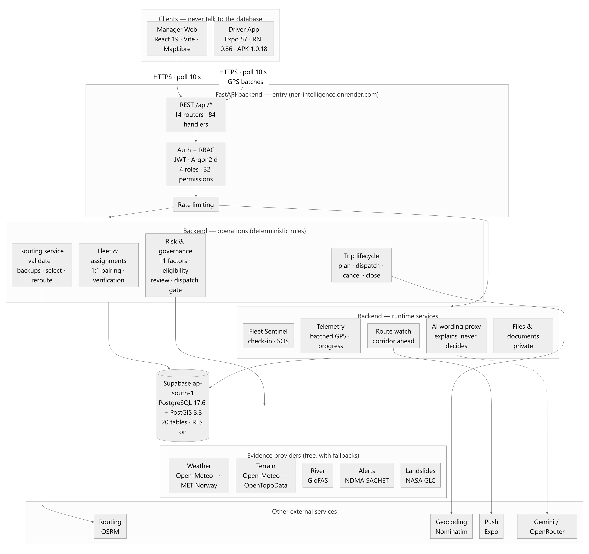

There are two ways to run it, and we used both today.

- **Local REST mode.** Everything goes through FastAPI, which talks to a PostgreSQL/PostGIS cluster on the laptop. This is the mode we verified in this report, because it exercises the full backend path: authentication, permissions, validation, business logic, database.
- **Hosted mode.** The console and the app authenticate against Supabase and read operational state through its Data API, while the FastAPI "intelligence" service (routing, risk, weather, terrain, navigation packages) runs on Render. This was certified on 18 September in the handoff log; today we only checked that all three hosted services answer, which they do (section 12).

The split exists because the intelligence service holds no state of its own. If it is down, routes report their accessibility as *unassessed* and every other workflow keeps working. That property is what let us host the tested Python engine instead of porting it to something else in a hurry.

---

## 3. What it is built with

We read the versions off the installed environment rather than off a wishlist.

| Part | Technology | Version | Notes |
| --- | --- | --- | --- |
| Backend runtime | Python | 3.11.9 | Deliberately not 3.14; some ML dependencies have no wheels for it yet |
| Web framework | FastAPI on Uvicorn | 0.115.6 / 0.34.0 | 84 routes at `8561f46` |
| Validation | Pydantic | 2.10.4 | Every request body and path parameter |
| Database access | SQLAlchemy (async) with psycopg | 2.0.36 / 3.2.3 | Parameterised SQL only; no string formatting anywhere near PostGIS |
| Migrations | Alembic | 1.14.0 | 12 versions; row-level security enabled on every table |
| Passwords and tokens | argon2-cffi, PyJWT | 23.1.0 / 2.10.1 | Argon2id hashes; signed access tokens |
| Hosted database | Supabase PostgreSQL + PostGIS | 17.6 / 3.3 | Mumbai region; primary for the running product |
| Local database | PostgreSQL + PostGIS | 18.2 / 3.6 | An isolated cluster on `127.0.0.1:55432`, used by every test and by today's local stack |
| Manager console | React, TypeScript, Vite | 19.2 / 6.0 / 8.2 | |
| Manager UI | Tailwind CSS, lucide-react, MapLibre GL | 4.3 / 1.45 / 6.6 | Fleet map on OpenStreetMap tiles |
| Client routing | react-router-dom | 7.18 | Per-role guards on every screen (section 6.1) |
| Driver app | Expo SDK, React Native, react-native-web | 57 / 0.86.3 / 0.21 | One codebase for the Android APK and the web build |
| Driver map | Leaflet inside a WebView | 1.9.4 | OSM tiles, no API key |
| Tests | pytest, Vitest, Testing Library | — | See section 12 |
| Hosting | Render (API, manager, driver web) and Supabase | — | Declared in `render.yaml` |

---

## 4. How the code is laid out

### 4.1 Manager console — `manager-web/src`

The console is organised so that a page never touches `fetch` directly. Pages compose components, components call the API layer, and the API layer is the only thing that knows about tokens, timeouts and the error envelope.

**Pages.** One file per screen: `LoginPage`, `FleetPage` (the dispatcher's home, with the map), `TripsPage` (plan, review, dispatch), `DriversPage`, `TrucksPage`, `AssignmentsPage`, `ReviewPage` (the optional second-level reviewer) and `SystemPage` (diagnostics). A control the signed-in role cannot use is simply not rendered; we never draw a disabled button that would 403 if you could click it.

**Components.** `ui.tsx` holds the primitives everyone uses: `Button`, `Field`, `StatusPill`, `Card`, and the three state components `LoadingState`, `EmptyState` and `ErrorState`. The bigger pieces are `FleetMap` and `FleetKpiBar`; the route work in `TripRouteReview`, `RouteCandidateCards` and `RouteApprovalDialog`; `AddressPicker` (Google Places, "choose on map", or paste a Maps link); `AssignTruckDialog`; and two side drawers for driver and truck context.

**API layer.** `api/client.ts` is the REST client: `ApiError` and `NetworkError`, an in-memory access token, a single-flight token refresh that is also serialised across browser tabs, a 15-second timeout (90 s for route assessments, which fan out to several providers), and since today a `fieldErrors()` helper (section 6.2). `api/supabaseManagerApi.ts` is the hosted-mode implementation of the same interface. `api/connectivity.ts` decides whether the console is online from whether the last request succeeded, not from `navigator.onLine`.

**Hooks.** `useResource` is the data-fetch state machine (idle, loading, success, error) with a stale-while-revalidate cache in `localStorage` and optional polling that pauses when the tab is hidden. `useMutation` guards against double submits and hands the error back synchronously so a form can map a 422 onto its fields.

**Utilities.** Pure functions with their own tests: `track.ts` (splits the GPS track where the truck was not actually sampled), `terrain.ts`, `focusTrap.ts`, `planValidation.ts`, `googleMapsUrl.ts`, `i18n/reasonCodes.ts`.

**Auth.** `AuthProvider.tsx` restores the session on reload, exposes `can(permission)`, and refuses a driver's credentials at the console with one sentence.

### 4.2 Driver app — `driver-app/src`

Four tabs: **Trip**, **Navigate**, **Safety**, **More**. The screens are `LoginScreen`, `TripScreen`, `AssignmentScreen` (truck verification), `MapScreen`, `SafetyScreen`, `MoreScreen`, `MyDetailsScreen`, `AssistantScreen` and `PhrasebookScreen`.

Under them: `api/` (backend selection and the same error model as the console), `tracking/` (GPS batching with an idempotent replay queue, so a reconnecting phone cannot duplicate rows), `notify/` (push), `offline/` (the corridor package and bundled guidance), `map/` (manoeuvre cards, navigation state, spoken guidance — muted by default), `trip/TripProvider.tsx` (the trip state, and the connection status derived from the last successful poll), and `i18n/` (English plus the 22 scheduled languages selectable; some translations are still drafts and fall back to English).

### 4.3 Backend — `backend/app`

| Package | What lives there |
| --- | --- |
| `api/` | The routers: `auth`, `driver` (everything under `/api/driver/me`), `fleet` (drivers, trucks, assignments), `trips` (shipments, trips, routes, fleet positions), `emergencies`, `geocoding`, `ai`, `files`, `documents`, `health`. Each route declares its permission with `require_permission(...)`. |
| `core/` | `config`; `errors` (the one error envelope, and the boundary that keeps stack traces and connection strings out of responses); `permissions` (the RBAC catalogue); `security` (hashing, JWT); `rate_limit`; `event_loop` (a Windows-specific fix without which async psycopg fails). |
| `services/` | 33 modules. The only layer that talks to the database. Transactions and business rules: `auth`, `drivers`, `trucks`, `assignments`, `shipments`, `trips`, `driver_trips`, `telemetry`, `routes`, `route_risk`, `route_review`, `reroute`, `navigation`, `sentinel` and so on. |
| `domain/` | 20 pure modules with no I/O: `trip_state`, `route_eligibility`, `route_risk`, `telemetry_policy`, `fuel_model`, `reroute`, `sentinel`… Deterministic rules with published constants, which is why the tests around them are cheap and numerous. |
| `models/`, `schemas/` | SQLAlchemy tables; Pydantic request and response contracts. `schemas/domain.py` is where every validation rule in section 11 comes from. |
| `alembic/versions/` | 12 migrations. History is history; nothing is edited in place. |
| `tests/` | 82 files, 1,144 test functions at `8561f46`. The suite refuses to run against any database other than the isolated cluster, a guard added after a test run once wrote into the shared project. |

---

## 5. Our verification checklist

This is the list we worked through. Each item names where its evidence is.

| Requirement from the brief | What we did | Where |
| --- | --- | --- |
| Major frontend screens | Signed in and captured all 8 manager screens and all 6 driver screens from a stack started from this checkout | Section 7 |
| Usability and responsiveness | Emulated 1440×900, 768×1024 and 390×844 in headless Chrome; measured horizontal overflow on every screen | Section 7 |
| REST APIs | Dumped the route table from the running app (84 routes); made 40 calls by hand and recorded every status code and body | Section 9 |
| Authentication | Exercised no token, bad token, wrong password, unknown user, web and mobile clients, and the rate limiter | Section 10 |
| Authorization | Called manager endpoints with a driver token and driver endpoints with a manager token; checked the client-side guards too | Section 10 |
| Business logic | Ran the full backend suite (1,183 tests), which pins the trip state machine, capacity, the dispatch gate, route eligibility and the reroute rules | Section 12 |
| Input validation | Sent bad bodies to five endpoints; checked the 422 envelope and how the form displays it | Section 11 |
| Error handling | Checked the client's handling of network loss, timeouts, 401, 403, 404, 409, 422 and 503 | Section 11 |
| Frontend ↔ backend | Every screenshot in section 7 shows live data from the API, not fixtures | Sections 7 and 8 |
| Loading / empty / error / success | Confirmed the state machine in `useResource` and photographed each state | Sections 7 and 11 |
| Broken buttons, forms, routes, calls | Found two defects and fixed both with regression tests; the earlier zero-dead-control audit is in `docs/INTERACTION_CERTIFICATION.md` | Section 6 |

---

## 6. Two things we found and fixed

### 6.1 A screen you could reach by URL but not use

The console hides navigation links that the signed-in role lacks. The shell's own comment went further and promised that a screen "is not mounted" if you type its URL directly, so that an operator who lands on the wrong page sees a redirect rather than a page whose every request fails with 403. That promise was kept for `/fleet` and for nothing else.

The role this bites is the **authorised reviewer**, who holds only `trip:read`, `route:read` and `route:review_authorize`. Type `/drivers` and you got a mounted Drivers page with a red "Not permitted" card. Honest, but it reads like a broken system rather than a missing permission.

The fix was five lines: `/trips`, `/drivers`, `/trucks`, `/assignments` and `/review` now use the same `Guarded` element that `/fleet` already used, keyed on the permission the navigation table already declares. The redirect target is the first screen the role *can* use, so it cannot loop.

We added `App.test.tsx` with two cases: a reviewer opening `/drivers` lands on `/trips`; a manager still reaches every workflow screen. We ran the test against the old `App.tsx` first — it failed, as it should — and then against the new one.

### 6.2 A validation message that quoted a regular expression at the operator

Create a driver with the phone number `12345` and the field lit up red with: *String should match pattern '^\+?[0-9]{10,15}$'*. That is Pydantic's own wording, passed straight through. It is correct and it is useless to a dispatcher.

Looking at why, we found the same fifteen lines that map a 422 onto form fields copied into both `DriversPage.tsx` and `TrucksPage.tsx`, so the truck registration field had the same problem. We replaced both copies with one helper in the API layer:

```ts
export function fieldErrors(error: unknown): Record<string, string> {
  const out: Record<string, string> = {}
  if (!(error instanceof ApiError) || error.code !== 'VALIDATION_ERROR') return out
  const details = error.details as { errors?: { loc?: unknown[]; msg?: string; type?: string }[] }
  for (const item of details.errors ?? []) {
    const field = String(item.loc?.[item.loc.length - 1] ?? '')
    if (!field) continue
    out[field] = item.type === 'string_pattern_mismatch' ? 'Not in the expected format' : (item.msg ?? 'Invalid value')
  }
  return out
}
```

Only the pattern-mismatch case is reworded. The other Pydantic messages ("String should have at least 8 characters") are already fine and we left them alone. The phone field's hint now says it wants a 10-digit mobile number. There is a test for the helper in `client.test.ts`, and the corrected screen is Figure 11.

### 6.3 What we deliberately did not touch

Three lint warnings about React hooks in `FleetPage.tsx` and `TripsPage.tsx` predate today. They are not defects and they are outside the brief, so we left them. We also did not remove the optional reviewer page even though a manager no longer needs it to dispatch: it is still the audit trail of who accepted what evidence and why, and that is worth keeping.

---

## 7. The screens

Everything in this section was captured today from a backend started from this checkout (port 8000, the demo database), the Vite dev server (port 5174) and the Expo web build (port 8123). The sign-in is a real one with the demo manager account; the driver screens are the demo driver's. Widths were emulated with Chrome's device metrics. On every screen we also measured `scrollWidth − clientWidth`, which is zero when nothing spills off the right edge. It was zero at all three widths.

### 7.1 Signing in

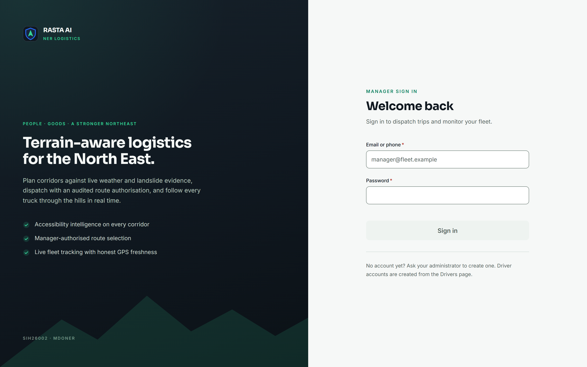

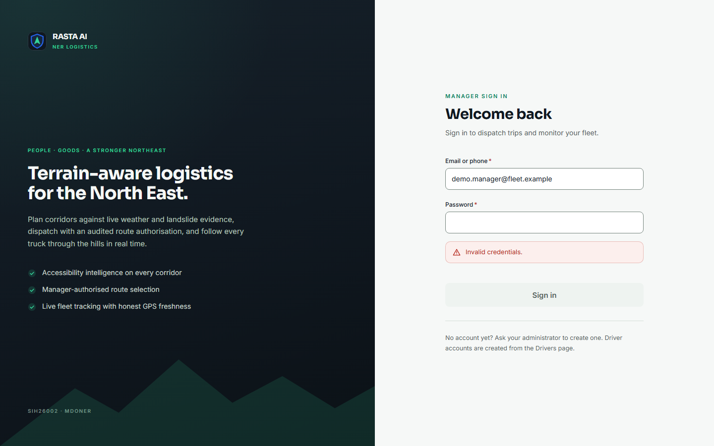

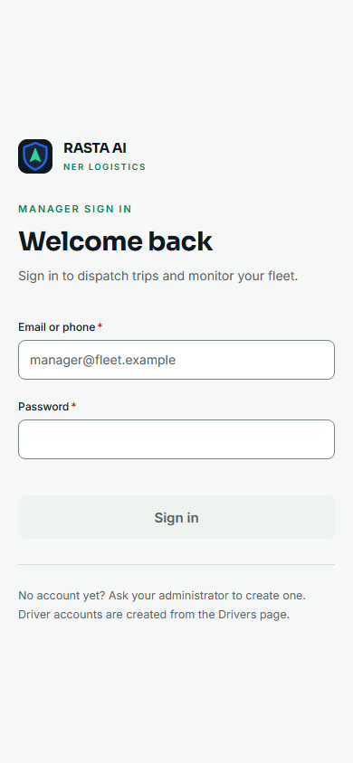

### 7.2 Fleet command

This is the screen a dispatcher keeps open. The demo database had no trips on the road when we took these, which is a useful thing to show: the tiles say **0** with the word *dispatched* next to it, and "none transmitting". Nothing is padded with a plausible-looking number.

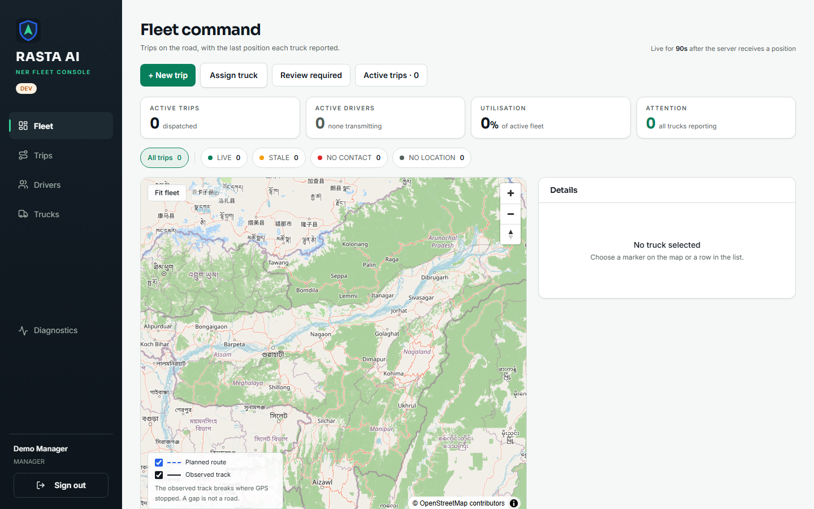

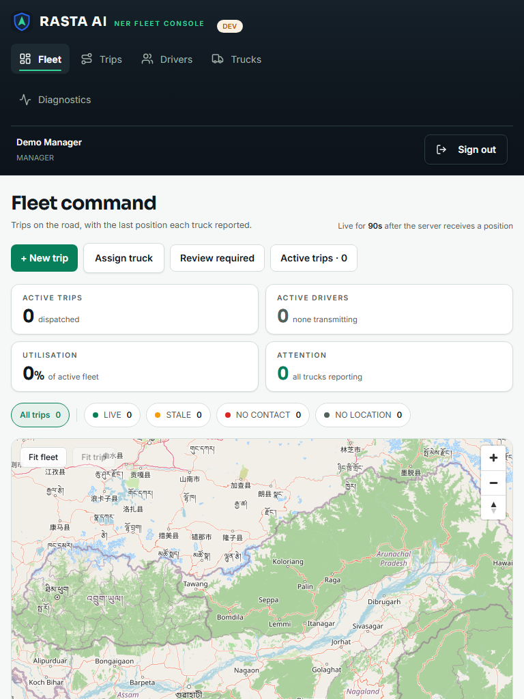

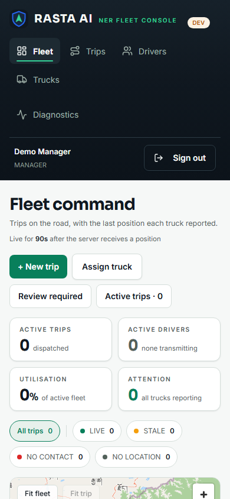

### 7.3 Dispatch workspace


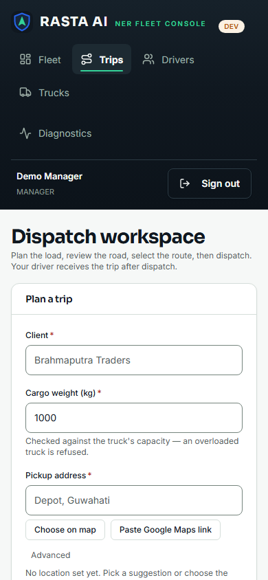

### 7.4 Drivers, trucks and assignments

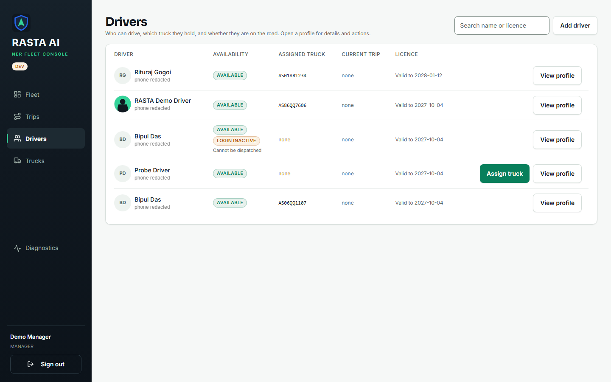

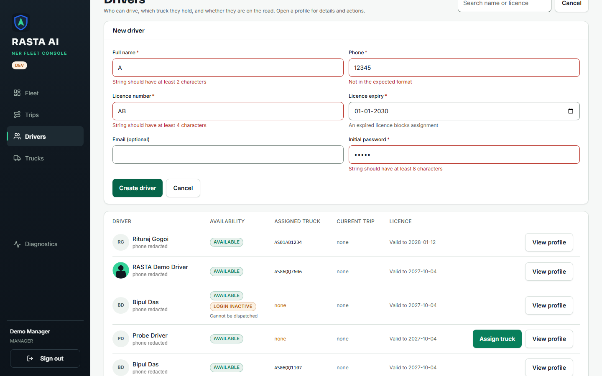

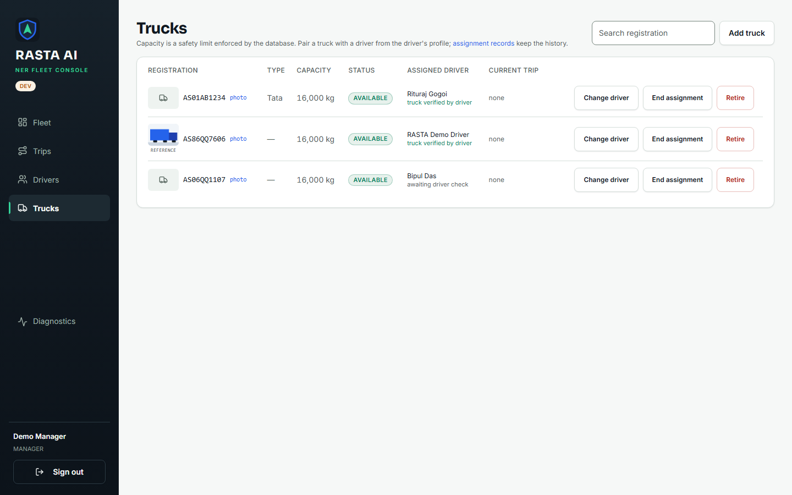

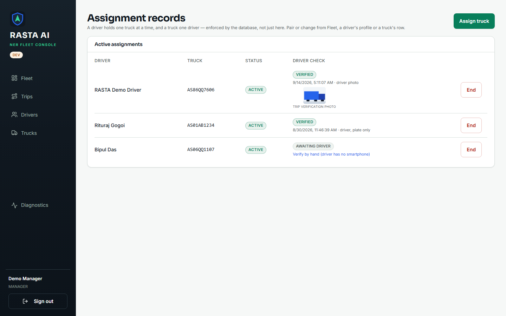

### 7.5 Review and diagnostics

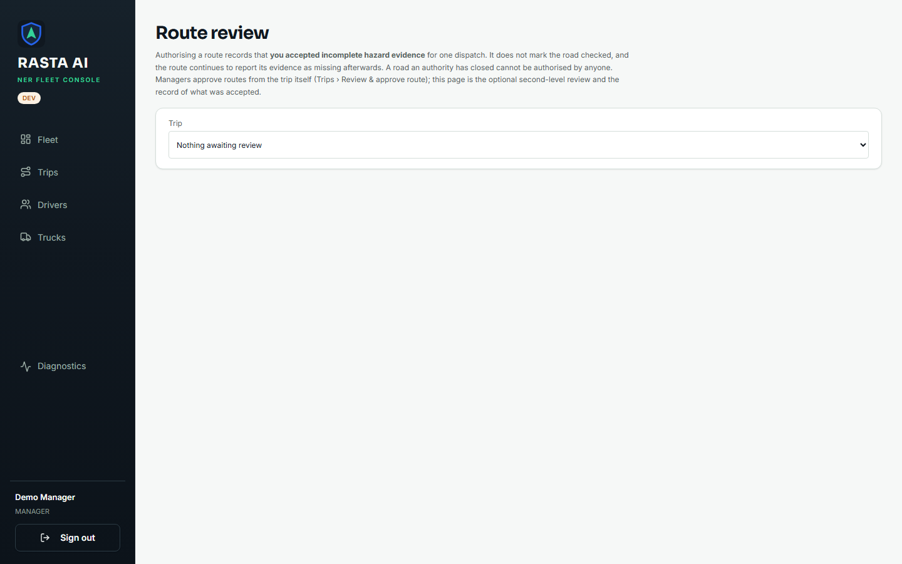


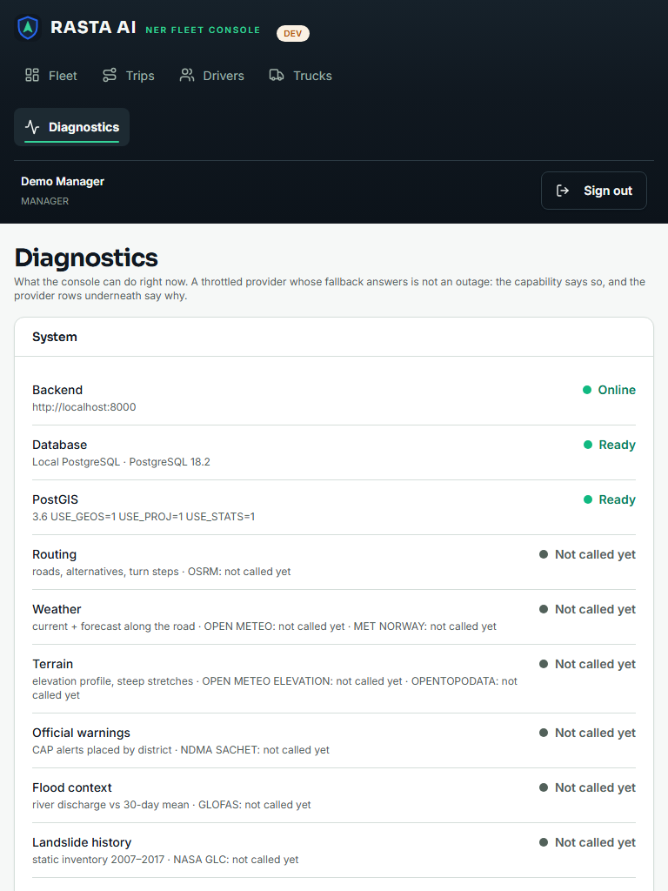

### 7.6 The driver app

The driver web build is the same code as the Android APK, rendered by react-native-web. We used it here because it can be driven by a script; the physical-phone certification from 14 and 16 September is in the handoff log and we did not repeat it today.


---

## 8. One request, end to end

Every write in the system takes the same path. Here it is for *Add driver*, which is the flow behind Figure 11.

```flow
USER ACTION — the manager fills in "New driver" and presses Create driver
FRONTEND STATE — useMutation refuses a second submit while one is in flight; the button shows busy
API REQUEST — POST /api/drivers with a JSON body, Authorization: Bearer <access token>, credentials included
AUTHENTICATION — signature and expiry checked; the role is re-read from the users table on every request
AUTHORIZATION — require_permission("driver:create"); a missing permission is a 403 that names it
BACKEND VALIDATION — Pydantic DriverCreate: name ≥ 2, phone ^\+?[0-9]{10,15}$, licence ≥ 4, password ≥ 8; failure is a 422 with per-field errors
BUSINESS LOGIC — the service creates the users row and the drivers row in one transaction and writes an audit_logs entry
DATABASE — PostgreSQL/PostGIS through parameterised SQL; a unique-constraint hit becomes a 409
API RESPONSE — 201 with the new DriverRead, or the one error envelope {error: {code, message, details, request_id}}
UI STATE — success: form cleared, list reloaded · 422: a message under each offending field · anything else: an ErrorState card, with a retry button only when a retry could help
```

Two details about this path are easy to miss and worth stating.

The access token never touches `localStorage`. It lives in memory, so a page reload loses it — deliberately. The refresh token sits in an `HttpOnly; SameSite=Strict; Path=/api/auth` cookie that JavaScript cannot read, and `AuthProvider` calls `/api/auth/refresh` silently before rendering anything. From the operator's side a reload just works; from an attacker's side there is no token to steal from script.

The driver app's GPS path is the same shape with one extra rule: each fix carries a client-generated `device_fix_id`, and the server is idempotent on `(trip_id, device_fix_id)`. A phone that loses signal in a valley, queues two hundred fixes and re-sends the batch twice does not produce duplicate rows. The response says how many fixes were accepted, how many were duplicates and how many were rejected, rather than a single pass or fail for the whole batch.

---

## 9. The API

### 9.1 Conventions

All bodies are JSON. Timestamps are ISO-8601 in UTC. Coordinates in payloads are `{lat, lon}`; only route geometry uses GeoJSON's `[lon, lat]`, because that is the GeoJSON standard and swapping it would be the most common spatial bug there is. Money is a decimal string. Lists are cursor-paginated (`?limit=&cursor=` gives `{items, next_cursor}`), because GPS and audit rows are appended constantly and offset paging would skip them.

Every failure, from every route, looks like this:

```json
{"error": {"code": "VALIDATION_ERROR",
           "message": "Request failed validation.",
           "details": {"errors": [{"loc": ["body", "phone"], "msg": "…", "type": "string_pattern_mismatch"}]},
           "request_id": "c1d48a99-…"}}
```

The status codes each mean one thing. 401: no token or a bad one. 403: you may not. 404: not found, or it exists but is not yours (a driver gets 404, not 403, for another driver's trip, so the API does not leak that it exists). 409: the request is fine but the state is not. 422: a rule nobody may override. 429: slow down. 503: something we depend on is unreachable, and a retry might help.

### 9.2 The endpoints the screens use

Auth column: *public*, or the permission the caller must hold. M means a manager holds it, D a driver, R an authorised reviewer. "Own" is always resolved from the token; no driver-side route takes a driver id.

| Method | Path | Purpose | Auth | Request | Response | Errors |
| --- | --- | --- | --- | --- | --- | --- |
| POST | `/api/auth/login` | Sign in with email (manager) or phone (driver) | public | `{identifier, password, client: "web" or "mobile"}` | `{access_token, refresh_token (mobile only), token_type, expires_at, user}` and, for web, a `ner_refresh` cookie | 401 (same message for unknown user and wrong password), 422, 429 |
| POST | `/api/auth/refresh` | Rotate the refresh token | cookie or body | `{client}` (+ `refresh_token` on mobile) | as login | 401; presenting an already-rotated token revokes the whole family |
| POST | `/api/auth/logout` | Revoke the refresh token | any token | — | 204 | — |
| GET | `/api/auth/me` | Who am I, and what may I do | any token | — | `{user, permissions[]}` | 401 |
| GET | `/api/drivers` | List drivers | driver:read (M, D) | `?limit&cursor&status` | `{items[], next_cursor}` | 401, 403 |
| POST | `/api/drivers` | Create a driver and their login | driver:create (M) | `DriverCreate` | 201 `DriverRead` | 422, 409 |
| PATCH | `/api/drivers/{id}` | Edit a driver | driver:update (M) | partial `DriverUpdate` | `DriverRead` | 404, 422 |
| POST | `/api/drivers/{id}/deactivate` | Disable the login | driver:deactivate (M) | — | `DriverRead` | 404, 409 if on a trip |
| GET | `/api/drivers/{id}/documents` | Licence and other documents | driver:read (M) | — | list | 404 |
| POST | `/api/drivers/{id}/support-session` | A short-lived, read-only "view as driver" token | driver:support_view (M) | — | `{token, expires_at, driver_id}` | 404 |
| GET / POST | `/api/trucks`, `/api/trucks/{id}`, `…/retire` | Trucks | truck:read / create / update / retire (M) | `TruckCreate` (registration pattern, capacity 0–100,000 kg) | `TruckRead` | 422, 404, 409 |
| GET / POST | `/api/assignments`, `…/{id}/end`, `…/verify-manual` | Driver–truck pairing | assignment:read / create / end / review (M) | `{driver_id, truck_id}` | `AssignmentRead` | 409 already assigned, 422 licence expired |
| POST | `/api/assignments/{id}/verify` | The driver confirms the physical truck | assignment:verify_own (D) | photo, registration, odometer, fuel % | `AssignmentRead` | 409, 422 |
| POST | `/api/trips/plan` | Create the shipment **and** the trip in one transaction | trip:create (M) | `{shipment: ShipmentCreate, trip: TripPlanTrip}` | 201 `TripRead` | 422 (capacity, outside the service region, missing fields), 503 routing provider down |
| GET | `/api/trips`, `/api/trips/{id}` | List (with `total`) and detail | trip:read (M, R) | `?limit&cursor&status` | `{items[], next_cursor, total}` / `TripDetail` | 404 |
| POST | `/api/trips/{id}/dispatch` | DRAFT → DISPATCHED | trip:dispatch (M) | — | `TripRead` | 404, 409 wrong state, 422 no selected route |
| POST | `/api/trips/{id}/cancel`, `…/close` | Cancel / close | trip:cancel, trip:close (M) | `?reason=` (≤ 200 chars) | `TripRead` | 409; cargo on the truck is never cancelled silently |
| GET | `/api/trips/{id}/routes` | The candidate roads | route:read (M, R) | — | `TripRoute[]` | 404 |
| POST | `/api/trips/{id}/routes/recalculate` | Ask the routing provider again | route:plan (M) | — | `RoutePlanResult` | 503 |
| GET | `/api/trips/{id}/routes/recommendation` | Compare the candidates | route:read (M, R) | — | `RouteRecommendation` (`comparable`, reason codes) | 404, 503 |
| GET | `/api/trips/{id}/routes/{route_id}/risk` | Deterministic risk for one road | route:read (M, R) | — | `RouteRisk` (score, band, the datasets it lacks) | 404, 503 |
| POST | `/api/trips/{id}/routes/{route_id}/select` | Choose the road, when it is eligible | route:select (M) | — | `TripRoute` | 422 REQUIRES_REVIEW, 409 |
| POST | `/api/trips/{id}/routes/{route_id}/approve` | Accept incomplete evidence and choose the road in one audited step | route:select (M) | `{rationale ≥ 20 chars, acknowledged_incomplete_evidence: true, from_route_id?}` | `TripRoute` | 422 ROUTE_REJECTED_ACTIVE_HAZARD, 409 stale screen |
| GET / POST / DELETE | `/api/trips/{id}/routes/{route_id}/review-authorization` | The optional reviewer's single-use, 30-minute authorisation | route:review_authorize (R) | `{rationale}` | `ReviewAuthorization` | 403 for a manager |
| GET / POST | `/api/trips/{id}/reroute`, `…/reroute/accept` | A driver's proposed road, and the manager's answer | route:read / route:select (M) | — | `RerouteAssessment` / `RerouteAccepted` | 404, 422 |
| GET | `/api/fleet/active` | Trips on the road with their last position | fleet:location_read (M) | — | `{trips[], fresh_seconds: 90, stale_seconds: 600, server_time}` | 403 |
| GET | `/api/trips/{id}/track` | The observed GPS track | fleet:location_read (M) | — | `TrackSnapshot` | 404 |
| POST / DELETE | `/api/trips/{id}/simulation` | Demo simulator: moves a truck along its road | trip:dispatch (M) | — | — | 404 |
| GET | `/api/driver/me`, `…/assignment`, `…/profile`, `…/documents`, `…/truck-documents`, `…/notices` | The driver's own records | driver token | — | own rows only | 403 for a manager token |
| GET | `/api/driver/me/trip` | The driver's current trip, with route progress | driver token | — | `TripRead` with progress, or `null` when there is none | — |
| POST | `/api/driver/me/trip/accept`, `…/start`, `…/stops/{stop}/arrive`, `…/stops/{stop}/complete`, `…/complete` | Trip execution | trip:execute_own (D) | — / `{position}` | `TripRead` | 409 wrong state, 422 rule |
| POST | `/api/driver/me/trip/reroute` | "I have left the road; propose another" | trip:execute_own (D) | `{position}` | 201 proposal | 422 |
| POST | `/api/driver/me/trip/check-in`, `…/instruction/ack` | Safety check-in; acknowledge a manager instruction | trip:execute_own (D) | — | — | 409 |
| GET | `/api/driver/me/trip/navigation`, `…/offline-package`, `…/route-risk`, `…/places` | Manoeuvres, the offline corridor pack, conditions ahead, roadside services | trip:execute_own (D) | — | packages | 404 when there is no trip |
| POST | `/api/driver/me/location` | A batch of GPS fixes, idempotent on `(trip_id, device_fix_id)` | location:submit_own (D) | `{trip_id, fixes[1..500]: {device_fix_id (UUID), location, recorded_at, speed_kmph ≤ 200, …}}` | `{accepted, duplicates_ignored, rejected, rejected_reasons}` | 422 |
| POST | `/api/driver/me/push-token` | Register the phone for push | driver token | `{token}` | 204 | 422 |
| GET / POST | `/api/emergencies/active`, `…/{id}/resolve`, `…/sweep` | Fleet Sentinel: stationary or silent trucks | emergency:read / resolve (M) | `{note}` | `EmergencyRead` | 403, 404 |
| GET / POST | `/api/geocoding/suggest`, `…/details`, `…/resolve-link` | Address search (server-side key), and pasting a Google Maps link | trip:create (M) | `?q=` / `{url}` | suggestions / a resolved point | 503 when no key is configured |
| POST / GET | `/api/files`, `/api/files/{id}` | Photos and documents; ownership checked in the service | any token | bytes | `{id, …}` / bytes | 403, 404 |
| GET / POST | `/api/ai/status`, `/api/ai/ask` | The optional in-cab assistant | driver token | `{question, context}` | an answer, or 503 AI_UNAVAILABLE | 503 |
| GET | `/api/system/providers`, `…/simulation` | Provider health for the Diagnostics page | any token | — | `{providers[14], intelligence}` | — |
| GET | `/health`, `/ready` | Liveness; readiness with database and PostGIS checks | public | — | `{status}` / `{status, provider, checks}` | 503 when not ready |

### 9.3 What we actually got back today

We ran these by hand against the local backend with a small Python script, then read the responses. The backend was at `8561f46`.

| We sent | We got |
| --- | --- |
| `GET /api/auth/me` with no token | 401, code UNAUTHENTICATED, "Authentication required." |
| `GET /api/drivers` with a garbage token | 401, "Invalid or expired token." — not a 500 |
| Login with the right email and a wrong password | 401, "Invalid credentials." |
| Login with an email that does not exist | 401, "Invalid credentials." — byte-identical to the previous one |
| Login with `client: "fax"` | 422, "Input should be 'web' or 'mobile'" |
| Login as the manager with `client: "web"` | 200; no `refresh_token` in the body; `Set-Cookie: ner_refresh=…; HttpOnly; SameSite=strict; Path=/api/auth` |
| Login as the driver with `client: "mobile"` | 200; `refresh_token` in the body; no cookie |
| The eleventh wrong password from one address within a minute | 429, code RATE_LIMITED, "Too many attempts. Try again shortly.", `Retry-After: 45` |
| `GET /api/auth/me` as the manager | 200 with the user and the full permission list |
| `GET /api/fleet/active` with a driver token | 403, `details.required_permission = "fleet:location_read"` |
| `GET /api/trips` with a driver token | 403, required `trip:read` |
| `POST /api/trucks` with a driver token | 403, required `truck:create` |
| `GET /api/driver/me` with a manager token | 403, "This endpoint is for drivers only." |
| `POST …/review-authorization` with a manager token | 403, required `route:review_authorize` |
| `GET /api/drivers?limit=2`, `/api/trucks?limit=2`, `/api/trips?limit=2` | 200, two items each, an opaque `next_cursor`; the trips list also carries `total: 70` |
| `GET /api/assignments?active_only=true`, `/api/fleet/active`, `/api/emergencies/active`, `/api/system/providers` | 200 |
| `GET /api/driver/me` as the driver | 200, the driver's own record |
| `GET /api/driver/me/trip` as the driver, with no trip on the road | 200 `null` — a legitimate answer, not an error |
| `POST /api/drivers` with name `A`, phone `12345`, licence `AB`, password `short` | 422 with four entries, each with `loc`, `msg` and `type` |
| `POST /api/trucks` with registration `hello` and capacity `0` | 422, `string_pattern_mismatch` and `greater_than` |
| `POST /api/trips/plan` with an empty body | 422, `shipment` and `trip` "Field required" |
| `POST /api/driver/me/location` with a fix id that is not a UUID | 422, `uuid_parsing` at `body.fixes.0.device_fix_id` |
| `GET /api/trips/<random uuid>` and `POST …/dispatch` on it | 404, "Trip not found." |
| `GET /api/trips/not-a-uuid` | 422, `uuid_parsing` at `path.trip_id` |
| `GET /api/no-such-route` | 404 in the same envelope |
| `POST /api/drivers` with a body that is not JSON | 422, `json_invalid`, and no stack trace |
| `POST /api/auth/logout` | 204 |

---

## 10. Signing in, and staying in your lane

We were asked to check authentication and authorization separately, and they are separate things in this codebase.

**Authentication** is "prove who you are". Passwords are hashed with Argon2id and are never logged; the 422 handler strips input values from its details for exactly that reason. A successful login issues a signed JWT that lasts 15 minutes and a refresh token that lasts 30 days. The refresh token rotates on every use and, if an already-rotated token is ever presented again, the whole family is revoked; that is how a stolen token is caught. Web clients get the refresh token as an `HttpOnly` cookie; the mobile app gets it in the body and stores it in `expo-secure-store`. The client says which it is, and nothing is inferred from the User-Agent, because that would let anyone ask for the token in the body by claiming to be a phone. The login endpoint answers "Invalid credentials." with the same body whether the identifier exists or not, and it is rate-limited at 20 attempts a minute per address and 10 per identifier. We tripped that limit ourselves during the day, which is how we know the `Retry-After` header is there.

**Authorization** is "are you allowed to do this", and it lives in one place: `app/core/permissions.py`. Permissions are strings like `trip:dispatch`; roles map to sets of them; every route depends on a permission and never on a role name. There are four roles — ADMIN, MANAGER, DRIVER and AUTHORISED_REVIEWER — and the interesting one is the reviewer, who can read trips and routes and authorise a selection but deliberately cannot make one. The person who accepts a risk should not be the person who acts on it.

Two more properties are worth knowing. The role is re-read from the database on every request rather than taken from the token, so demoting or deactivating someone takes effect immediately, not at token expiry. And no driver-side route takes a driver id: `require_current_driver()` resolves the driver from the token, which is the shape that makes a whole class of "change the id in the URL" bugs impossible to write.

On the client, the same permission strings drive what is rendered. The navigation only shows screens the role can use, buttons the role cannot use are not drawn, and since today (section 6.1) arriving at a screen's URL directly redirects instead of mounting a page that would fail. The console also refuses a driver's valid credentials outright, with one sentence, on login and on the silent restore a reload performs.

For the hosted deployment the backend verifies Supabase-issued tokens instead of its own (ES256/RS256 against the project's JWKS, with issuer, audience and expiry checked, and an unreachable JWKS reported as a 5xx rather than as "your session expired"). That path has 17 tests of its own and was exercised on the hosted stack in the 18 September certification; we did not re-run it today.

Finally, secrets. No `.env` file is tracked (we checked with `git ls-files`). Every `VITE_` and `EXPO_PUBLIC_` variable is a URL or a public tile key, because those prefixes are inlined into the client bundle. The API's `/docs` and `/openapi.json` are switched off outside development so the endpoint inventory is not handed to anyone who asks for it.

---

## 11. Validation, and what the user sees when things go wrong

### 11.1 The rules the server enforces

All of these come from `backend/app/schemas/domain.py` and `schemas/auth.py`. The client does not duplicate them; it shows what the server says.

| Field | Rule | An input we tried | What the form shows |
| --- | --- | --- | --- |
| `full_name` | 2 to 120 characters | `A` | String should have at least 2 characters |
| `phone` | `^\+?[0-9]{10,15}$` | `12345` | Not in the expected format |
| `licence_number` | 4 to 40 characters, upper-cased on the way in | `AB` | String should have at least 4 characters |
| `initial_password` | 8 to 200 characters | `short` | String should have at least 8 characters |
| `registration_number` | `^[A-Z]{2}[ -]?\d{1,2}[ -]?[A-Z]{1,3}[ -]?\d{1,4}$`, spacing and case normalised | `hello` | Not in the expected format |
| `max_capacity_kg` | more than 0, at most 100,000 | `0` | Input should be greater than 0 |
| `cargo_items[]` | at least one; each with `weight_kg > 0` and `quantity` 1–100,000 | `[]` | List should have at least 1 item |
| `reference_code`, `trip_code` | 3 to 32 characters | `ab` | String should have at least 3 characters |
| `stops[].geofence_radius_m` | 10 to 20,000 m | `5` | Input should be greater than or equal to 10 |
| GPS fix | `device_fix_id` a UUID; `speed_kmph` 0–200; `heading_deg` 0 to below 360; `accuracy_m` up to 20,000; 1 to 500 fixes per batch | speed `999` | Input should be less than or equal to 200 |
| `client` on login | exactly `web` or `mobile` | `fax` | Input should be 'web' or 'mobile' |
| `rationale` on approve / authorise | at least 20 characters | `ok` | String should have at least 20 characters (the UI keeps the button shut until this is met) |

Then there are the rules that are not about the shape of a field but about the world, and those come back as **422** no matter who you are: cargo heavier than the truck's capacity; a driver whose licence has expired; a shipment endpoint outside the service region; dispatching a trip that has no selected route; rerouting onto a road with a verified closure (`ROUTE_REJECTED_ACTIVE_HAZARD`). State conflicts are **409**: dispatching a trip that is already moving, assigning a truck that is on a trip, approving a reroute from a screen that is no longer current.

### 11.2 What the operator sees

The console has one component for each kind of failure, and every page uses them.

| When | What appears |
| --- | --- |
| The backend cannot be reached | A "Cannot reach the backend" card on the page, and a banner across the top of the shell: **Offline · showing last known data · last synced N min ago · reconnecting…** Pages keep whatever they last loaded. |
| A request takes longer than 15 s (90 s for a route assessment) | "The backend took too long", with a retry |
| The session is really gone (401 after a failed silent refresh) | The login screen, with the session state cleared |
| 403 | "Not permitted", with the server's message and no retry button, because retrying cannot help |
| 404 / 409 | "Not found" / "Conflict", with the server's message |
| 422 | The message under each offending field (Figure 11). The request never reached the database. |
| 503 from a routing or weather provider | "Service unavailable" with a retry; the route cards show **NOT ASSESSED** rather than a made-up score |
| Anything else | "Something went wrong". The server never sends a stack trace or a connection string: `register_exception_handlers` in `core/errors.py` is the boundary, and psycopg's habit of putting the full DSN into its exceptions is the reason it exists. |

Loading and empty states are components too — `LoadingState` with a label, `EmptyState` with a title, a hint and an optional action — and `useResource` guarantees a page cannot confuse "no data yet" with "the request failed". That distinction sounds pedantic until an outage renders as an empty list and someone concludes the fleet is idle.

---

## 12. Test results

Every number here was produced by a command we ran today. None were copied from earlier documents.

| Suite | Command | Result |
| --- | --- | --- |
| Backend, full suite | `pytest` against the isolated cluster, armed with `.runtime/use-isolated-db.sh` | **1,183 passed, 5 skipped, 0 failed** in 7 min 00 s. The skips are four destructive migration tests gated behind an environment variable, and one non-Windows case. |
| Manager console, tests | `vitest run` on a clean checkout of `8561f46` plus our changes | **231 passed, 0 failed** across 22 files (228 before today, 3 new) |
| Manager console, types | `tsc -b --noEmit` | 0 errors |
| Manager console, build | `vite build` | Built in 0.8 s; one chunk-size warning |
| Manager console, lint | `oxlint src` | 0 errors, 3 pre-existing warnings |
| Driver app, tests | `vitest run` | **624 passed, 0 failed** across 54 files |
| Driver app, types | `tsc --noEmit` | 0 errors |
| API by hand | 40 requests (section 9.3) | Every status code and body as documented |
| Browser, manager console | `.runtime/task3/evidence.mjs` — headless Chrome, real login | 8 of 8 checks: login error shown, session established, zero overflow at three widths on Fleet and at 390 px on Trips, the 422 mapped onto four fields, an unknown URL redirected home; no uncaught exceptions |
| Browser, driver app | `.runtime/task3/evidence_driver.mjs` | 3 of 3: wrong password refused, session established, zero overflow |
| Regression test for section 6.1 | `App.test.tsx` against the old `App.tsx`, then the new | 1 failed, then 2 passed |
| Hosted deployment, read-only | `GET /health` and `/ready` on the API; the manager and driver sites | 200 / ready (PostgreSQL 17.6, PostGIS 3.3) / 200 / 200 |
| Re-run on `main` at `5dcc608`, after the parallel session's commits | backend `pytest`; manager `tsc -b`, `vitest run`, `vite build`; driver `tsc`, `vitest run` | Backend **1,199 passed, 5 skipped** (3 min 42 s). Manager **246 passed**, `vite build` fine, but `tsc -b` reports **2 errors** in files from those commits (an unused import in `TripsPage.tsx`; a tuple index in a new test in `client.test.ts`), so `npm run build`, which type-checks first, fails on `main` right now. Driver 624 passed, types clean. |

The backend suite is where the business rules live. The files a mentor might want to open are `test_trip_lifecycle`, `test_dispatch_route_gate`, `test_assignment_invariant`, `test_route_eligibility`, `test_route_review_authorization` (which now includes the hard-block reroute case), `test_driver_reroute_api`, `test_authorization`, `test_auth`, `test_rate_limit`, `test_telemetry` and `test_golden_path_e2e`, which walks a trip from creation to closure through the real API.

> One caution about "clean checkout". While we were working, another session was editing files in the same working copy (section 13). To make sure our numbers were about our code and not theirs, we made a fresh `git worktree` of `8561f46`, copied only our six files into it, and ran the manager suite, type-check and build there. Those are the numbers above.

---

## 13. What we could not verify, and what is still open

We would rather list these ourselves than have them found.

**The hosted console in Supabase-direct mode.** Certified end to end on 18 September (handoff log, sections 18 and 19), including a live reroute approved by a manager while a simulated truck was moving. Today we only confirmed that the three hosted services answer. In that mode, twenty operations are deliberately switched off with the reason shown on the control itself — creating, editing and deactivating drivers; adding, editing and retiring trucks; cancelling and closing trips; address lookup; and a few more — because they need the API service rather than the Data API. All of them work through the FastAPI path this report is about.

**Which backend the driver screenshots came from.** Figures 17 and 18 were taken from a driver web build that was already running on port 8123 and points at a demo backend on port 8010, started at 09:58, before one of the day's earlier commits. Nothing on those screens depends on that commit, but strictly they were not captured against the port-8000 backend the rest of this report uses. *Needs testing*, if that distinction matters to the reviewer.

**A physical phone.** The APK (1.0.18) was certified on a handset on 14 and 16 September. We did not repeat that today.

**The reviewer redirect in a real browser.** Section 6.1 is covered by a unit test. There is no reviewer account in the local demo database, so we did not also click through it.

**Trip history and the `ROUTE_CHANGED` event.** At `8561f46` the backend wrote the event when a manager approved a reroute, but nothing listed it and there was no endpoint for it. During the afternoon a parallel session added `GET /api/trips/{id}/events` and `POST /api/trips/{id}/stops` (commit `24986f0`) and then a manager-side journey history and trip export (`985db6d`). We did not run or exercise any of that; it is outside the numbers in section 12. *Needs testing.*

**Concurrent work in the same checkout.** This deserves a plain statement. While we were auditing, another session was editing `TripsPage.tsx`, `TripRouteReview.tsx`, `supabaseManagerApi.ts`, the driver's `TripScreen.tsx` and several new files in the same working copy. It later committed its work and, in doing so, swept our six files into its commit `985db6d`. So our changes are on `main`, but under a commit message that is not ours. We have not touched that commit. Everything we measured was measured on a clean copy of `8561f46` plus our files, and Figures 8 and 9 show the Trips page as it was at `8561f46`.

**`main` does not type-check at `5dcc608`.** The two TypeScript errors above are in the parallel session's files, not in ours (our six files type-checked clean in the worktree run), but anyone pulling `main` this evening and running `npm run build` in `manager-web` will hit them. Tests and the Vite build itself pass. We have left the fix to the session that owns those changes rather than editing its work under it.

**No accuracy figure for any model.** The route risk is a deterministic weighted rule with published constants and is labelled as such on screen. No predictive model has been evaluated on a held-out set (`docs/AI_MODELS.md`), so this report claims no percentage, and neither should anyone quoting it.

---

## 14. Files we changed

| File | What changed |
| --- | --- |
| `manager-web/src/App.tsx` | `/trips`, `/drivers`, `/trucks`, `/assignments` and `/review` wrapped in the existing `Guarded` element |
| `manager-web/src/App.test.tsx` | New. Two tests for the route guard |
| `manager-web/src/api/client.ts` | New `fieldErrors()` helper, 18 lines |
| `manager-web/src/api/client.test.ts` | A test for the helper, including the pattern-mismatch rewording |
| `manager-web/src/pages/DriversPage.tsx` | Its copy of the 422 mapping replaced by the helper; the phone hint now names the format |
| `manager-web/src/pages/TrucksPage.tsx` | Its copy of the 422 mapping replaced by the helper |
| `docs/submission/day1/task3/` | This report and its Markdown source, 21 screenshots, and the two JSON files the browser scripts wrote |
| `docs/submission/day1/build_docs.py` | The document builder we already had for Task 1, taught to take a source path, place screenshots and draw an editable table flowchart |

Fifty-one lines added and thirty-one removed in application code. We did not commit, push or deploy anything ourselves, and the hosted database was only read.

---

## 15. Appendix A — running our checks yourself

From the repository root on Windows, each block in its own terminal. The backend must be started with `run.py`; starting Uvicorn directly skips an event-loop fix and every database call then fails.

```bash
# backend tests (about 7 minutes; refuses any database but the isolated cluster)
source .runtime/use-isolated-db.sh
cd backend && .venv/Scripts/python.exe -m pytest -q
```

```bash
# manager console: types, tests, build
cd manager-web && npm run typecheck && npm test && npm run build
```

```bash
# driver app: types, tests
cd driver-app && npm run typecheck && npm test
```

```bash
# the local stack we used for the screenshots
cd backend && .venv/Scripts/python.exe run.py          # http://127.0.0.1:8000
cd manager-web && npm run dev                          # http://localhost:5173
cd driver-app && npm run web                           # http://localhost:8081
```

```bash
# the browser evidence scripts: headless Chrome, a real login, screenshots into docs/submission/day1/task3/screenshots
node .runtime/task3/evidence.mjs
node .runtime/task3/evidence_driver.mjs
```

The demo manager and driver credentials are in `.runtime/demo-credentials.private.json`, which is not tracked. The API smoke in section 9.3 is a 70-line stdlib Python script; the responses are quoted in that section as we received them.

---

## 16. Appendix B — the afternoon, in order

We kept the timestamps because they answer the question "how long did this actually take".

| Time (IST) | What happened |
| --- | --- |
| 15:30 | Started reading: `AGENTS.md`, the README, the last three handoff sections, the route table, the permission catalogue |
| 15:33 | Kicked off the full backend suite against the isolated cluster |
| 15:40 | Manager console: type-check clean, 228 tests green. Driver app: type-check clean, 624 tests green |
| 15:41 | Backend suite finished: 1,183 passed, 5 skipped |
| 15:45 | Route guard gap confirmed by reading `App.tsx`; fix written; `App.test.tsx` written and shown to fail on the old code |
| 16:05 | A backend started from this checkout on port 8000, Vite on port 5174 |
| 16:07–16:11 | First browser evidence run. One script bug: we looked for a button called "Create"; it is called "Create driver" |
| 16:13 | The second run reused the headless profile and the session restore let us straight in. A feature, but not the screenshot we wanted; fixed the script |
| 16:15 | The regex-in-the-error-message defect noticed in Figure 11; helper written, both pages switched to it, test added |
| 16:16 | Third evidence run, 8 of 8. Driver app run, 3 of 3 after fixing the "Sign In" capitalisation in the script |
| 16:20 | 40 API calls by hand. Noticed our own probing had tripped the login rate limiter, which is how the `Retry-After: 45` line got into section 9.3 |
| 16:25 | Found the other session's uncommitted edits in the same checkout; made a clean worktree of `8561f46` and re-ran the manager checks there: 231 tests, types and build green |
| 16:30 onwards | Wrote this report, built the Word document, and checked every page of it as rendered by Word |
