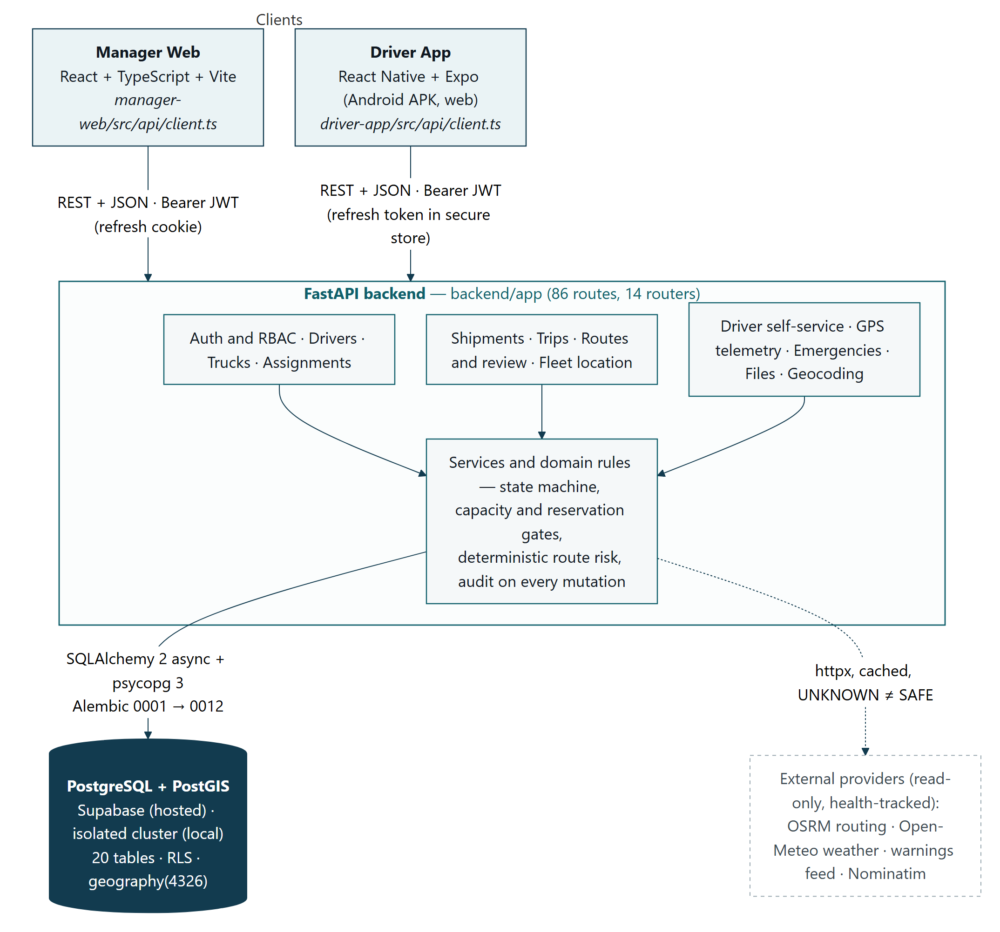

# RASTA AI

## Day 2 — Task 1

### Backend Finalization, API & Database Integration

| | |
| --- | --- |
| Problem statement | SIH26002 — AI-Based Smart Logistics and Accessibility Intelligence Platform for the North Eastern Region |
| Team | NER-AI LOGISTICS (Team 17) |
| Task | Day 2 · Task 1 — Backend Finalization, API & Database Integration (software track, page 1 of the task sheet) |
| Date | 19 September 2026 |
| Repository | `nxtlucifer/ner-ai-logistics`, branch `main`, backend commit `7c176f3` |
| Evidence base | `docs/DAY2_TASK1_*.md` (final report, CRUD, ER diagram, API test results, integration evidence); screenshots and raw results in `docs/submission/day2/task1/` |

> Every figure in this report was measured on 19 September 2026 from the running application — the mounted routes were read from the FastAPI app itself, the schema from the SQLAlchemy metadata and a live `alembic current`, the test counts from the suites run in the same session, and the API results from real HTTP calls against the backend. Where something was not verified it is marked NEEDS TESTING or NOT IMPLEMENTED rather than claimed.

## Table of contents

## 1. Task objective and completion summary

The Day 2 Task 1 sheet asks each team to finish the backend and prove it: complete pending server-side modules and business logic, define proper API endpoints and HTTP methods, implement CRUD wherever applicable, design the tables with their fields, types and relationships, connect the database to the backend, test all endpoints, and hand in the CRUD documentation, the schema or ER diagram, the frontend–backend integration details with screenshots, and the API testing results.

| Official requirement (task sheet, page 1) | Status | Where it is shown |
| --- | --- | --- |
| Backend final touch — pending modules, business logic, workflows | PASS | §2, §3 |
| API development & integration — endpoints and HTTP methods | PASS | §3 (86 routes) |
| CRUD operations wherever applicable | PASS | §4 |
| Tables, fields, data types, relationships | PASS | §5 |
| Database connectivity with the backend | PASS | §5, §7 (`/ready`) |
| Test all API endpoints | PASS | §7 |
| Finalized working backend | PASS | §2, §7, §8 |
| CRUD operations documentation | PASS | §4, CRUD document |
| Database schema / ER diagram | PASS | §5, Appendix A, ER document |
| Frontend–backend integration details and screenshots | PASS | §6, §8 |
| API testing results / screenshots | PASS (4 terminal shots still to be taken, listed in §8) | §7, §8 |

**How the system fits together.** The Manager Web console and the Driver App are two clients of one FastAPI service. Every request carries a JWT; the backend applies role-based permissions, runs the business rules (trip state machine, capacity and reservation gates, route review), writes the change and its audit row to PostgreSQL, and returns the result. PostGIS holds every coordinate as `geography(4326)` so distances and geofences are computed in metres on the server. The driver's GPS batches travel the same path in the other direction and are read back by the manager's Fleet page.

| Headline numbers (measured 19 Sep 2026) | Value |
| --- | --- |
| Mounted HTTP routes / routers | 86 / 14 |
| Database tables · foreign keys · CHECK constraints · indexes · enum types | 20 · 41 · 36 · 75 · 20 |
| Alembic migrations | `0001_bootstrap` → `0012_push_notifications` (linear, at head) |
| Backend tests · Manager tests · Driver tests | 1210 passed, 5 skipped · 259 passed · 624 passed |
| End-to-end HTTP run · browser evidence checks | 56 / 56 · 24 / 24 |


## 2. System architecture



The manager console is React 19 + TypeScript + Vite with one REST client (`manager-web/src/api/client.ts`: token refresh, offline detection, server 422s mapped onto form fields). The driver app is React Native + Expo (Android APK 1.0.18, also exported to web) with a GPS tracker that batches idempotent uploads and an offline trip package. The backend is FastAPI with one router per domain, each route declaring the permission it needs, services and domain modules holding the rules, SQLAlchemy 2 async with psycopg 3 for persistence, and Alembic for migrations. The database is PostgreSQL + PostGIS — Supabase for the hosted demo (17.6 / 3.3) and an isolated local cluster for development and tests (18.2 / 3.6).

Authentication is JWT access tokens plus rotating refresh tokens (an `HttpOnly` cookie for the browser, a secure-store token for the phone); reusing a rotated refresh token revokes its whole family. Authorization is a permission catalogue (`driver:create`, `trip:dispatch`, `route:select`, `fleet:location_read`, …) mapped to the roles ADMIN, MANAGER, DRIVER and AUTHORISED_REVIEWER; object-level scoping ("own trip", "own row") is enforced in the service layer.


## 3. Backend and API implementation

All 86 routes were enumerated from the running application (`app.routes`) rather than from documentation, and the route inventory with permission, database operation, frontend consumer and test file for each one is in `docs/DAY2_TASK1_FINAL_REPORT.md` §17.

| Area | Routes | What it covers |
| --- | --- | --- |
| System | 4 | `/health` liveness, `/ready` database + PostGIS check, provider health, demo simulation |
| Authentication | 4 | login, refresh (rotation), me, logout |
| Drivers · Trucks · Assignments | 7 · 5 · 6 | fleet master data, soft delete, driver↔truck pairing with physical verification |
| Shipments · Trips | 2 · 12 | atomic plan, list with server-side filters, dispatch, cancel, close, add stop, journey history, track |
| Routes and governance | 13 | recalculate (up to three validated options), risk, recommendation, select / approve, reviewer path, live reroute |
| Fleet location | 1 | trips on the road with the last position of each truck |
| Driver self-service | 24 | profile, assignment verification, accept / start / stops / complete, GPS batches, navigation, offline package, notices, push token, check-in |
| Emergencies (Fleet Sentinel) | 3 | active incidents, sweep, resolve |
| Files · Geocoding · AI assistant | 2 · 3 · 2 | private photo storage, address search, advisory assistant |

| Method | Endpoint | Purpose | Permission |
| --- | --- | --- | --- |
| POST | `/api/auth/login` | Sign in (e-mail for managers, phone for drivers) | public, rate-limited |
| GET | `/api/drivers` | List drivers (search, status, cursor paging) | `driver:read` |
| POST | `/api/drivers` | Create login + profile (one transaction) | `driver:create` |
| PATCH | `/api/drivers/{id}` | Update driver fields | `driver:update` |
| POST | `/api/drivers/{id}/deactivate` | Safe delete: login off, history kept (trucks: `…/retire`) | `driver:deactivate` |
| POST | `/api/trucks`, `/api/assignments`, `/api/shipments` | Create a truck, a pairing, a shipment | `truck:create` etc. |
| POST | `/api/trips/plan` | Shipment + trip in one transaction | `trip:create` |
| GET | `/api/trips` | Trip list: server filters, search, `total` | `trip:read` |
| POST | `/api/trips/{id}/routes/recalculate` | Plan candidate roads | `route:plan` |
| POST | `…/routes/{route_id}/approve` | Manager approves and selects the route | `route:select` |
| POST | `/api/trips/{id}/dispatch` | DRAFT → ASSIGNED; needs an approved route | `trip:dispatch` |
| GET | `/api/trips/{id}/events` | Journey history (timeline) | `trip:read` |
| POST | `/api/driver/me/trip/accept`, `…/start`, `…/complete` | Driver executes their own trip | DRIVER (own) |
| POST | `/api/driver/me/location` | GPS batch ingestion (202, idempotent) | DRIVER (own) |
| GET | `/api/fleet/active` | Fleet positions for the manager map | `fleet:location_read` |

Every non-2xx answer uses one envelope, `{"error": {"code", "message", "details", "request_id"}}`, with 401 for a missing or invalid token, 403 for a role that may not act, 404 for records another actor must not learn exist, 409 for uniqueness and illegal state transitions, and 422 for schema and business-rule violations. Swagger UI is served at `/docs` in development builds (Figure 3).


## 4. CRUD operations

Delete is never a physical `DELETE`. Master data is deactivated or retired (`deleted_at` set, rows kept because trips, GPS points and audit rows reference them with `ON DELETE RESTRICT`); operational records end through audited state transitions; the `audit_logs` table itself rejects UPDATE and DELETE by trigger. This is the intended design, and it is what the evidence shows.

| Resource | Create | Read | Update | Delete / transition |
| --- | --- | --- | --- | --- |
| Sessions | login | me | refresh (rotation) | logout; family revoked on token reuse |
| Drivers | yes | list, get, search | PATCH | deactivate (soft) — 409 while on a trip |
| Trucks | yes | list, get | PATCH | retire (soft) — 409 while on a trip |
| Assignments | yes | list, get | verify (driver), verify-manual (manager) | end |
| Shipments + cargo | yes (alone or inside `/trips/plan`) | list | immutable once planned | via the trip |
| Trips | create, atomic plan | list (server filters, total), get, events | dispatch, add stop, driver accept / start / stop / complete | cancel (with dispositions), close |
| Routes | recalculate, driver reroute | list, risk, recommendation | select, approve, reroute accept | superseded (state) |
| GPS telemetry | batch POST (202) | fleet, track, driver progress | append-only | append-only |
| Emergencies | raised by the Sentinel sweep | active | driver check-in | resolve / false alarm |
| Files and documents | upload, add document | read (owner or manager), masked lists | — | — |

The tables behind each resource are listed in §5 and in the CRUD document.

**Business-critical changes are validated and audited.** Verified in code and in the HTTP run: request schemas normalise and validate input (phone pattern, Indian registration format, capacity 0–100 000 kg, licence expiry, service-region check on every coordinate); uniqueness surfaces as 409 (`LICENCE_EXISTS`, `REGISTRATION_EXISTS`, `ASSIGNMENT_UNCHANGED`); the shipment weight is derived by a database trigger from the cargo items, so a client cannot declare the number the capacity check uses; trip creation reserves the driver and the truck under `SELECT … FOR UPDATE` so two planners cannot double-book; dispatch is refused without an approved route (`ROUTE_SELECTION_REQUIRED`); every consequential mutation writes an `audit_logs` row with actor, before/after JSON and IP, and every trip step writes a `trip_events` row.


## 5. Database schema and ER diagram

| Property | Verified value |
| --- | --- |
| Engine | PostgreSQL + PostGIS — local 18.2 / 3.6 (`/ready`), hosted Supabase 17.6 / 3.3 (`/ready`) |
| Migrations | Alembic `0001_bootstrap` → `0012_push_notifications`, linear chain, `alembic current` = head on the live database |
| Tables | 20 domain tables (+ `alembic_version`, `system_info`) |
| Integrity | 41 foreign keys · 36 named CHECK constraints · 75 indexes (GIST on 5 geography columns, partial unique indexes for "one open pairing", "one live authorisation", "one open emergency") · 20 native enum types |
| Conventions | UUID primary keys · `TIMESTAMPTZ` · `NUMERIC` for money and weight · `geography(Point / LineString, 4326)` · soft delete on master data · Row Level Security enabled on every table |
| Triggers | `total_weight_kg` derived from `cargo_items`; `updated_at` maintained server-side; `audit_logs` append-only |
| Drift guard | `tests/test_schema_drift.py` compares the models with the migrated database on every test run |

Relationships are enforced in the database, not only in code: `drivers.user_id` is unique; partial unique indexes allow one open pairing per driver and per truck, one live review authorisation per route and one open emergency per trip; `(trip_id, sequence)` and `(trip_id, device_fix_id)` are unique; time-ordering, range and rationale-length CHECKs guard trips, telemetry and authorisations. The remaining six tables are reference data: `driver_documents`, `truck_documents`, `truck_maintenance`, `stored_files` (private photos as `BYTEA`, ≤ 5 MiB), `driver_notifications` (push / notice log) and `refresh_tokens`; `emergencies` and `audit_logs` complete the operational set. The core ER diagram is Figure 2 (Appendix A, landscape page); the complete 20-table diagram is `er-diagram.png` beside this report.


## 6. Frontend ↔ backend integration

Both clients call the same REST API through one client module each; the requests below were recorded from the browser's network layer while a real Chromium drove the screens (manager 148 API responses over two passes, driver 44; zero 5xx). The trip used, `HILL-F5BF1C`, was created through the real endpoints: plan → route → manager approval → dispatch → driver acceptance → truck verification photo → start.

| Manager action | Request the console makes | Backend → database | What the manager sees |
| --- | --- | --- | --- |
| Sign in | `POST /api/auth/login` · `GET /api/auth/me` | `users` read, `refresh_tokens` written, `audit_logs` LOGIN | Console opens on Fleet command as "Demo Manager · MANAGER" |
| Fleet monitoring | `GET /api/fleet/active` · `/api/trips` · `/api/emergencies/active` · `/ready` | latest `gps_points` per truck joined to `trips` (PostGIS) | "ACTIVE TRIPS 1 · LIVE 1", truck AS86QQ7606 on the map (Figure 4) |
| Driver / truck management | `GET`/`POST`/`PATCH` `/api/drivers`, `/api/trucks`, `/api/assignments` | `drivers`, `trucks`, `driver_truck_assignments` | Tables with status, pairing, server-side 422 shown on the field |
| Trip planning | `POST /api/trips/plan` · `POST …/routes/recalculate` | `shipments` + `cargo_items` + `trips` + `trip_stops` in one transaction; `trip_routes` | Draft trip with candidate roads |
| Route review and dispatch | `POST …/routes/{rid}/approve` · `POST …/dispatch` | `route_review_authorizations` issued and consumed, `trips` ASSIGNED, `trip_events`, `driver_notifications` | "Approved by Demo Manager (manager)" on the review panel; row moves to ASSIGNED |
| Trip list and history | `GET /api/trips?open_only=true…` / `…open_only=false…` | `trips` ⨝ `shipments` with `total` | "5 shown of 5 matching"; History "20 of 69, page 1 of 4", read-only rows (Figure 6) |

| Driver action | Request the app makes | Backend → database | What the driver sees |
| --- | --- | --- | --- |
| Sign in with phone | `POST /api/auth/login` (`client: mobile`) · `GET /api/driver/me` | `users`, `drivers`; `refresh_tokens` | "Good morning, RASTA Demo Driver" |
| Trip tab | `GET /api/driver/me/trip` (polled) · `…/assignment` · `…/profile` · `…/notices` | `trips`, `trip_stops`, `trip_routes`, `driver_truck_assignments`, `driver_notifications` | "CURRENT TRIP · ACTIVE · HILL-F5BF1C", truck "AS86QQ7606 · verified" (Figure 5) |
| Accept, verify truck, start | `POST …/trip/accept` · `POST /api/files` (verification photo) · `POST …/assignment/verify` · `POST …/trip/start` | `trips.driver_accepted_at`, `stored_files`, `verified_at` on the assignment, `trips` ACTIVE, `trip_events` | Trip becomes active; start is refused until the truck is verified |
| Navigation | `GET …/trip/navigation` · `…/offline-package` · `…/route-risk` | `trip_routes.maneuvers` and geometry (4,341 points, 98.82 km) | Turn-by-turn, route line, landslide-exposure caution with its evidence count (Figure 5) |
| GPS update | `POST /api/driver/me/location` → 202 | `gps_points` (server assigns trip, driver, truck; unique device fix) | "GPS live"; the manager's Fleet page shows the truck LIVE seconds later |
| Stops and completion | `POST …/stops/{id}/arrive`, `…/complete`, `POST …/trip/complete` | `trip_stops` ARRIVED / COMPLETED, `trips` DELIVERED, `trip_events` | Verified by the backend suite (`test_trip_execution.py`) and the hosted runs of 14–18 Sep; not re-driven in the browser today |


## 7. API testing and test results

| Backend tests | Manager tests | Driver tests | HTTP run | Browser checks |
| --- | --- | --- | --- | --- |
| **1210** passed | **259** passed | **624** passed | **56 / 56** | **24 / 24** |

| Suite (all run on 19 September 2026, commit 7c176f3) | Result |
| --- | --- |
| Backend — `pytest`, 83 test files, isolated PostgreSQL + PostGIS | **1210 passed · 5 skipped · 0 failed** (223 s) |
| Manager Web — `vitest` | **259 passed · 0 failed** |
| Manager Web — `tsc` / `npm run build` | **0 errors** (5 errors were found at HEAD and fixed today, see §9) |
| Driver App — `vitest` | **624 passed · 0 failed** |
| Driver App — `tsc` | **0 errors** |
| End-to-end HTTP run against the backend (`api_evidence.py`, real requests) | **56 / 56 PASS** |
| Browser evidence passes (manager + driver, real sign-ins) | **24 / 24 PASS** |

The five skips are four destructive migration downgrade tests that run only with `RUN_DESTRUCTIVE_MIGRATION_TESTS=1`, and one Linux-only event-loop case. The three routes without an HTTP-level test (`POST /api/ai/ask`, `GET /api/ai/status`, `GET /api/driver/me/trip/places`) wrap external providers and are marked NEEDS TESTING; no claim is made about external-provider behaviour.

| What the automated suites cover | Examples |
| --- | --- |
| Authentication | wrong password, token rotation, refresh reuse, logout, rate limiting, deactivated login |
| Authorization | permission matrix per role, driver sees only own rows, 404 instead of 403 for foreign records |
| Input validation | phone and registration patterns, capacity bounds, service-region check, stop sequences |
| CRUD and persistence | create / read / update / deactivate for drivers, trucks, assignments; shipments; trips |
| Conflict handling | duplicate licence or registration, double pairing, double booking under concurrency, illegal transitions |
| Trip lifecycle | state machine, dispatch gates, acceptance, stops, delivery, cancel dispositions, mid-trip stops, history |
| GPS and geospatial | batch ingestion, idempotent fixes, PostGIS distance and geofence logic, fleet reads |
| Route logic | option validation, deterministic risk, recommendation, review authorisation, reroute, hazard providers |
| Database | schema drift against the migrated database, enum parity, RLS enabled, migration cycle (opt-in) |
| Integration | golden-path end-to-end test, Sentinel sweeps, notifications, files and documents |

| Selected HTTP cases from the 56-step run | Expected | Actual |
| --- | --- | --- |
| `GET /health` · `GET /ready` | 200 · 200 | 200 · 200 (`database ok`, `postgis ok`) |
| `POST /api/auth/login` wrong password · valid | 401 · 200 | 401 `UNAUTHENTICATED` · 200 |
| `GET /api/drivers` without token · as DRIVER · `POST` as DRIVER | 401 · 200 (own row only) · 403 | 401 · 200 (1 row, own id) · 403 |
| `POST /api/drivers` invalid phone · valid · duplicate licence · `PATCH` · deactivate · token afterwards | 422 · 201 · 409 · 200 · 200 · 401 | 422 · 201 · 409 `LICENCE_EXISTS` · 200 · 200 · 401 |
| `POST /api/trucks` bad capacity · valid · duplicate · `POST /api/assignments` twice | 422 · 201 · 409 · 201 + 409 | as expected (`REGISTRATION_EXISTS`, `ASSIGNMENT_UNCHANGED`) |
| `POST /api/trips/plan` out of region · over capacity · valid | 422 · 422 · 201 | 422 · 422 `CAPACITY_EXCEEDED` (no orphan shipment) · 201 |
| `POST /api/trips/{id}/dispatch` without a route · `…/cancel` · cancel again | 422 · 200 · 409 | 422 `ROUTE_SELECTION_REQUIRED` · 200 · 409 `ILLEGAL_TRIP_TRANSITION` |
| `POST /api/driver/me/location` malformed · with no trip · with an active trip (browser) | 422 · 404 · 202 | 422 · 404 · 202 |


## 8. Evidence

The screenshots below were captured automatically on the local stack (backend on port 8010 against the demo clone database, manager console on 5173, driver web build on 8123) by a headless Chromium that signed in with the real demo accounts. Nothing is mocked; the request log for each page is stored beside the images in `evidence-results*.json`.

Backend readiness as returned by the running service (screenshots `01_backend_health.png`, `02_backend_ready_database.png`):

```text
GET /health -> 200  {"status":"ok"}
GET /ready  -> 200  {"status":"ready","provider":"local","checks":{
                      "database":{"ok":true,"detail":"PostgreSQL 18.2"},
                      "postgis":{"ok":true,"detail":"3.6 USE_GEOS=1 USE_PROJ=1 ..."}}}
hosted /ready -> 200  provider=supabase, PostgreSQL 17.6, PostGIS 3.3
```


Also in the folder: `03` (Swagger header and API description), `07b`–`07d` (Drivers, Trucks, Diagnostics), `08c` (driver More tab), `09c` (route approval on the trip), `09d` (History tab) and the full `er-diagram.png`.

**Evidence to be captured before submission.** Four items need a terminal or a database client and were not produced automatically: `04_api_login_success.png` (Swagger *Try it out* on `POST /api/auth/login` → 200, tokens masked), `05_api_crud_example.png` (terminal output of `python docs/submission/day2/task1/api_evidence.py`: the `/api/drivers` create → read → update → deactivate lines), `06_database_tables.png` (pgAdmin, DBeaver or the Supabase table editor listing the 20 tables) and `10_test_results.png` (terminal: `1210 passed, 5 skipped`, `259 passed`, `624 passed`). Their text equivalents are already in `api-results.json` and `docs/DAY2_TASK1_API_TEST_RESULTS.md`.

## 9. Issues found today, limitations and conclusion

| Found | Root cause | Fix and verification |
| --- | --- | --- |
| Manager console production build (`npm run build`) failed at HEAD with 5 TypeScript errors | an unused import left after the journey-history panel moved; an untyped `fetch` mock; test fixtures passing plain strings where a `TripStatus` is required | 3 files, 4 lines; `tsc` 0 errors, build green, 259 tests pass. The hosted site was never affected (its build does not run `tsc`) |
| OpenAPI description and three documents described emergencies as unimplemented and quoted 2 migrations / 15 tables / old test counts | documentation drift since 13–18 Sep | corrected from code evidence: route table regenerated from the app, migrations 0003–0012 added, counts refreshed |

| Limitation | Classification |
| --- | --- |
| `POST /api/ai/ask`, `GET /api/ai/status`, `GET /api/driver/me/trip/places` | IMPLEMENTED · NEEDS TESTING (external providers, no HTTP test) |
| Fuel estimation, payments / expenses / payroll, deliveries, `/api/alerts`, WebSocket fleet feed | NOT IMPLEMENTED (design-only sections of `API_CONTRACTS.md`; the demo does not depend on them) |
| `planned_eta` / `current_eta` / fuel columns | schema present, values not populated by the backend (the driver app computes its ETA bar client-side) |
| Hazard evidence on the hosted stack | landslide dataset not configured, so every corridor requires the manager's audited approval — the designed fallback, not a fault |

| Official requirement | Result | Evidence |
| --- | --- | --- |
| Finalized working backend | PASS | FastAPI runtime, `/health` and `/ready`, 1210 backend tests, 86 routes enumerated |
| Working database integration | PASS | `/ready` database + PostGIS checks (local and hosted), Alembic at head `0012`, schema-drift test |
| CRUD operations documentation | PASS | §4 and the CRUD document |
| Database schema / ER diagram | PASS | §5, Appendix A, ER document |
| Frontend–backend integration details and screenshots | PASS | §6, Figures 4–6, recorded request logs |
| API testing results | PASS | 56/56 HTTP run, three green suites (§7); 4 terminal screenshots still to be taken |

> DAY 2 TASK 1 — READY FOR SUBMISSION. The backend is finished for the demo scope, connected to PostgreSQL + PostGIS at migration head, exposes a tested and documented API with CRUD on every operational resource, and is used end to end by both clients. Outstanding: the four hand-taken screenshots listed in §8.

## Appendix A — Core ER diagram


