# RASTA AI

## Day 2 — Task 2

### Web Application Vulnerability Testing & Security Assessment

| | |
| --- | --- |
| Problem statement | SIH26002 — AI-Based Smart Logistics and Accessibility Intelligence Platform for the North Eastern Region |
| Team | NER-AI LOGISTICS (Team 17) |
| Task | Day 2 · Task 2 — Web Application Vulnerability Testing & Security Assessment (software track, page 1 of the task sheet) |
| Date | 19 September 2026 |
| Repository | `nxtlucifer/ner-ai-logistics`, branch `main`, HEAD `5b5e474` plus the uncommitted working tree of 19 September |
| Evidence base | `docs/DAY2_TASK2_SECURITY_TEST_PLAN.md`, `docs/submission/day2/task2/DAY2_TASK2_SECURITY_RESULTS.md`, `evidence/results.json`, `evidence/*.txt`, `evidence/*.png`, `backend/tests/test_security_assessment.py` |

> Every result in this report was produced on 19 September 2026 by running the real application: a local backend built from the working tree, bound to an isolated clone of the demo database, plus read-only checks of our own hosted services. Findings are stated with the evidence that produced them; where a control was not exercised (OWASP ZAP, `pip-audit`, the hosted rate limiter) the report says so rather than claiming it. No statement of the form "fully secure" is made anywhere in this document: the honest claim is that no exploitable issue was reproduced within the defined scope after the fixes below.

## Table of contents

## 1. Executive summary

The Day 2 Task 2 sheet asks for a basic security assessment of the developed web application across eight vulnerability classes, each finding documented with evidence, impact, severity and remediation. This assessment covered the RASTA AI FastAPI backend (86 operations over 75 paths), the Manager Web console and the Driver App's API surface, using a written test plan of 63 cases, a 49-case runtime probe against an isolated environment, a headless-browser stored-XSS check, static code review, a repository and bundle secret scan, dependency audits, and the project's own test suites.

**Overall posture.** The application was designed with security boundaries that held under test: every database query is parameterised through SQLAlchemy (no SQL injection reproduced on login, three search endpoints, cursors, path and enum parameters); React and the two hand-written HTML writers escape user text (stored `` / `<svg onload>` payloads rendered as literal text in the manager console, with zero live handlers and zero dialogs); refresh tokens rotate, replay revokes the whole family, logout invalidates, forged and expired JWTs are refused, a deactivated account is cut off on its next request; uploads are typed by magic bytes and never by name; the SSRF surface refuses every non-Google host before contacting anything; every one of the 81 non-public operations answers 401 without a token; and the login limiter returned `429` with `Retry-After` on the eleventh wrong password.

**What was found and fixed today.** Five real defects, none Critical or High: one Medium — a broken object-level authorisation on `GET /api/drivers/{id}/documents` that let any driver read another driver's document types, expiry dates and masked numbers — and four Low: no security headers on API responses, the DRIVER role able to read the whole truck register, uploads buffered in full before the 5 MB check, and clickjacking/referrer headers missing from the hosted static sites. All five are fixed in the working tree with regression tests that fail when the fix is reverted (6 of 8 backend cases fail without it). The backend suite passed in full afterwards (1,246 passed, 5 skipped), as did the Manager Web (261 tests, typecheck, build) and Driver App (624 tests, typecheck) suites.

**What remains.** *(Updated 20 September 2026: SEC-006 and SEC-008 have since been closed — see `docs/submission/day2/task3/RASTA_AI_DAY2_TASK3_MITIGATION.md`. The paragraph below records the position as it stood at the end of Task 2.)* One Low finding is open by choice — the login rate limiter keys on the TCP peer, which on Render is the platform proxy, so the per-address budget is shared fleet-wide (the per-account budget still holds). Seven informational observations are recorded. Two hosted checks still show the pre-fix headers until the working tree is deployed. Residual risks are listed in section 17.

| Headline numbers (measured 19 Sep 2026) | Value |
| --- | --- |
| Test plan cases / runtime probe cases | 63 / 49 (46 PASS · 1 INFO · 2 FINDING pending deploy) |
| Operations checked without a token | 81 of 81 → 401 |
| Findings | 0 Critical · 0 High · 1 Medium · 5 Low · 7 Informational |
| Fixed today with regression tests | 5 (SEC-001 … SEC-005) — 8 new backend tests, 1 new manager test |
| Backend / Manager / Driver suites after the fixes | 1,246 passed 5 skipped · 261 passed + tsc + build · 624 passed + tsc |

## 2. Testing scope

| In scope | What was exercised |
| --- | --- |
| Backend (FastAPI, `backend/app`) | all 86 mounted operations: authentication, drivers, trucks, assignments, shipments, trips, routes, fleet location, driver self-service, telemetry, emergencies, files, documents, geocoding, AI proxy, system |
| Manager Web (`manager-web`) | stored-XSS rendering of Drivers, Trips and Trucks pages in headless Chrome; the printable report writer (`tripExport.ts`); built bundle contents; hosted response headers |
| Driver Web / App (`driver-app`) | API surface exercised with driver tokens; WebView map HTML reviewed; token storage reviewed; hosted web build headers; unit tests and typecheck |
| REST APIs | authentication, authorisation (role and object level), input validation, pagination limits, method restrictions, SSRF, error containment, CORS |
| Authentication & session management | login (web and mobile contracts), refresh rotation and reuse detection, logout, token forgery, expiry, disabled accounts, support-view tokens, rate limiting |
| Database-facing inputs | login identifier, three ILIKE searches, opaque cursors, UUID path parameters, enum filters; code review of every raw SQL use |
| File uploads | `POST /api/files` (all six kinds) and `GET /api/files/{id}` |
| Security headers | local API before and after the fix; hosted API, manager and driver web sites |
| Configuration | `Settings`, `render.yaml`, `vercel.json`, `netlify.toml`, `.env` handling, docs exposure, secrets in the repository and in the built bundle, RLS test suite, dependency advisories |

| Out of scope (deliberately) | Reason |
| --- | --- |
| Supabase infrastructure, Render, MapTiler, Google, OSRM, Open-Meteo, NDMA feed, Nominatim | third-party services; only our own application was tested |
| Denial-of-service and high-volume brute force | the limiter was proven with 11 requests; nothing more was sent |
| Writes against the shared/production database | every write went to a disposable local clone |
| Page 2 of the task sheet (hardware, sensors, actuators, power) | RASTA AI ships no hardware in this repository |
| OWASP ZAP active scan, `pip-audit` | not installed on the assessment machine; recorded as not run rather than claimed |

## 3. Testing environment

| Item | Value |
| --- | --- |
| Git branch / commit | `main` @ `5b5e474` (working tree carried uncommitted Day 2 Task 1 work; nothing was committed or pushed by this assessment) |
| Local backend | FastAPI from the working tree, `.runtime/start-sec-backend.sh`, `http://127.0.0.1:8020`, `APP_ENV=development` (docs open, cookie without `Secure` — both by design for local http) |
| Local test database | PostgreSQL 18.2 + PostGIS 3.6 on the isolated cluster `127.0.0.1:55432`; database `ner_logistics_sec` created with `CREATE DATABASE … TEMPLATE ner_logistics_demo`, migrated to `0013`, dropped after the assessment |
| Backend test suite | the same cluster, database `ner_logistics_test`, guarded by `tests/db_target.py` (refuses any other target before a socket is opened) |
| Manager URL | Vite dev server `http://localhost:5175` → API `:8020` |
| Driver URL | the driver web build was not started; its API surface was exercised with driver tokens and its hosted build's headers were read |
| Hosted (read-only) | `https://ner-intelligence.onrender.com` (API), `https://ner-manager.onrender.com`, `https://ner-driver-web.onrender.com` — HEAD/GET of public pages, one login/logout with the team's own account to read cookie flags |
| Accounts | seeded demo manager and two seeded demo drivers on the clone; one throwaway driver created and deactivated on the clone per run; one driver, truck and trip carrying XSS payloads created on the clone per probe run (Figure 3 shows the four from the runs before the final one) |
| Tools | `security_probe.py` (httpx 0.28, PyJWT), `xss_browser_check.mjs` and `render_evidence.mjs` (Chrome DevTools Protocol, headless Chrome), pytest 8, vitest, tsc, vite build, npm audit, `scripts/secret_scan.py` plus a full tracked-file pattern scan, curl |
| Redaction | tokens, cookies and passwords were replaced with `<REDACTED>` at capture time by the probe; no credential appears in any evidence file or figure |

## 4. Security methodology

```flow
CODE REVIEW — routers, dependencies, services, models, config, deployment descriptors, both clients; grep for raw SQL, eval/exec/subprocess/pickle/yaml.load, dangerouslySetInnerHTML/innerHTML/document.write, localStorage tokens
STATIC CHECK — secret scan of untracked+modified files (project tool) and of all 590 tracked text files; built-bundle scan; npm audit for both clients; permission matrix review
RUNTIME TEST — 49 probe cases against the isolated backend: sessions, SQLi, XSS storage, misconfiguration, headers, uploads, API and object boundaries, pagination, rate limit
NEGATIVE SECURITY TEST — forged tokens, replayed refresh tokens, other users' ids, SSRF hosts, polyglot files, oversized bodies, tautology payloads, tampered cursors
FIX — minimum safe change at the layer that owns the boundary: one middleware, one scoped lookup, one scoped query, one bounded read, one deployment header block
REGRESSION — new tests written first and shown to fail with the fix reverted (6 of 8), then the full backend, manager and driver suites
RETEST — the probe re-run on the fixed backend; the browser XSS check re-run; hosted checks repeated to record what is pending deployment
```

The order matters: code review first, so that runtime tests target real sinks rather than guesses; fixes only after a failing regression test exists, so that no test was weakened to pass.

## 5. Vulnerability assessment summary

| ID | Vulnerability | Severity | Status |
| --- | --- | --- | --- |
| SEC-001 | API responses carried no security headers (`X-Content-Type-Options`, `X-Frame-Options`/`frame-ancestors`, `Referrer-Policy`, `Cache-Control: no-store`, HSTS) | Low | FIXED (hosted: pending deploy) |
| SEC-002 | BOLA: any driver could read another driver's document metadata via `GET /api/drivers/{id}/documents` | Medium | FIXED |
| SEC-003 | DRIVER role could list and read the whole truck register (`GET /api/trucks`, `GET /api/trucks/{id}`) | Low | FIXED |
| SEC-004 | `POST /api/files` buffered the entire body before the 5 MB check (authenticated memory amplification) | Low | FIXED |
| SEC-005 | Hosted static sites (Render) lacked `X-Frame-Options` / `frame-ancestors`, `Referrer-Policy`, `Permissions-Policy` | Low | FIXED (pending deploy) |
| SEC-006 | Login rate limiter keys on the TCP peer; behind Render's proxy the per-address budget is shared by every client | Low | **CLOSED 20 Sep** — trusted-proxy handling implemented and tested (12 cases). See Day 2 Task 3 §2. |
| SEC-007 | Swagger UI and `/openapi.json` are open when `APP_ENV=development` | Informational | ACCEPTED (404 on the hosted service, verified) |
| SEC-008 | Leaflet loaded from unpkg inside the driver's map WebView without Subresource Integrity | Informational | **CLOSED 20 Sep** — sha384 digests pinned on both assets, `crossorigin` set, 5 tests. See Day 2 Task 3 §3. |
| SEC-009 | Dependency advisories: 2 moderate dev-only (vitest) in Manager Web; 10 moderate in the Driver App's Expo build toolchain (`xcode` → `uuid`) | Informational | OPEN (build-time only; 0 in either production dependency set) |
| SEC-010 | `%` and `_` are not escaped in ILIKE searches (a search for `%` lists every row the caller may already list) | Informational | ACCEPTED |
| SEC-011 | Supabase anon (publishable) key inlined in the manager bundle | Informational | ACCEPTED (public by design; RLS proven by `tests/test_rls_boundary.py`) |
| SEC-012 | Web login response body contains a `"refresh_token": null` key | Informational | ACCEPTED (the value is never present for web clients) |
| SEC-013 | A JPEG/PNG polyglot containing `<script>` is accepted as an image | Informational | MITIGATED by SEC-001 (`nosniff`; served as `image/jpeg` only) |

Everything else in the eight required areas passed: see sections 6–13 and the compliance matrix in section 18.

## 6. SQL injection assessment

**Code review.** Every database access goes through SQLAlchemy 2 Core/ORM with bound parameters. The only `text()` calls in the application are two constant strings in the readiness probe (`SELECT version()`, `SELECT postgis_version()`); there is no f-string or concatenated SQL, no dynamic `ORDER BY` and no dynamic table or column name anywhere under `backend/app`. Searches use `Column.ilike(pattern)` with the pattern bound as a parameter; cursors are base64 JSON decoded into a typed `(datetime, UUID)` pair and rejected as `400 INVALID_CURSOR` when malformed; UUID path parameters and enum filters are validated by Pydantic before any query is built.

**Runtime tests** (payloads: `'`, `''`, `' OR '1'='1`, `" OR "1"="1`, `'; SELECT 1 --`, `') OR ('1'='1`, `admin'--`, `%' OR 1=1 --`):

| Endpoint | Payload placement | Observed | Result |
| --- | --- | --- | --- |
| `POST /api/auth/login` | identifier (8 payloads) and password (3 payloads) | `401 UNAUTHENTICATED` for every request, identical envelope, no driver text | PASS |
| `GET /api/drivers?search=` | 8 payloads | `200`, 0 rows each (literal match); the unfiltered page returned rows | PASS |
| `GET /api/trucks?search=` | 8 payloads | `200`, 0 rows each | PASS |
| `GET /api/trips?search=` (trip code + client-name sub-select) | 8 payloads | `200`, 0 rows each | PASS |
| `GET /api/trips?cursor=` | raw SQL, base64-wrapped SQL in `t` and in `i`, `AAAA`, empty | `400 INVALID_CURSOR` for every malformed value; empty = first page | PASS |
| `GET /api/trips/' OR 1=1--` | UUID path parameter | `422 VALIDATION_ERROR` | PASS |
| `GET /api/trips?trip_status=' OR 1=1--` | enum filter | `422 VALIDATION_ERROR` | PASS |

No authentication bypass, no database error text and no unexpected rows were observed. The login endpoint additionally verifies against a dummy Argon2 hash when no user matches, so the response time does not reveal whether the identifier exists. Evidence: Figure 2 (section 16).

## 7. XSS assessment

**Sinks reviewed.** Both clients are React; the only non-React HTML writers are the printable trip report (`manager-web/src/pages/tripExport.ts`, written with `document.write` into a print window) and the driver's Leaflet map page (`driver-app/src/map/DriverRouteMap.native.tsx`, a WebView). Both escape `& < > "` before interpolating any user text (`escapeHtml()` and `esc()` respectively); tooltips go through `esc()` before `bindTooltip`. There is no `dangerouslySetInnerHTML`, no `innerHTML` assignment and no Markdown-to-HTML renderer in either client. AI answers are rendered as text. The one `window.open` in the manager builds its URL from an encoded server token, never from user text.

**Stored payloads through the API.** `` and `"><svg onload=alert(1)>` were stored as a driver's name and emergency contact, a truck's make, and a shipment's client name, both addresses and a cargo name via `POST /api/drivers`, `POST /api/trucks` and `POST /api/trips/plan`. The API accepted them as plain strings (`201`) and returned them verbatim as JSON — correct, since escaping belongs at the rendering boundary, not in storage.

**Rendering in the Manager Web** (headless Chrome, `alert`/`confirm`/`prompt` replaced by counters before every document loaded): the Drivers page, the Trips page and the Trucks page each showed the payload as literal text, with `0` live `img[onerror]`/`svg[onload]` nodes in the DOM and `0` dialog calls. The printable report escapes an attribute-breaking payload in every one of its twelve columns and in its title, filters, timestamp and note (new vitest case).

**Reflected.** A payload in a path parameter returns a `404` JSON envelope that does not echo the input; in a query parameter it returns `200 application/json` with no reflection. Every error envelope is `application/json`, so a browser never interprets it as HTML.

| Test | Observed | Result |
| --- | --- | --- |
| Store `` / `<svg onload>` via three POST endpoints | `201` / `201` / `201`, echoed as JSON strings | PASS (storage is not the boundary) |
| Drivers page renders the driver name | shown as text; live handlers 0; alerts 0 | PASS |
| Trips page renders client name and addresses | shown as text; live handlers 0; alerts 0 | PASS |
| Trucks page renders the make | live handlers 0; alerts 0 | PASS |
| `reportHtml()` with `"><svg onload=alert(1)>` in every column and header | no `` inside, then `GET` | stored as `image/jpeg`; served with `Content-Type: image/jpeg`, `X-Content-Type-Options: nosniff` (after SEC-001), `Cache-Control: private, max-age=3600` | PASS (SEC-013 informational) |
| Driver A uploads with `?driver_id=<driver B>` | `201`; B's `photo_url` unchanged; the file is owned by A | PASS |
| Upload without a token | `401` | PASS |
| Driver B reads A's photo / manager reads it / A reads it / anonymous | `404 / 200 / 200 / 401` | PASS |
| Whole body buffered before the size check | reproduced by code review (`await request.body()`); **fixed** — `Content-Length` over the cap is refused before a byte is read, a chunked body is cut off at 5 MB + 1 (tests pull 0 and ≤ 6 of 20 offered chunks) | FIXED (SEC-004) |

Evidence: Figure 8 (section 16).

## 10. Security headers

Before the assessment the API set no hardening headers at all (locally and on the hosted service), and the hosted static sites relied on Render's defaults (`nosniff`, HSTS) with nothing against framing. The fix adds one middleware in `backend/app/main.py` and a `headers:` block for both static services in `render.yaml`. A full script-src Content-Security-Policy for the manager was deliberately not added blind: the console loads Google Fonts, MapLibre workers and map tiles, and a wrong policy would blank the map during a demo; it is listed as a residual improvement.

| Header | API before | API after (local, fixed) | Manager / driver web (hosted, before) | Manager / driver web (after deploy) | Status |
| --- | --- | --- | --- | --- | --- |
| `X-Content-Type-Options` | absent | `nosniff` | `nosniff` (Render default) | `nosniff` | FIXED / PASS |
| `X-Frame-Options` | absent | `DENY` | absent | `DENY` | FIXED |
| `Content-Security-Policy` | absent | `frame-ancestors 'none'` | absent | `frame-ancestors 'none'` | FIXED (frame-ancestors only) |
| `Referrer-Policy` | absent | `no-referrer` | absent | `strict-origin-when-cross-origin` | FIXED |
| `Cache-Control` on `/api/*` | absent (files: `private, max-age=3600`) | `no-store` (files keep `private, max-age=3600`) | `public, max-age=0, s-maxage=300` (static, fine) | unchanged | FIXED |
| `Strict-Transport-Security` | absent | set outside development (`max-age=31536000; includeSubDomains`) | present (Render default) | present | FIXED |
| `Permissions-Policy` | not applicable to a JSON API | not set | absent | manager: `camera=(), microphone=(), payment=()`; driver web: `camera=(self), microphone=(self), geolocation=(self), payment=()` (it captures photos, speech and GPS) | FIXED |

Hosted verification: the API at `ner-intelligence.onrender.com` and both static sites still answered with the pre-fix headers at the time of writing because the working tree has not been deployed; the probe records these two rows as FINDING (pending deploy) rather than PASS. Evidence: Figure 9 (section 16) and `evidence/headers_before_after.txt`.

## 11. Session management

| Control | Observed | Result |
| --- | --- | --- |
| Web login cookie (local, development) | `ner_refresh=<REDACTED>; HttpOnly; Max-Age=2592000; Path=/api/auth; SameSite=strict`; body `refresh_token` absent (null) | PASS |
| Web login cookie (hosted, production) | `HttpOnly; Secure; SameSite=none; Path=/api/auth; Max-Age=2592000` (cross-site static host, so `none`+`Secure` by configuration) | PASS |
| Mobile login | refresh token in the body, no cookie set (stored in `expo-secure-store` on the phone; nothing persisted on the web target) | PASS |
| Access token lifetime | `expires_at − now = 15.0 min`; role and `is_active` re-read from the `users` row on every request | PASS |
| Refresh rotation and reuse detection | rotate → `200` with a different token; replay of the old token → `401`; the newly issued token is then `401` too (family revoked) | PASS |
| Logout invalidation | `204`, then refresh with the same token → `401` | PASS |
| Forged / broken bearer tokens | malformed, wrong signature, `alg=none`, expired, tampered role claim, refresh token presented as access token, random string → `401` for all seven | PASS |
| Disabled account | manager deactivates a driver → that driver's still-valid access token gets `401 Account is disabled.` on the next request; login → `401` | PASS |
| Manager support-view token | `GET /api/driver/me` as the driver → `200`; any POST with the same token → `403 Manager support view is read-only.`; token lives 15 minutes and is carried in the URL fragment only | PASS |
| Web token storage | access token held in memory only; `localStorage` used solely for a non-sensitive offline page cache (`connectivity.ts`) | PASS (code review) |

Evidence: Figure 10 (section 16).

## 12. API security

**Authentication.** All 81 operations outside `/health`, `/ready` and the three public auth routes answered `401 UNAUTHENTICATED` without a token, including every `POST`, `PATCH` and `DELETE` with a random UUID in the path.

**Authorisation and object boundaries.**

| Test | Observed | Result |
| --- | --- | --- |
| Driver token on `/api/trips`, `/api/shipments`, `/api/fleet/active`, `/api/emergencies/active`, `POST /api/drivers`, `POST /api/trucks`, `POST /api/emergencies/sweep` | `403` everywhere | PASS |
| Driver A on `GET /api/drivers/{B}` | `404` (scoped getter; the id space is not an oracle) | PASS |
| Driver A on `GET /api/drivers/{B}/documents` | before: `200` with B's document rows — **BOLA**; after the fix: `404 Driver not found.` | FIXED (SEC-002) |
| Driver lists `GET /api/drivers` / `GET /api/trucks` | drivers: 1 row (self); trucks before: the full register; after the fix: only the assigned truck (1 row vs 9 for the manager) | FIXED (SEC-003) |
| Manager token on `/api/driver/me`, `/api/driver/me/trip`, `/api/driver/me/documents`, `/api/ai/status`, `POST /api/driver/me/location` | `403` (a manager has no driver profile) | PASS |
| Driver B reads driver A's private file | `404` | PASS |
| Driver A acts on a stop of another driver's trip | `409 TRIP_NOT_IN_PROGRESS` — the subject trip comes from the token, never from the path | PASS |
| Mass assignment: `role`, `id`, `user_id` on `PATCH /api/drivers/{id}`; `status`, `id` on `POST /api/trips/plan` | `422` (every request model is `extra='forbid'`) | PASS |
| Unknown UUID / non-UUID | `404` / `422` | PASS |
| `DELETE /api/drivers/{id}`, `PUT /api/trips` | `405` | PASS |
| SSRF via `POST /api/geocoding/resolve-link`: loopback, `169.254.169.254`, `localhost`, `[::1]`, `10.0.0.1`, `file://`, `maps.google.com.evil.example`, `maps.google.com@evil.example` | `400 NOT_A_MAPS_LINK` for all eight before any request is made | PASS |
| Error leakage | uniform `{"error":{code,message,details,request_id}}` envelope; validation errors name the field, never the value | PASS |
| Idempotency / state transitions | covered by the existing suites (`test_trip_state.py`, `test_concurrency.py`, `test_resource_reservation.py`), all passing | PASS (existing tests) |

Evidence: Figures 11 and 12 (section 16).

## 13. Excessive / improper API access

| Check | Observed | Result |
| --- | --- | --- |
| Page size bounds `GET /api/trips?limit=` | `0`, `-1`, `999999`, `abc`, `101` → `422`; `100` → `200` (service also clamps to 100) | PASS |
| Track dump `GET /api/trips/{id}/track?limit=100000` | `422` (max 1,000, `since` cursor for more) | PASS |
| Events `GET /api/trips/{id}/events?limit=` | max 200 by schema | PASS (review) |
| Sensitive fields | no `password_hash` in `/api/auth/me` or any list; `base_salary_monthly` requires `driver:read_sensitive` (ADMIN only); document numbers leave the API as `•••• 1234` only | PASS |
| User enumeration | a driver's `GET /api/drivers` returns only their own row; `POST /api/drivers` → `403`; login and logout answer identically for unknown and known identifiers | PASS |
| Another driver's trip / files / documents | `404` / `404` / `404` (after SEC-002) | PASS |
| Whole fleet register readable by a driver | before: yes; after SEC-003: only assigned trucks | FIXED |
| Mass export | CSV/PDF export is client-side over pages the manager can already list; no export endpoint exists | PASS |
| Rate-limit abuse | login: 20/min per address and 10/min per identifier (counted before Argon2 runs); refresh: 60/min per address; GPS ingestion deliberately unlimited (per-route limiter, never global) | PASS / SEC-006 |

**Authentication rate limiting.** Eleven wrong passwords on one identifier: ten `401` then `429 RATE_LIMITED` with `Retry-After: 60`. Because every earlier login in the run shares the address budget, the probe waited 61 s first and the first attempt after the wait was `401` again — the fixed window recovers. Per-address limits, window arithmetic and identifier case-folding are covered by `tests/test_rate_limit.py` (18 tests, clock injected, passing). Evidence: Figure 13 (section 16).

## 14. Issues found & remediation

### SEC-001 — API responses carried no security headers

**Category** Missing / weak security headers · **Severity** Low · **Status** FIXED (local); hosted pending deploy

**Affected component** FastAPI backend, every response · **File** `backend/app/main.py`

**Description** `GET /api/auth/me` (and every other route) answered without `X-Content-Type-Options`, `X-Frame-Options`/`frame-ancestors`, `Referrer-Policy`, `Cache-Control` or HSTS. Stored user files were served inline without `nosniff`.

**Reproduction** `curl -sI http://127.0.0.1:8020/api/auth/me` (baseline) and the same against `https://ner-intelligence.onrender.com`.

**Evidence** `evidence/headers_before_after.txt`, `evidence/probe_prefix_baseline.txt` (SEC-HDR-001 FAIL), Figure 9.

**Impact** Low: bearer tokens are never in a URL and the API returns JSON, so the practical exposure was the absence of defence in depth — a polyglot image could in principle be sniffed by an old browser, and a proxy could cache an authenticated JSON body.

**Root cause** No response-hardening layer existed; the project's rule against app-wide *authorisation* middleware had been read as a rule against any middleware.

**Fix applied** One `@app.middleware("http")` setting `nosniff`, `X-Frame-Options: DENY`, `Content-Security-Policy: frame-ancestors 'none'`, `Referrer-Policy: no-referrer`, `Cache-Control: no-store` on `/api/*` (with `setdefault`, so `/api/files` keeps its avatar cache policy) and HSTS outside development.

**Regression test** `tests/test_security_assessment.py::TestSecurityHeaders` (2 tests) · **Retest** probe SEC-HDR-001 PASS, SEC-UP-005 PASS; hosted rows remain FINDING until deployed.

### SEC-002 — Any driver could read another driver's document metadata

**Category** API security (BOLA / IDOR) · **Severity** Medium · **Status** FIXED

**Affected endpoint** `GET /api/drivers/{driver_id}/documents` · **File** `backend/app/api/documents.py`

**Description** The route required `driver:read`, which the DRIVER role holds for its own row, but did not resolve the target driver through the scoped getter that `GET /api/drivers/{id}` uses. A driver could therefore request any driver id and receive that driver's document types, issue and expiry dates, status and masked numbers (`•••• 1234`).

**Reproduction** Log in as driver A, `GET /api/drivers/{B}/documents` → `200 [...]` (baseline probe SEC-API-005).

**Evidence** `evidence/probe_prefix_baseline.txt` line `FAIL SEC-API-005 … 200`; after the fix `evidence/probe_postfix.txt` `PASS … 404`; Figure 12.

**Impact** Medium, not High: the exposed rows are limited metadata about identity documents of other drivers (numbers masked, file bytes still protected by the file endpoint's ownership check), reachable only with a valid driver account. It is still personal data crossing an ownership boundary.

**Root cause** Object-level scoping was implemented in `drivers.get()` but this route queried `DriverDocument` directly by the path id.

**Fix applied** The route now calls `driver_service.get(db, driver_id, actor=actor)` first, which raises `404` for any driver the actor may not see, before selecting documents. Managers and reviewers are unaffected.

**Regression test** `TestDriverDocumentsAreScoped` (2 tests: other driver → 404, manager still 200) · **Retest** probe SEC-API-005 PASS.

### SEC-003 — DRIVER role could read the whole truck register

**Category** Excessive / improper API access · **Severity** Low · **Status** FIXED

**Affected endpoints** `GET /api/trucks`, `GET /api/trucks/{id}` · **Files** `backend/app/services/trucks.py`, `backend/app/api/fleet.py`

**Description** DRIVER holds `truck:read` so it can load its own truck's photo, but `list_trucks()` and `get()` took no actor and returned every truck (registration numbers, capacity, make/model, photo URLs) to any driver.

**Reproduction** Driver token on `GET /api/trucks` → `200` with the fleet's rows (exploratory run); code review of `list_trucks` (no actor parameter).

**Evidence** Figure 12 (after: 1 row for the driver vs 9 for the manager); `evidence/regression_tests.txt`.

**Impact** Low: fleet asset data, not personal data, but well beyond what a driver needs and inconsistent with the project's own "a driver reads their own records" rule.

**Root cause** Scoping was written for drivers and assignments but never for trucks.

**Fix applied** `_own_trucks(actor)` — an `IN (select truck_id from open assignments of this user)` predicate — applied in both `list_trucks` and `get` when the actor is a DRIVER; the API passes `actor` through. Every other caller of `get` is unchanged (`actor` defaults to `None`).

**Regression test** `TestTruckRegisterIsScopedForDrivers` (2 tests) · **Retest** probe SEC-XS-004 PASS.

### SEC-004 — Upload body buffered in full before the size check

**Category** Insecure file upload · **Severity** Low · **Status** FIXED

**Affected endpoint** `POST /api/files` · **File** `backend/app/api/files.py`

**Description** `data = await request.body()` read the entire request into memory and only then compared it with the 5 MB cap; the module docstring claimed "reading at most 5 MB + 1", which was not what the code did. An authenticated client could make one request cost the process hundreds of megabytes before receiving `413`.

**Reproduction** Code review; the new tests offer a 20 MB body and count how many chunks the server pulls.

**Evidence** `evidence/regression_tests.txt` — both upload tests fail on the old code, pass on the new.

**Impact** Low: requires an authenticated account and the process runs one worker, so the effect is a self-inflicted slowdown rather than data exposure; Render's edge also caps request bodies.

**Root cause** Convenience API used where a bounded stream read was intended.

**Fix applied** A declared `Content-Length` above the cap is refused before any byte is read; otherwise the body is accumulated from `request.stream()` and the request is rejected the moment it exceeds 5 MB + 1.

**Regression test** `TestUploadIsBoundedBeforeItIsBuffered` (2 tests: 0 chunks pulled with a declared length; ≤ 6 of 20 pulled when chunked) · **Retest** probe SEC-UP-004 PASS.

### SEC-005 — Hosted static sites lacked clickjacking and referrer headers

**Category** Missing / weak security headers · **Severity** Low · **Status** FIXED (pending deploy)

**Affected components** `ner-manager.onrender.com`, `ner-driver-web.onrender.com` · **File** `render.yaml`

**Description** `manager-web/vercel.json` and `netlify.toml` carry `X-Frame-Options`, `Referrer-Policy` and `nosniff`, but the Render blueprint — the deployment that is actually live — had no `headers:` block, so the manager console could be framed by any site.

**Reproduction** `curl -sI https://ner-manager.onrender.com/` → HSTS and `nosniff` only.

**Evidence** `evidence/headers_before_after.txt`, Figure 9.

**Impact** Low: the console needs a live session and every mutating action is a server call, so a clickjacking page could at most trick a signed-in manager into a click; no credential is exposed.

**Root cause** Three deployment descriptors with different header sets; the canonical one was the incomplete one.

**Fix applied** `headers:` on both Render static services: `X-Frame-Options: DENY`, `Content-Security-Policy: frame-ancestors 'none'`, `Referrer-Policy: strict-origin-when-cross-origin`, `Permissions-Policy` (manager denies camera/microphone/payment; driver web keeps `camera=(self)`, `microphone=(self)`, `geolocation=(self)` because it captures photos, speech and GPS).

**Regression test** none possible offline; verify after deploy with the same `curl -sI` (section 19, action 1) · **Retest** pending deploy.

### SEC-006 — Login rate limiter keys on the TCP peer behind a proxy

**Category** Session management / API security · **Severity** Low · **Status** OPEN

**Affected component** `backend/app/core/rate_limit.py`, `backend/app/api/auth.py`; `backend/Dockerfile` (uvicorn without `--forwarded-allow-ips`)

**Description** The limiter deliberately keys on `request.client.host` and ignores `X-Forwarded-For` (which a client can forge). On Render every request arrives from the platform proxy, so the per-address budget of 20 logins per minute is shared by every user of the hosted service, and twenty junk requests a minute from anyone keep it exhausted. The per-identifier budget (10/min per account) is unaffected and still stops password guessing on any one account. The trade-off is written in the module's docstring.

**Reproduction** Not exercised against the hosted service on purpose: proving it would lock the team out of the demo. Established by code review and uvicorn's default of trusting forwarded headers from loopback only.

**Impact** Low: availability of hosted login under hostile traffic; no confidentiality impact. Also a false sense of per-address protection.

**Remediation** Run uvicorn with `--proxy-headers --forwarded-allow-ips=<Render proxy range>` or take the client address from the header Render's edge sets after stripping client-supplied copies (the rightmost trusted hop, never the leftmost value), then key the limiter on that. Keep the per-identifier limit as the primary control until then.

### SEC-007 … SEC-013 — Informational

| ID | Observation | Disposition |
| --- | --- | --- |
| SEC-007 | Swagger and `/openapi.json` are served when `APP_ENV=development` | Intended; both are `None` in every other environment and the hosted service answers `404` (verified) |
| SEC-008 | Leaflet 1.9.4 JS/CSS loaded from unpkg inside the driver map WebView without SRI | The WebView holds no token and talks only to tile servers; add `integrity` attributes or vendor the 40 KB file |
| SEC-009 | `npm audit`: Manager Web 2 moderate (vitest/@vitest/mocker, dev only, 0 in production); Driver App 10 moderate, all in the Expo build toolchain (`xcode` → `uuid`), 0 in shipped code | Track upstream Expo release; `npm audit fix --force` would change Expo majors and was not applied |
| SEC-010 | `%`/`_` unescaped in ILIKE searches | Harmless: the caller can already list the same rows; add `escape='\\'` if search semantics ever matter |
| SEC-011 | Supabase anon key inlined in the manager bundle | Publishable by design; the Data API is protected by RLS (`tests/test_rls_boundary.py`) and the hosted manager talks only to the FastAPI service |
| SEC-012 | Web login body includes `"refresh_token": null` | The value is never present; the key could be dropped with `exclude_none` |
| SEC-013 | A valid-magic JPEG/PNG with HTML inside is accepted | Served with the sniffed image type and `nosniff` (SEC-001), never as HTML; a re-encode on upload would remove the payload entirely |

## 15. Test results

All results are from the runs of 19 September 2026 after the fixes were applied.

| Suite | Command | Result |
| --- | --- | --- |
| Backend | `pytest` on the isolated cluster (`ner_logistics_test`) | **1,246 passed, 5 skipped** in 216.8 s (skips: 4 destructive migration tests gated by `RUN_DESTRUCTIVE_MIGRATION_TESTS`, 1 non-Windows event-loop test) |
| Backend — security regression | `pytest tests/test_security_assessment.py` | **8 passed**; with the fixes temporarily reverted: **6 failed, 2 passed** (the two "manager still sees" controls) |
| Manager | `npm test` | **261 passed** (24 files), including the new `tripExport` XSS case |
| Manager | `npm run typecheck` (`tsc -b --noEmit`) | clean, exit 0 |
| Manager | `npm run build` (`tsc -b && vite build`) | built in 0.67 s (chunk-size warning only) |
| Driver | `npm test` | **624 passed** (54 files) |
| Driver | `npm run typecheck` (`tsc --noEmit`) | clean, exit 0 |
| Security-specific | `security_probe.py` (49 cases) | **46 PASS, 1 INFO, 2 FINDING** (hosted headers, pending deploy); baseline before fixes: SEC-HDR-001 FAIL, SEC-UP-005 FINDING, SEC-API-005 FAIL, trucks unscoped |
| Security-specific | `xss_browser_check.mjs` | 4/4 PASS (login, drivers, trips, trucks) |
| Static | `scripts/secret_scan.py`; full tracked scan; bundle scan | 0 / 0 real / 0 |
| Dependencies | `npm audit` (prod and full) | Manager 0 prod, 2 moderate dev; Driver 10 moderate (build toolchain); `pip-audit` not installed — not run |

Evidence: Figures 14 and 15 (section 16) and the raw captures listed there.

## 16. Evidence gallery

All figures are in `docs/submission/day2/task2/evidence/`. Cards were rendered from the run's own output files (`results.json`, pytest/npm/curl captures) by `render_evidence.mjs`; the two console screenshots were taken by `xss_browser_check.mjs` in headless Chrome. No credential, token or key appears in any of them.

| Figure | File | Shows |
| --- | --- | --- |
| 1 | `01_scope_environment.png` | branch/HEAD, targets, database, accounts, tools, exclusions |
| 2 | `02_sqli_test.png` | SQL injection cases SEC-SQLI-001 … 007 |
| 3, 4 | `03_xss_test.png`, `03b_xss_trips.png` | stored payloads rendered inert in the Manager Web |
| 5, 6, 7 | `10_secret_scan.png`, `10b_secret_scan_full.png`, `10c_bundle_dependencies.png` | configuration checks, repository secret scans, bundle scan, dependency audit |
| 8 | `05_file_upload_validation.png` | upload typing, caps, ownership |
| 9 | `04_security_headers.png` | header rows plus the curl before/after capture |
| 10 | `06_session_security.png` | cookie flags, rotation, replay, logout, forged tokens, disabled account |
| 11 | `07_api_unauthorized_access.png` | 81/81 → 401, wrong role, SSRF, methods |
| 12 | `08_api_role_access.png` | object boundaries after the fixes, pagination, minimisation |
| 13 | `09_rate_limit.png` | 10 × 401 then 429, Retry-After 60, window recovery |
| 14 | `11_security_tests.png` | regression tests failing without the fix, passing with it |
| 15 | `12_final_regression.png` | full backend, manager and driver results |
| — | `probe_prefix_baseline.txt`, `probe_postfix.txt`, `results.json` | raw probe output before and after the fixes |
| — | `headers_before_after.txt`, `secret_scan.txt`, `dependency_audit.txt`, `regression_tests.txt`, `backend_full_suite.txt`, `manager_regression.txt`, `driver_regression.txt`, `xss_browser_results.json` | raw captures behind the cards |

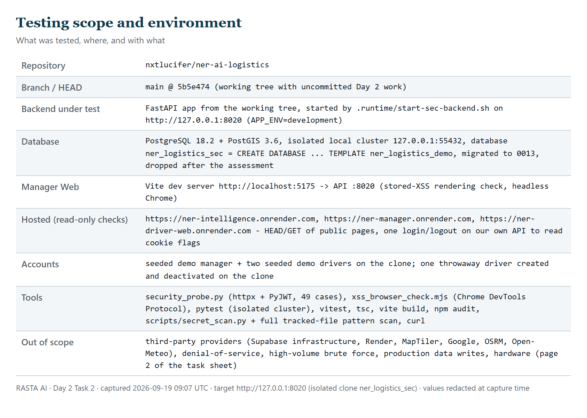

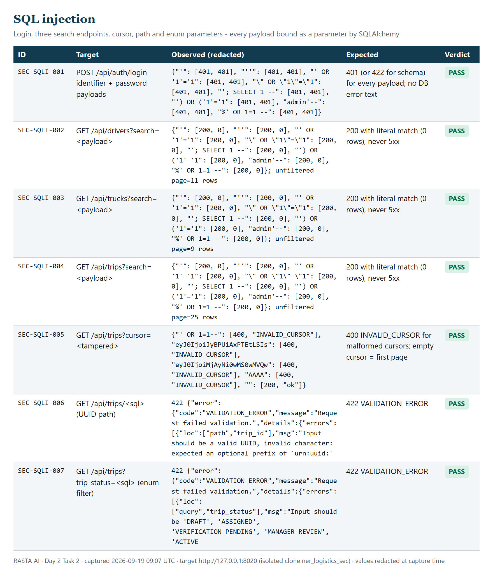

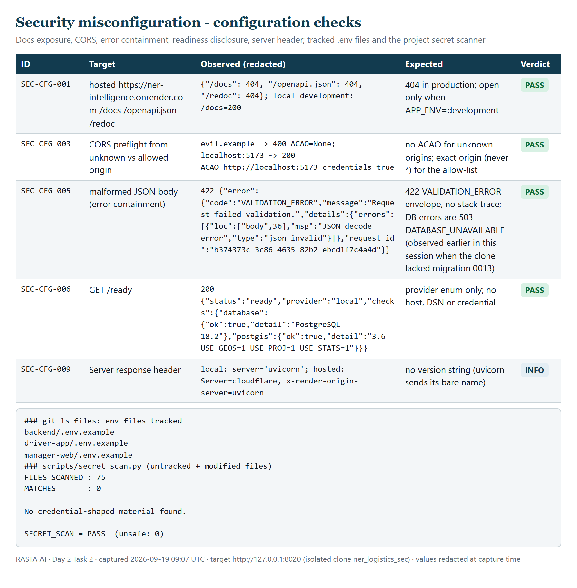

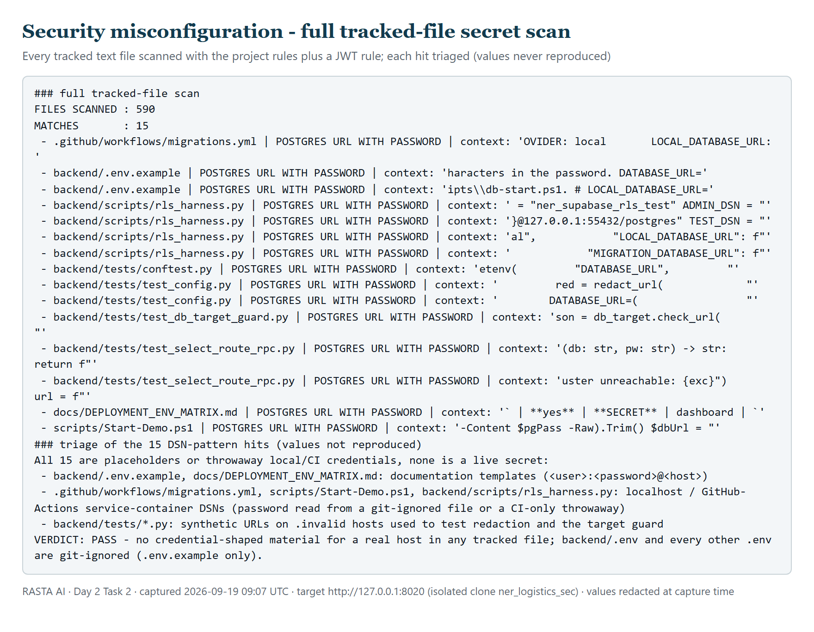

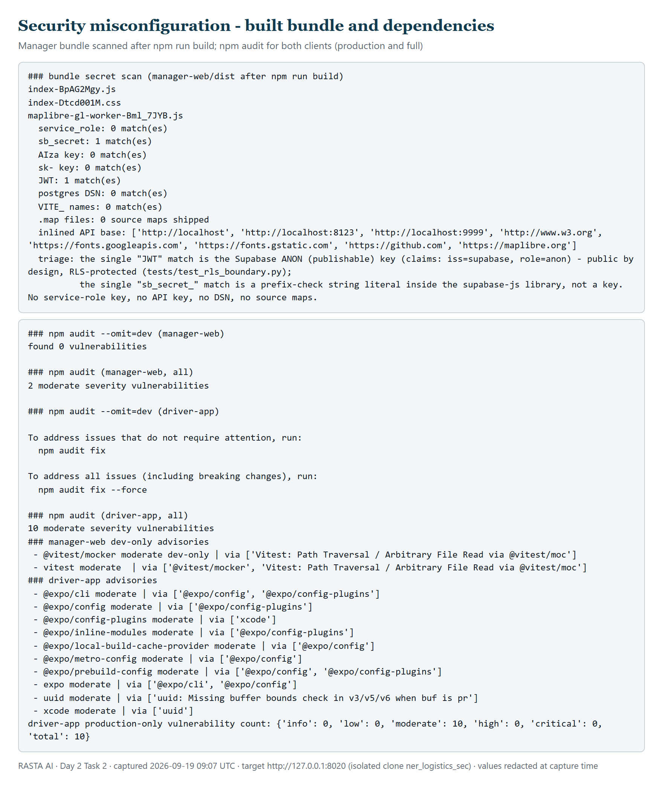

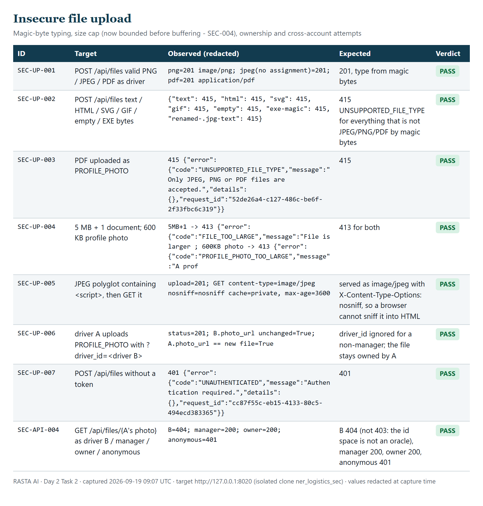

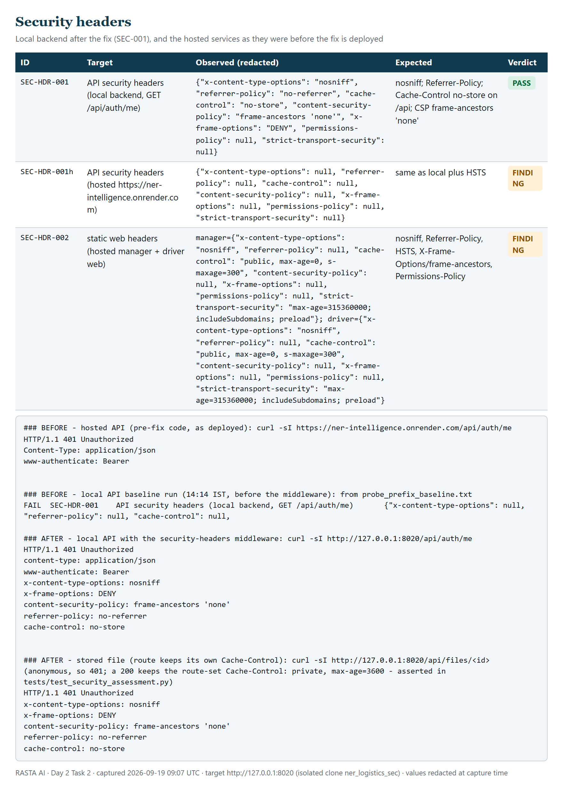

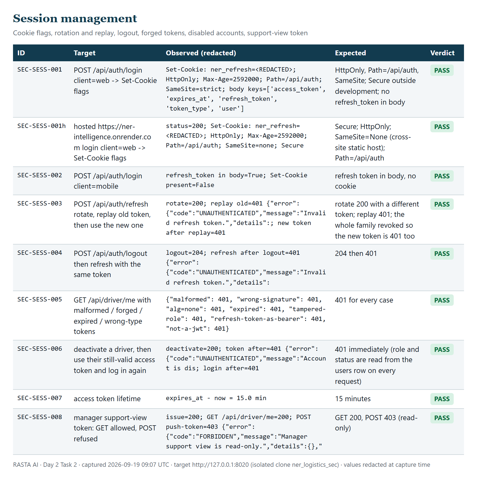

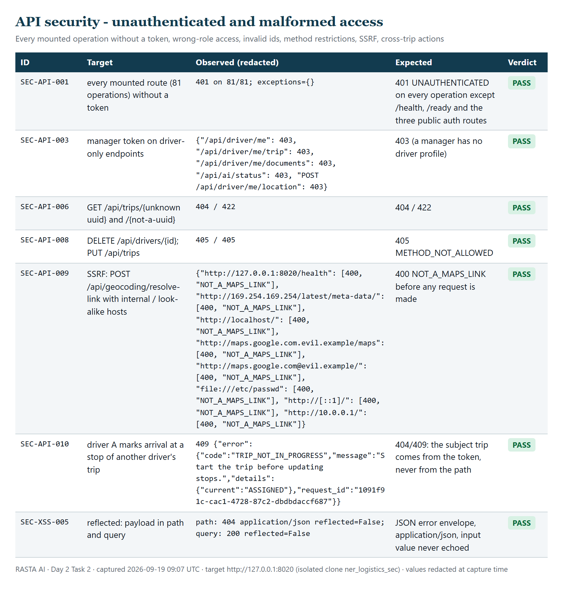

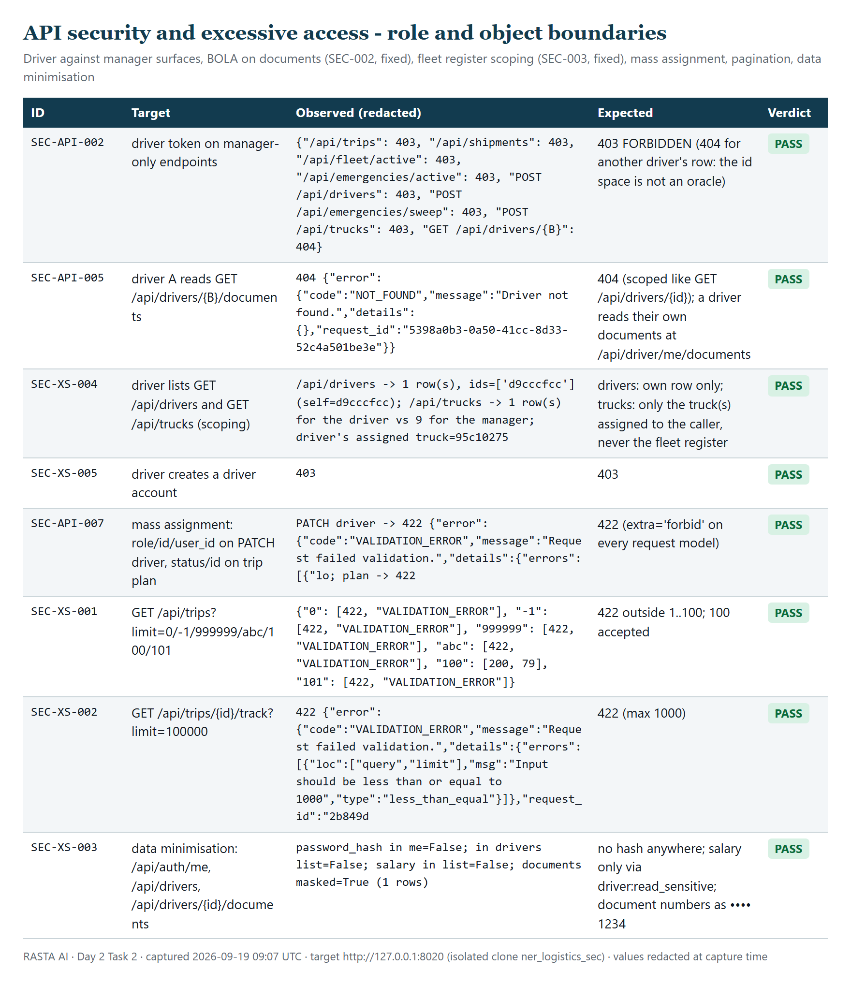

![Figure 13 — Rate limit: codes [401 ×10, 429], Retry-After 60, after a 61 s window recovery.](evidence/09_rate_limit.png)

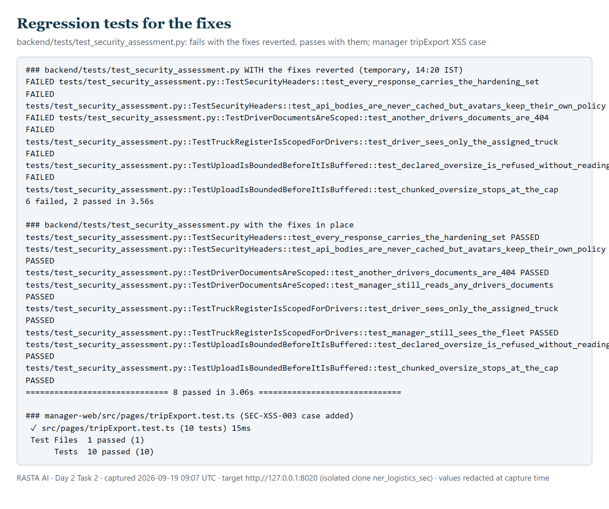

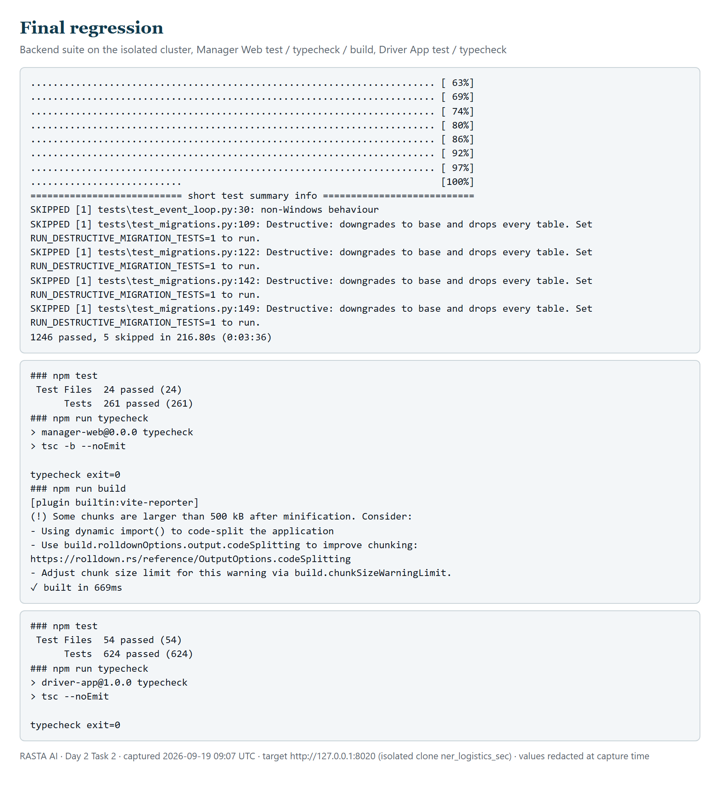


## 17. Residual risks

- **Deployment lag.** SEC-001 and SEC-005 are fixed in the working tree only; the hosted API and both static sites keep serving the old headers until `main` is pushed and Render rebuilds. Verify with `curl -sI` afterwards (section 19).
- **Rate limiting behind the platform proxy (SEC-006).** Per-address login limiting is effectively global on Render; the per-account limit is the control that holds. State is in-process, so a restart clears it and a second worker would double it.
- **No full Content-Security-Policy on the clients.** Only `frame-ancestors` is set. A script-src policy would blunt any future XSS but must be tested against the map, fonts and worker loads before it ships.
- **Dependency advisories.** Ten moderate advisories in the Driver App's Expo build toolchain and two dev-only ones in the manager's test runner; none in production dependency sets; no Python audit was run (`pip-audit` unavailable offline).
- **Third-party providers.** Routing, weather, terrain, flood, warnings and geocoding come from public providers over HTTPS with time-outs and health tracking; their availability and the integrity of the public OSRM demo server are outside our control (the code treats "unknown" as "not safe", never as "safe").
- **No web application firewall** in front of the hosted service beyond Cloudflare's defaults on Render's free tier.
- **Isolated-clone limits.** Tests ran against a local clone of the demo database, so Supabase-specific behaviour (pooler limits, its own RLS enforcement for the Data API) was covered by the existing test suites rather than re-exercised here.
- **Physical devices.** The Driver App was exercised through its API and its web build's headers; secure-store behaviour on a real phone was reviewed in code, not re-tested on a device today.

## 18. Final security assessment

| Required task | Result | Evidence |
| --- | --- | --- |
| SQL Injection | PASS — no injection reproduced; all queries parameterised | §6, Figure 2, SEC-SQLI-001…007 |
| XSS | PASS — stored and reflected payloads inert; escaping at every raw-HTML sink; new unit test | §7, Figures 3–4, `tripExport.test.ts` |
| Security Misconfiguration | PASS — docs closed in production, exact-origin CORS, no secrets tracked or bundled, errors contained, RLS proven | §8, Figures 5–7, `secret_scan.txt` |
| Insecure File Upload | FINDING → FIXED — magic-byte typing, caps and ownership held; unbounded buffering fixed (SEC-004) | §9, Figure 8, `TestUploadIsBoundedBeforeItIsBuffered` |
| Missing / Weak Security Headers | FINDING → FIXED — API headers added (SEC-001), Render static headers added (SEC-005); hosted verification pending deploy | §10, Figure 9, `TestSecurityHeaders` |
| Session Management | PASS — cookie flags, rotation, replay revocation, logout, forgery, disabled accounts, support token all correct; SEC-006 open (limiter keying) | §11, Figure 10, SEC-SESS-001…008 |
| API Security | FINDING → FIXED — 81/81 unauthenticated → 401, roles enforced, SSRF refused; documents BOLA closed (SEC-002) | §12, Figures 11–12, `TestDriverDocumentsAreScoped` |
| Excessive / Improper API Access | FINDING → FIXED — pagination bounded, sensitive fields minimised, enumeration blocked; truck register scoped (SEC-003) | §13, Figure 12, `TestTruckRegisterIsScopedForDrivers` |

**Severity totals:** Critical 0 · High 0 · Medium 1 (fixed) · Low 5 (4 fixed, 1 open) · Informational 7.

## 19. Conclusion

Day 2 Task 2 is ready for submission on the evidence above. All eight required areas were tested against the running application, each with captured evidence; five real defects were found, fixed with the smallest change at the owning layer, and locked in by tests that demonstrably fail without the fix; the complete backend, manager and driver suites pass afterwards. No exploitable issue was reproduced within the defined scope after the fixes. What is not claimed: that the hosted deployment already carries the fixes (it does not until the next push), that the clients ship a full CSP, or that any automated scanner beyond the ones named was run.

Three actions follow this report, in order: (1) commit and push the working tree so the hosted API and static sites pick up SEC-001 and SEC-005, then re-run `curl -sI` against the three hosted URLs and `security_probe.py` with `SEC_BASE` pointed at the hosted API for the read-only rows; (2) decide on SEC-006 — configure uvicorn's forwarded-IP trust for Render's proxy or accept the shared address budget for the demo; (3) schedule the informational items (SRI for Leaflet, Expo toolchain update, a tested script-src CSP) into the next engineering pass. The isolated database `ner_logistics_sec` has been dropped and `.runtime/start-sec-backend.sh` remains for re-running the assessment.
